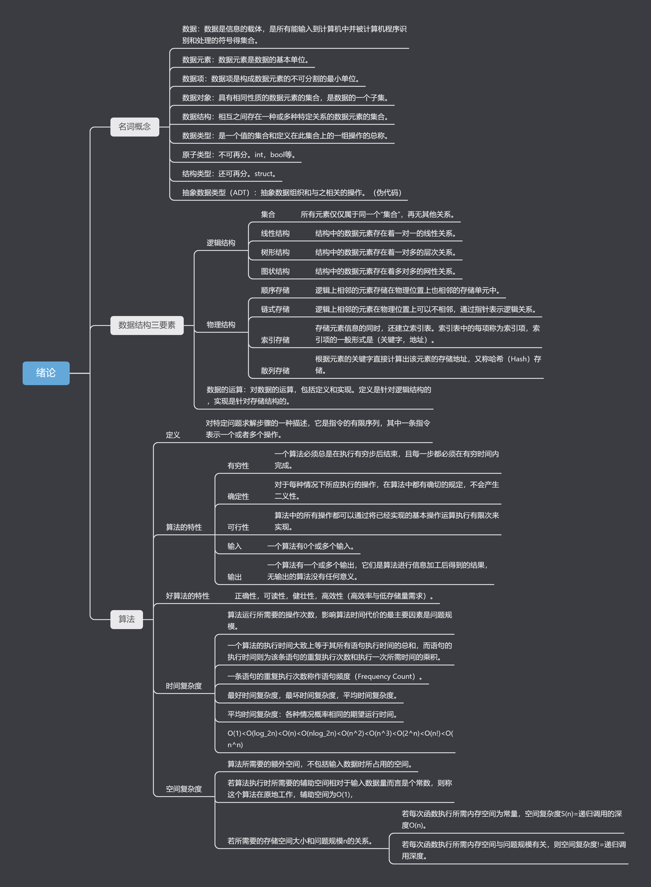

## 碎碎念

记录一下改动了什么，以防以后出问题。

怎么能加多个tag呢？还没看到，哎，我好菜。

> 后续补充：多个tag方式，tags: ["Unity", "游戏开发"]，tags写成tag同样生效。

突然发现这一个为什么在最下边是第一篇？B是最小的？

## 添加bilibili链接

通过对文件夹内容搜索，在weibo所在的位置后边复制了一份并改为了bilibili，个人主页链接一开始没注意写的bilibili.com，实际应该写space.bilibili.com，在config里添加我的id之后发现打开是三体动画，愣是没反应过来，我还以为都现在了打开B站还有三体的开屏广告？硬控我半分钟

其实是因为[这个链接](https://bilibili.com/35246697)正好是三体动画，跟我的ID一样。hhhhhh

## 图片加载修复

本地编辑时，直接粘贴的图片的链接无法在网站上正常加载，所以搞了拼接，让它直接去加载仓库里的图片。

本地形如这样

```markdown

```

实际src会为这样，这样是无法加载的

```markdown
https://MapleInori.net/2025/01/08/image/2025-01-08-first_test/1737546135783.png
```

于是给article.html添加如下代码，万一以后有其他image之类的内容，还是要区分一下image/20开头，总不能超过100年。hhhhh

```html
<script>
  // 确保页面加载完成后执行
  document.addEventListener("DOMContentLoaded", function() {
    const images = document.querySelectorAll('img');
    images.forEach(img => {
      const src = img.getAttribute('src');
      if (src && src.startsWith('image/20')) {
        // 动态拼接GitHub URL，使其在不影响本地图片正常加载的情况下网页也能正常加载图片
        img.setAttribute('src', 'https://github.com/MapleInori/MapleInori.github.io/blob/main/_posts/' + src + '?raw=true');
      }
    });
  });
</script>
```

## 加速图片加载

修改

```js
img.setAttribute('src', 'https://github.com/MapleInori/MapleInori.github.io/blob/main/_posts/' + src + '?raw=true');
```

为

```js
img.setAttribute('src', 'https://cdn.jsdelivr.net/gh/MapleInori/MapleInori.github.io/_posts/' + src + '?raw=true');
```

但是感觉效果不大，不明白了，如果用github的子域名而不用我自己的域名的话，效果也许会好一些？可能是因为我这样来回跳的原因吗？github->NameSilo->腾讯DNS->github？

## 添加LeanCloud

配置config.yml，provider填写为leancloud，填写app_id，app_key，app_class，三个值来源于leancloud，且class为手动创建的类。应该是无限制。

修改leancloud.js，添加if判断

```js
function searchKey(key) {
      if (!key) {
        console.error('Invalid key provided:', key);
        return Promise.reject('Invalid key');
      }
      var query = new AV.Query(appClass);
      query.equalTo('key', key);
      return query.first();
    }
```

修改下方代码

```js
    function get(key, callback) {
      searchKey(key).then(function(result) {
        if (result) {
          callback && callback(result.attributes.views);
        }
      }, errorHandler);
    }
```

为

```js
    function get(key, callback) {
      searchKey(key).then(function(result) {
        // console.log(result);  // 打印查询结果
        if (result) {
          callback && callback(result.attributes.views);
        } else {
          insert(key, title).then(function(result) {
            increment(result).then(function(result) {
              callback && callback(result.attributes.views);
            });
          }, errorHandler);
        }
      }, errorHandler);
```

沃趣！这个主题的教程文档不行还是我看的不够仔细呢，原来只需要在每篇的头信息中添加KEY属性就好了。

不过会有延迟，浏览量变化比较慢，这个应该是网络问题，没办法吧，至少我没办法，github和leancloud的网络通信？不过DNS用的腾讯的，应该速度还好，有用就行。耶！

参考

[使用 LeanCloud 为 Github Pages 添加阅读量统计 (snownight22.github.io)](https://snownight22.github.io/cassidyblog/2023/06/18/LeanCloudForVisitorCount)

以及这个主题的教程

## 添加GoogleAnalysis

前端控制台出现如下报错，关闭广告拦截插件即可。

```shell
Failed to load resource: net::ERR_BLOCKED_BY_CLIENT
```

然后出现如下报错

```shell
GET https://www.googletagmanager.com/gtag/js?id=G-2S7EGHFE6M net::ERR_SSL_PROTOCOL_ERROR
```

很奇怪，我这个似乎还没解决，但是正常了。emmmmmmm

[使用Google Analytics监听GitHub pages页面访问量 Marvin&#39;s blog (winxuan.github.io)](https://winxuan.github.io/posts/add-google-analytics/)

## 修改variables.yml的sources版本

```yml
# 原版
sources:
  bootcdn:
    font_awesome: 'https://cdn.bootcdn.net/ajax/libs/font-awesome/5.15.1/css/all.css'
    jquery: 'https://cdn.bootcss.com/jquery/3.1.1/jquery.min.js'
    leancloud_js_sdk: '//cdn.jsdelivr.net/npm/leancloud-storage@3.13.2/dist/av-min.js'
    chart: 'https://cdn.bootcss.com/Chart.js/2.7.2/Chart.bundle.min.js'
    gitalk:
      js: 'https://cdn.bootcss.com/gitalk/1.2.2/gitalk.min.js'
      css: 'https://cdn.bootcss.com/gitalk/1.2.2/gitalk.min.css'
    valine: 'https://unpkg.com/valine/dist/Valine.min.js' # bootcdn not available
    mathjax: 'https://cdn.bootcss.com/mathjax/2.7.4/MathJax.js?config=TeX-MML-AM_CHTML'
    mermaid: 'https://cdn.bootcss.com/mermaid/8.0.0-rc.8/mermaid.min.js'
  unpkg:
    font_awesome: 'https://use.fontawesome.com/releases/v5.15.1/css/all.css'
    jquery: 'https://unpkg.com/jquery@3.3.1/dist/jquery.min.js'
    leancloud_js_sdk: '//cdn.jsdelivr.net/npm/leancloud-storage@3.13.2/dist/av-min.js'
    chart: 'https://unpkg.com/chart.js@2.7.2/dist/Chart.min.js'
    gitalk:
      js: 'https://unpkg.com/gitalk@1.2.2/dist/gitalk.min.js'
      css: 'https://unpkg.com/gitalk@1.2.2/dist/gitalk.css'
    valine: 'https//unpkg.com/valine/dist/Valine.min.js'
    mathjax: 'https://unpkg.com/mathjax@2.7.4/unpacked/MathJax.js?config=TeX-MML-AM_CHTML'
    mermaid: 'https://unpkg.com/mermaid@8.0.0-rc.8/dist/mermaid.min.js'

# 新版
sources:
  bootcdn:
    font_awesome: 'https://cdn.bootcdn.net/ajax/libs/font-awesome/6.0.0-beta3/css/all.min.css'
    jquery: 'https://cdn.jsdelivr.net/npm/jquery@3.6.0/dist/jquery.min.js'
    leancloud_js_sdk: 'https://cdn.jsdelivr.net/npm/leancloud-storage@4.7.0/dist/av-min.js'
    chart: 'https://cdn.jsdelivr.net/npm/chart.js@3.7.0/dist/chart.min.js'
    gitalk:
      js: 'https://cdn.jsdelivr.net/npm/gitalk@1.7.0/dist/gitalk.min.js'
      css: 'https://cdn.jsdelivr.net/npm/gitalk@1.7.0/dist/gitalk.min.css'
    valine: 'https://cdn.jsdelivr.net/npm/valine@1.5.2/dist/Valine.min.js'
    mathjax: 'https://cdn.jsdelivr.net/npm/mathjax@2.7.7/MathJax.js?config=TeX-MML-AM_CHTML'
    mermaid: 'https://cdn.jsdelivr.net/npm/mermaid@10.1.0/dist/mermaid.min.js'
  unpkg:
    font_awesome: 'https://unpkg.com/font-awesome@6.0.0-beta3/css/all.min.css'
    jquery: 'https://unpkg.com/jquery@3.6.0/dist/jquery.min.js'
    leancloud_js_sdk: 'https://cdn.jsdelivr.net/npm/leancloud-storage@4.7.0/dist/av-min.js'
    chart: 'https://unpkg.com/chart.js@3.7.0/dist/chart.min.js'
    gitalk:
      js: 'https://unpkg.com/gitalk@1.7.0/dist/gitalk.min.js'
      css: 'https://unpkg.com/gitalk@1.7.0/dist/gitalk.min.css'
    valine: 'https://unpkg.com/valine@1.5.2/dist/Valine.min.js'
    mathjax: 'https://unpkg.com/mathjax@2.7.7/unpacked/MathJax.js?config=TeX-MML-AM_CHTML'
    mermaid: 'https://unpkg.com/mermaid@10.1.0/dist/mermaid.min.js'
```

## 修改_sass\layout\_page.scss。

修改目录栏。

```scss
.page__aside {
  .toc-aside {
    padding: map-get($spacers, 5) 0 map-get($spacers, 3) map-get($spacers, 5);
    max-height: 80vh; // 限制最大高度为视口高度的 80%
    overflow-y: auto; // 启用垂直滚动条
    width: 300px; // 增加目录栏宽度
    margin-right: 20px; // 让目录栏距离右边更近
    word-wrap: break-word; // 自动换行
    word-break: break-word; // 防止长单词溢出
  }
}
```

## 修改_data\navigation.yml。

测试用，在FirstTest中测试使用。

```yaml
docs-test:
  - title:      Start
    children:
      - title:  First_Test
        url:    2025/01/08/first_test.html
      - title:  None
  - title:      中文
    children:
      - title:  修改
        url:    2025/01/08/Blog修改.html
      - title:  空

```

## 图片加载的简单替换

article.html修改。应该有更合适的写法，但我对于网页前端实在不熟悉。只能制作规定和自己遵守规定了hhhhhh

```js
<!-- <script>
  // 确保页面加载完成后执行
  document.addEventListener("DOMContentLoaded", function() {
    const images = document.querySelectorAll('img');
    images.forEach(img => {
      const src = img.getAttribute('src');
      if (src && src.startsWith('image/20')) {
        // 动态拼接GitHub URL，使其在不影响本地图片正常加载的情况下网页也能正常加载图片
        img.setAttribute('src', 'https://cdn.jsdelivr.net/gh/MapleInori/MapleInori.github.io/_posts/' + src + '?raw=true');
      }
    });
  });
  
</script> -->
<script>
  // 确保页面加载完成后执行
  document.addEventListener("DOMContentLoaded", function() {
    const images = document.querySelectorAll('img');
    const currentPath = window.location.pathname; // 获取当前文章的路径
    const basePath = currentPath.substring(0, currentPath.lastIndexOf('/')); // 获取文章所在目录
    const isDocs = basePath.includes('/docs/'); // 判断是否在 docs 文件夹下

    images.forEach(img => {
      const src = img.getAttribute('src');  // src 是图片的本地相对路径，与文档同级 image/xxxx.png
      if (src && src.startsWith('image/')) {
        let newSrc;
        if (isDocs) {
          // 如果文章在 docs 文件夹下，拼接 docs 的图片路径
          const docsBasePath = basePath.split('/').slice(0, 3).join('/'); // 提取 /docs/UGUI 部分
          newSrc = `https://cdn.jsdelivr.net/gh/MapleInori/MapleInori.github.io/_posts${docsBasePath}/${src}?raw=true`;
        } else {
          // 如果文章在 post 根目录下，拼接普通的图片路径
          const articleFolder = basePath.split('/').pop(); // 提取文章文件夹名称
          newSrc = `https://cdn.jsdelivr.net/gh/MapleInori/MapleInori.github.io/_posts/image/${articleFolder}/${src.replace('image/', '')}?raw=true`;
        }
        img.setAttribute('src', newSrc);
        console.log("新图片路径 (newSrc):", newSrc); // 输出拼接后的图片路径，便于调试
      }
    });
  });
  
</script>


```

## 放大代码字体

修改_reset.scss

```scss
// code字体从font-size-xs改为sm
code {  
  font-size: map-get($base, font-size-sm);
  line-height: map-get($base, line-height-sm);
}

```


To Be Continue...
