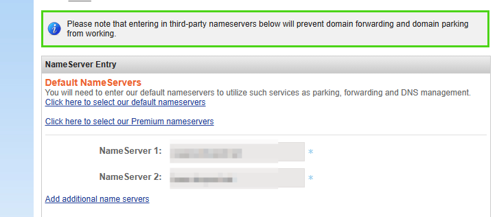
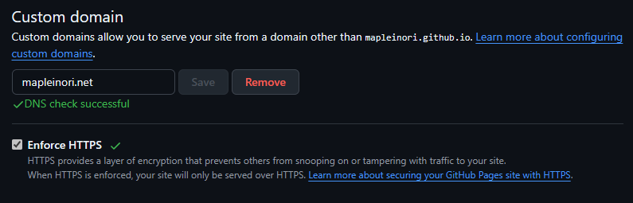

注意正文第一行（markdown下的正文第一行而非渲染后的正文）要跟头信息隔一行

## 前置条件

- 一个github账户
- [找一个主题](https://kitian616.github.io/jekyll-TeXt-theme/)

## 开始

1. [下载主题](https://github.com/kitian616/jekyll-TeXt-theme)
2. 创建仓库，名称格式为username.github.io
3. 把下载的主题丢进仓库里，其实理论上直接fork更快。
4. 修改config。（其实不改也能用，只不过是人家的名字）
5. NameSilo购买个人域名
6. 点击,
7. 去腾讯云域名解析，[找到自己的DNS服务器](https://docs.dnspod.cn/dns/dns-plan-address/#%E5%B8%B8%E8%A7%81%E9%97%AE%E9%A2%98)，填写到上方Name Server中。
8. 腾讯云解析CNAME类型到username.github.io仓库，一个@一个www。
9. 配置自定义域名 setting->pages->custom domain 填写个人域名，等待DNS检查，成功后加上Enforce HTTPS。

## 添加LeanCloud

[使用 LeanCloud 为 Github Pages 添加阅读量统计 (snownight22.github.io)](https://snownight22.github.io/cassidyblog/2023/06/18/LeanCloudForVisitorCount)

## 添加GoogleAnalysis
