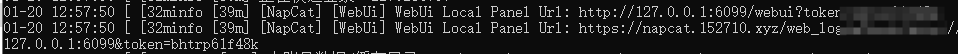

## 前置

- [python 3.9](https://www.python.org/downloads/release/python-390/)
- （缺少VCRUNTIME140_.DLL时）[Microsoft Visual C++ Redistributable](https://learn.microsoft.com/en-us/cpp/windows/latest-supported-vc-redist?view=msvc-170)
- QQ本体
- [Nonebot](https://nb2.baka.icu/docs/quick-start)

## 开始

1. 前往 [NapCatQQ 的 release 页面](https://github.com/NapNeko/NapCatQQ/releases) 下载NapCat.Shell.zip解压
2. 确保QQ版本安装且最新
3. 双击目录下launcher.bat即可启动 如果是win10 则使用launcher-win10.bat

   如果需要快速登录 将 QQ 号传入参数即可，launcher.bat 123456

## 通过 WebUI 配置OneBot服务

如果你已经启动了 NapCat，并且有多于 1 个开放端口，则可以通过 WebUI 进行配置。

默认地址为 `0.0.0.0`，即监听所有地址。当配置了不可用的地址时 WebUI 将被禁用。

默认端口为 `6099`。

当端口被设置为 `0` 时将禁用 WebUI。

当端口被占用时，会自动对端口 +1，直到找到可用端口（最多尝试100次，失败则会禁用 WebUI），端口号会在启动日志中显示。

启动后可在启动日志中看到形如 `[WebUi] WebUi Local Panel Url: http://127.0.0.1:6099/webui?token=xxxx` 的token信息。

也可打开 `webui.json` 文件，在其中找到token。

```json
{
    "host": "0.0.0.0", // WebUI 监听地址
    "port": 6099, // WebUI 端口
    "prefix": "", // WebUI 工作前缀，此项功能将在进阶配置中解释
    "token": "xxxx", //登录密钥，默认是自动生成的随机登录密码
    "loginRate": 3, //每分钟登录次数限制
}
```

控制台前边会有两个链接，

## 安装Nonebot

**python -m pip install --user pipx**
python -m pipx ensurepath

如果在此步骤的输出中出现了“open a new terminal”或者“re-login”字样，那么请关闭当前终端并重新打开一个新的终端。

pipx install nb-cli

安装完成后，你可以在命令行使用 `nb` 命令来使用脚手架。如果出现无法找到命令的情况（例如出现“Command not found”字样），请参考 [pipx 文档](https://pypa.github.io/pipx/) 检查你的环境变量。

## 创建项目

nb create

这一指令将会执行创建项目的流程，你将会看到一些询问：

1. 项目模板

   ```bash
   [?] 选择一个要使用的模板: bootstrap (初学者或用户)
   ```

   这里我们选择 `bootstrap` 模板，它是一个简单的项目模板，能够安装商店插件。如果你需要 **自行编写插件** ，这里请选择 `simple` 模板。
2. 项目名称

   ```bash
   [?] 项目名称: awesome-bot
   ```

   这里我们以 `awesome-bot` 为例，作为项目名称。你可以根据自己的需要来命名。
3. 其他选项 请注意，多选项使用**空格**选中或取消，**回车**确认。

   ```bash
   [?] 要使用哪些驱动器? FastAPI (FastAPI 驱动器)
   [?] 要使用哪些适配器? Console (基于终端的交互式适配器)
   [?] 立即安装依赖? (Y/n) Yes
   [?] 创建虚拟环境? (Y/n) Yes
   ```

   这里我们选择了创建虚拟环境，nb-cli 在之后的操作中将会自动使用这个虚拟环境。如果你不需要自动创建虚拟环境或者已经创建了其他虚拟环境，nb-cli 将会安装依赖至当前激活的 Python 虚拟环境。

   1. 如果安装依赖失败，需要安装pdm。
   2. pip install pdm
4. 选择内置插件

   ```bash
   [?] 要使用哪些内置插件? echo
   ```

   这里我们选择 `echo` 插件作为示例。这是一个简单的复读回显插件，可以用于测试你的机器人是否正常运行。

## 运行项目

在项目创建完成后，你可以在**项目目录**中使用以下命令来运行项目：

```bash
nb run
```

你现在应该已经运行起来了你的第一个 NoneBot 项目了！请注意，生成的项目中使用了 `FastAPI` 驱动器和 `Console` 适配器，你之后可以自行修改配置或安装其他适配器。

通过nb create创建的项目不包含.env文件和bot.py。如果需要，手动创建。

接下来怎么写插件捏？
