## 概述

为了了解一下Unity的开发过程，或者说感受？先搞简单的练练手。

## 工具

Unity:2022.3.51f1c1

visual studio 2022

## 开发过程

### 项目基本设置

新建2d项目，游戏画面设置为1080*1920（9：16）。

图片素材设置为sprite

### 游戏画面搭建

Camera Size：相机画面高度的一半

Pixels Per Unit：每个单元格的像素长度

#### 地面

新建地面GameObject，拖到相机底部，或者通过图片像素大小和相机高度来计算位置。

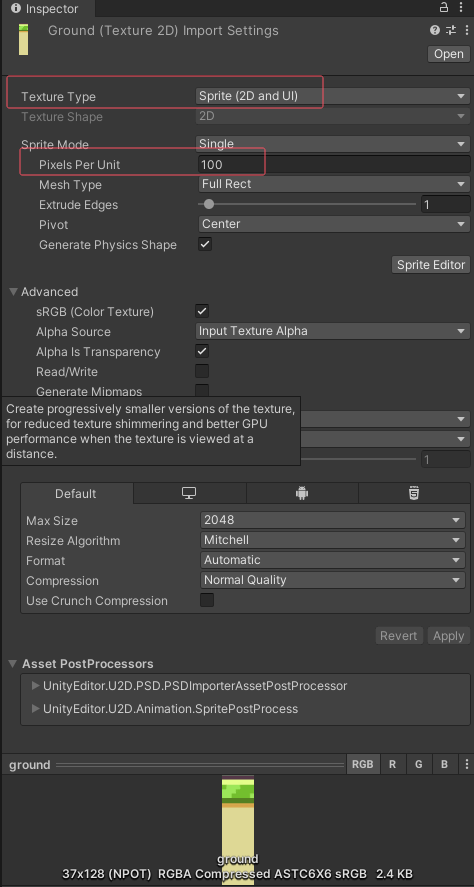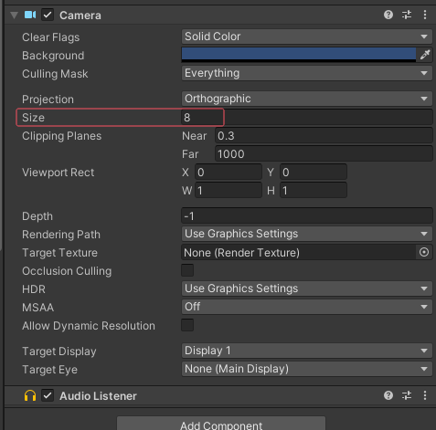

以Ground素材为例：其图片大小为37*128，Pixels Per Unit 为100。

相机高度（Camera Size）为8，在没有移动过相机的情况下，相机中心点为（0,0），相机底部位置为(0,-8)，若要让Ground图片刚好在相机最底部，那么其Y轴为 $-8+(\frac{128}{100} * \frac{1}{2} = -7.36)$,Unity中可以直接输入算式然后Enter即可。

要将Ground平铺在底部，修改Draw Mode为Tiled，同时确保Ground素材的Sprite Mode为Single或者Multyple，以及MeshType为FullRect，避免报警告。

然后需要平铺几个Ground就把Ground的Width乘几，或者不在意也行，我没管。

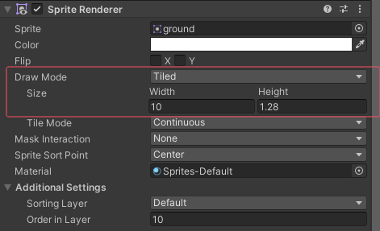

#### 背景

添加背景画面，将其DrawMode改为Sliced，同样MeshType设置为FullRect，然后点击Sprite Editor处理，切成九宫格（九宫格不同位置受拉伸影响不同），然后就可以拉伸了。

其实图片右侧还有一两个像素宽的灰色阴影，当采用两张背景平移轮播的方式时会有一条灰色的线在画面中移动，以AB的形式移动时候会有，A移出画面后挪到B后边时没有，很怪，于是我把图片右边黑色阴影涂成了旁边的颜色。

#### 实现背景素材的连续滚动

```csharp
public class BgMovement : MonoBehaviour
{
    private float BG_WIDTH = 9.8f;

    public Transform ground_1;
    public Transform ground_2;

    public Transform backGround_1;
    public Transform backGround_2;

    [Range(0,10)]
    public float moveSpeed = 3f;

    void Update()
    {
        if (GameStateManager.Instance.isFinish || GameStateManager.Instance.isPaused ) return;
        MoveBackground(ground_1, ground_2);
        MoveBackground(backGround_1, backGround_2);

    }

    private void MoveBackground(Transform obj1, Transform obj2)
    {
        obj1.position -= new Vector3(moveSpeed * Time.deltaTime, 0, 0);
        obj2.position -= new Vector3(moveSpeed * Time.deltaTime, 0, 0);

        if (obj1.position.x < -BG_WIDTH)
        {
            obj1.position = obj2.position + new Vector3(BG_WIDTH, 0, 0);
        }
        if (obj2.position.x < -BG_WIDTH)
        {
            obj2.position = obj1.position + new Vector3(BG_WIDTH, 0, 0);
        }
    }
}
```

#### 开始拼各种静态图片

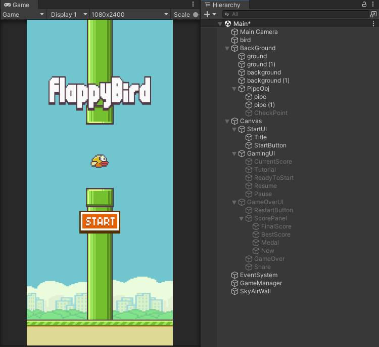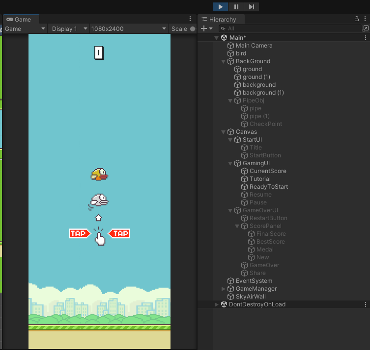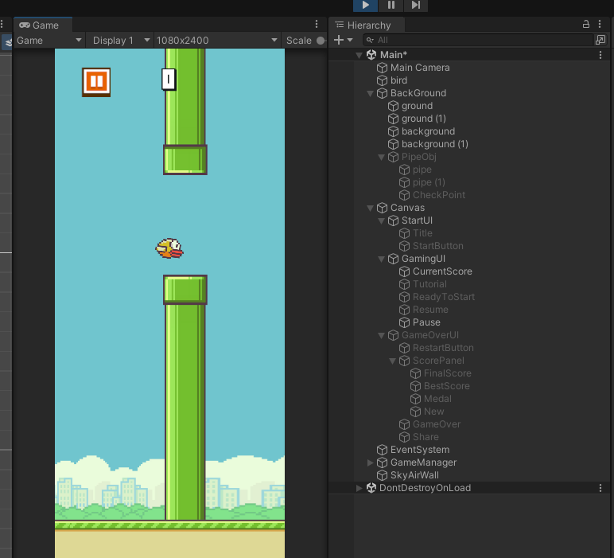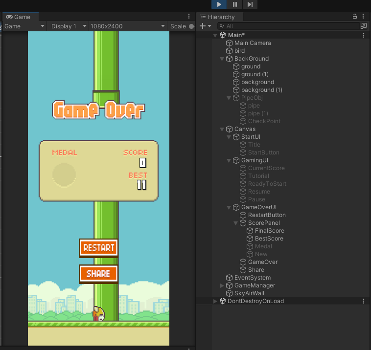

其中的ReadyToStart是覆盖在画面上的一个按钮，目的是检测到点击之后正式开始游戏。

背景中的PieObj只是背景的一部分，所以checkpoint关闭，以防bug。

默认开启（活动？）的游戏对象，第一张图中亮着的以及GameOverUI下的全部，

默认关闭的游戏对象，GamingUI下的全部以及GameOverUI本身。

#### 字体

别用TextMeshPro，不然这里边的字体可能没法用，反正我不会用，分数字体用Text组件就能用这里的字体了。

### 鸟的待机效果实现

#### 待机动画制作

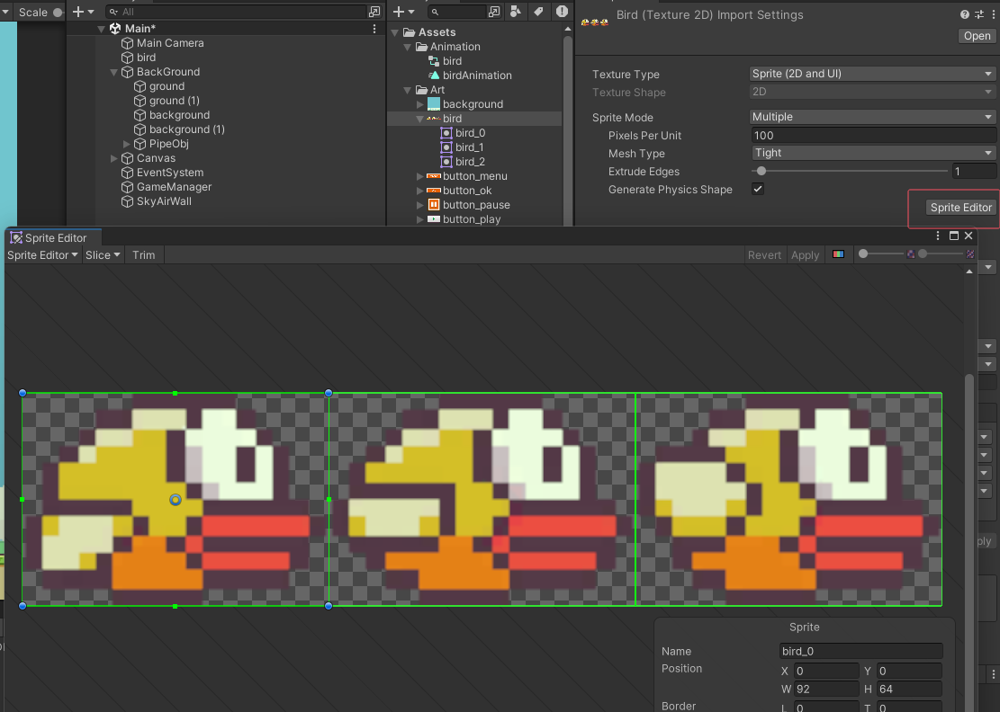

将鸟按三列一行的方式切分。

创建BirdAnimation，给动画添加关键帧，可以将图片直接拖到对应的时间点上。

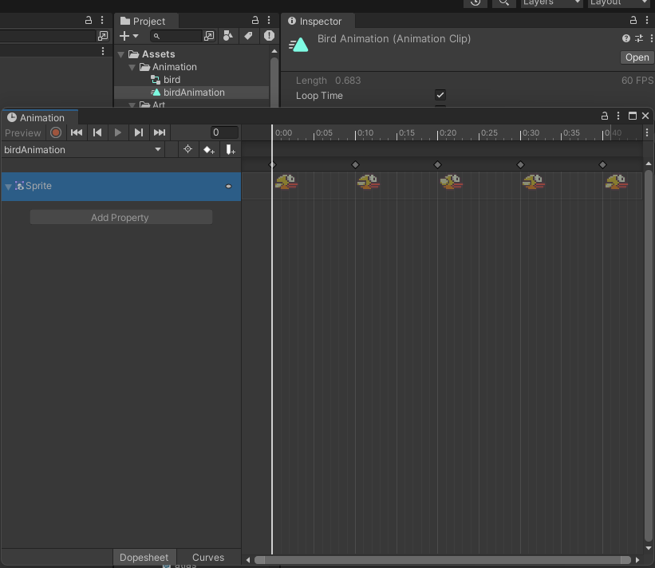

注意，要先把Animation放在游戏对象上，然后确保选中的是目标游戏对象，才能把图片拖到它的Animation上作为关键帧。

#### 待机动画控制

```csharp
    private void Idle()
    {
        Radian += R * Time.deltaTime;
        var height = Mathf.Sin(Radian) * IdleHeight;
        transform.position = orgPosition + new Vector3(0, height, 0);
    }
```

## 游戏的状态管理

因为在点击Start之后有一个引导等待画面，所以状态分为：

Start（主界面）->Ready（显示引导等待点击）->Playing(游戏中，真的开始游戏)->Finish（游戏结束），以及Paused（暂停状态）。

```csharp
using System;
using System.Collections;
using System.Collections.Generic;
using UnityEngine;

// 主界面，点击start但是在游戏开始前的准备状态（此时显示游戏引导），游戏中状态，游戏结束状态，暂停
public enum GameState {Start, Ready, Playing, Finished, Paused }

public class GameStateManager
{
    private static readonly Lazy<GameStateManager> instance = new Lazy<GameStateManager>(() => new GameStateManager());

    public static GameStateManager Instance => instance.Value;

    GameStateManager() { }

    public bool isStart;
    public bool isReady;
    public bool isPlaying;
    public bool isFinish;
    public bool isPaused;

    private MainPanel mainPanel;

    public void Setup(MainPanel panel)
    {
        mainPanel = panel;
    }

    public void SetState(GameState state)
    {
        switch (state)
        {
            case GameState.Start:
                isStart = true; isReady = false; isPlaying = false; isFinish = false; isPaused = false; break;
            case GameState.Ready:
                isStart = false ; isReady = true; isPlaying = false; isFinish = false; isPaused = false; break;
            case GameState.Playing:
                isStart = false; isReady = false; isPlaying = true; isFinish = false; isPaused = false; break;
            case GameState.Finished:
                isStart = false; isReady = false; isPlaying = false; isFinish = true; isPaused = false;
                mainPanel.ShowGameOverUI();
                break;
            case GameState.Paused:
                isPaused = true;
                Time.timeScale = 0;
                break;
        }
    }

    // 游戏恢复
    public void Resume()
    {
        SetState(GameState.Playing);  // 恢复游戏状态
        Time.timeScale = 1;  // 恢复游戏速度
    }

    // 重启游戏
    public void Restart()
    {
        SetState(GameState.Start);  // 设置为开始状态
        Time.timeScale = 1;  // 恢复时间缩放
    }

    // 获取并更新分数
    public void GetScore()
    {
        int currentScore;
        if (int.TryParse(mainPanel.CurrentScore.text, out currentScore))
        {
            mainPanel.CurrentScore.text = (currentScore + 1).ToString();
        }
    }
}

```

## 游戏的控制

游戏中的小鸟在不同的游戏状态下（如待机、游戏中、游戏结束等）有不同的表现。首先，在待机状态下，小鸟会在垂直方向上下浮动，模拟出类似摆动的效果。进入游戏后，小鸟会受到自定义重力的影响，触发用户输入（点击屏幕或鼠标点击）时会让小鸟跳跃，同时通过物理模拟调整小鸟的速度和旋转角度。在游戏结束后，角色会根据情况处理碰撞，判断是否与地面、管道等物体发生接触并做出相应的状态更新。

并且由于有一个暂停按钮在游戏中，当点击暂停按钮时同样会触发一次跳跃，所以对点击的位置进行判断。

```csharp
using System;
using System.Collections;
using System.Collections.Generic;
using UnityEngine;
using DG.Tweening;


public class BirdController : MonoBehaviour
{
    [Range(1, 10)]
    public float R = 5f; // 控制小鸟上下浮动的速度
    [Range(0, 1)]
    public float IdleHeight = 0.5f; // 小鸟在待机状态时的浮动高度

    private float Radian = 0; // 当前浮动的角度（弧度）
    private Vector3 orgPosition; // 初始位置

    public float Gravity = -9.81f; // 重力加速度
    public float JumpHeight = 1.3f; // 跳跃高度
    public Vector3 Velocity = Vector3.zero; // 当前速度

    public float MaxVelocity = -15f; // 最大下落速度

    private float RotationZ = 0; // 小鸟的旋转角度
    public float RotateSpeed = 8; // 旋转速度（弧度）
    private float JumpVelocity; // 跳跃的初始速度

    private Collider2D preCollieder; // 上次碰撞的物体

    void Start()
    {
        orgPosition = transform.position; // 记录小鸟的初始位置
        preCollieder = null; // 初始化碰撞器
    }

    // Update is called once per frame
    void Update()
    {
        if (GameStateManager.Instance.isPaused) return;
        if (GameStateManager.Instance.isStart || GameStateManager.Instance.isReady)
        {
            Idle();
        }
        else if (GameStateManager.Instance.isPlaying)
        {
            CustomGravity();
        }
        else if(GameStateManager.Instance.isFinish)
        {
            HandleBirdDie();
        }

    }

    // 控制小鸟在待机状态时的上下浮动
    private void Idle()
    {
        Radian += R * Time.deltaTime; 
        var height = Mathf.Sin(Radian) * IdleHeight; // 根据角度计算当前浮动高度
        transform.position = orgPosition + new Vector3(0, height, 0); 
    }

    // 控制小鸟的重力和跳跃
    private void CustomGravity()
    {
        if ((Input.touchCount > 0 && Input.GetTouch(0).phase == TouchPhase.Began) || Input.GetMouseButtonDown(0) )
        {
            Vector2 clickPosition;

            // 获取点击位置
            if (Input.touchCount > 0)
            {
                clickPosition = Input.GetTouch(0).position; // 触摸位置
            }
            else
            {
                clickPosition = Input.mousePosition; // 鼠标位置
            }

            if (!InitSceenSize.ClickPause(clickPosition))
            {
                // 如果点击位置不在暂停按钮区域内，触发跳跃
                Jump();
            }
      
            //if (GameStateManager.Instance.isPlaying) Jump();
        }
        Velocity.y += Gravity * Time.deltaTime; // 受重力影响更新垂直速度
        if (Velocity.y < MaxVelocity) Velocity.y = MaxVelocity; // 限制最大下落速度
        transform.position += Velocity * Time.deltaTime; // 更新小鸟的位置

        // 控制小鸟的旋转角度，使其根据下落速度旋转
        if (Velocity.y < -JumpVelocity * 0.1f)
        {
            RotationZ -= RotateSpeed * Time.deltaTime * 1000 * Mathf.Deg2Rad; // 放大1000倍才显得正常，帧率太高导致deltaTime过低？

            RotationZ = Mathf.Max(-90, RotationZ);// 限制旋转角度不超过-90°
        }

        transform.eulerAngles = new Vector3(0, 0, RotationZ);
    }

    // 鸟作为触发器去接触其他物体，要么是其他物体都设置为触发器检测是否碰到鸟，那么需要给每个会碰到鸟的物体写脚本。
    // 如果碰到后那些物体需要各种处理的话，也许其他作为触发器好点，毕竟还要给它们写其他东西。
    // 如果东西多的话，鸟要接触的东西太多了，集中在这里看起来也许不如分散到各自身上处理
    private void OnTriggerEnter2D(Collider2D collision)
    {
        //Debug.Log(collision.tag);

        if(collision.CompareTag("ground") || collision.CompareTag("pipe"))
        {
            //GameStateManager.Instance.Finish();
            GameStateManager.Instance.SetState(GameState.Finished);
        }
        if (collision.CompareTag("sky"))
        {
            Velocity = new Vector3(0, -2, 0);
        }

        // 避免刚好接触时死亡，触发两次加分的情况
        if (collision.CompareTag("checkPoint") && ((preCollieder==null)|| preCollieder.GetComponent<Transform>().position != collision.GetComponent<Transform>().position))
        {
            GameStateManager.Instance.GetScore();
            preCollieder = collision;
        }
    }

    // 防止卡进去然后穿过去
    private void OnTriggerStay2D(Collider2D collision)
    {
        if (collision.CompareTag("sky"))
        {
            Velocity = new Vector3(0, -2, 0);
        }
    }

    private void HandleBirdDie()
    {
        float distance = -Camera.main.orthographicSize + 1.28f + 0.64f * 0.5f; // 通过手动计算得到的地面高度
        if(transform.position.y > distance)
        {
            CustomGravity();
        }
    }

    // 重启游戏时重置小鸟的位置和状态
    public void Restart()
    {
        transform.position = orgPosition; // 恢复初始位置
        transform.eulerAngles = Vector3.zero; // 恢复旋转角度
        RotationZ = 0; // 恢复旋转值
        Velocity = Vector3.zero; // 恢复速度
    }

    // 使小鸟跳跃
    public void Jump()
    {
        Velocity.y = MathF.Sqrt(JumpHeight * -2 * Gravity); // 计算跳跃的初始速度
        JumpVelocity = Velocity.y; // 记录跳跃速度
        RotationZ = 30; // 跳跃时调整旋转角度
    }
}

```

## 障碍物的创建与控制

### 障碍物的创建

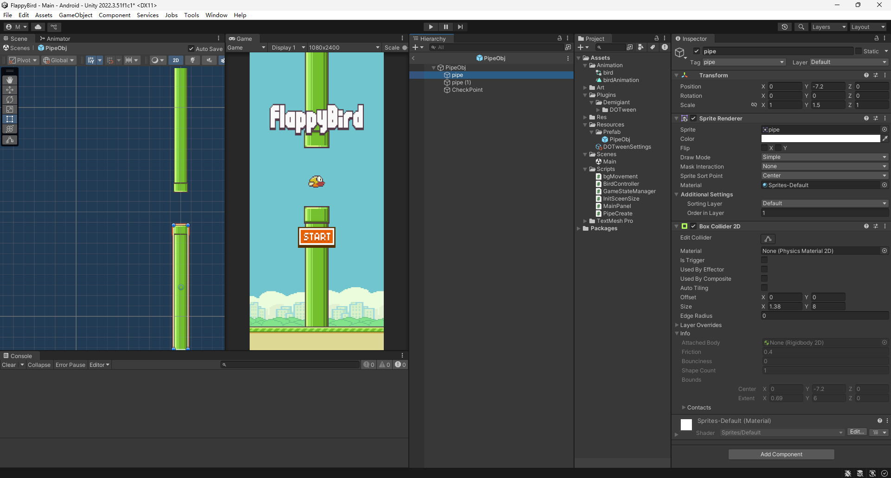

用两个管道图片拼接而成，给图片添加碰撞体，添加空游戏对象最为检查点，添加碰撞体，设置合适的位置和大小，注意设置tag。创建为预制体

### 障碍物的控制

```csharp
using System.Collections.Generic;
using UnityEngine;

public class PipeCreate : MonoBehaviour
{

    public BgMovement bgMove;

    private List<GameObject> pipeList;
    private float Distance = 5f;
    private float CameraHalfWidth;

    private GameObject pipePrefab;
    // Start is called before the first frame update
    void Start()
    {
        pipePrefab = Resources.Load<GameObject>("Prefab/PipeObj"); // 只加载一次

        CameraHalfWidth = Screen.width * 1f / Screen.height * Camera.main.orthographicSize;
        //Debug.Log(CameraHalfWidth);
        pipeList = new List<GameObject>();
  
        // 也能通过协程的方式不断生成
        for(int i =0; i< 5;i++)
        {
            var go = GameObject.Instantiate(pipePrefab);
            go.transform.position = new Vector3(i * Distance, Random.Range(-3f,4.5f), 0) + new Vector3(8,0,0);
            go.transform.SetParent(this.transform,true);

            pipeList.Add(go);
        }
    }

    public void Restart()
    {
        for (int i = 0; i < 5; i++)
        {
            var go = pipeList[i];
            go.transform.position = new Vector3(i * Distance, Random.Range(-3f, 4.5f), 0) + new Vector3(8, 0, 0);
        }
    }

    // Update is called once per frame
    void Update()
    {
        if(GameStateManager.Instance.isPlaying)
        {
            foreach (var item in pipeList)
            {
                item.transform.position += new Vector3(-Time.deltaTime * bgMove.moveSpeed, 0, 0);
                if (item.transform.position.x < -CameraHalfWidth - 1)
                {
                    var lastPipe = pipeList[pipeList.Count - 1];
                    item.transform.position = lastPipe.transform.position + new Vector3(Distance, 0, 0);
                    item.transform.position = new Vector3(lastPipe.transform.position.x + Distance, Random.Range(-3f, 4.5f), 0);

                    pipeList.Remove(item);
                    pipeList.Add(item);
                    return;
                }

            }

        }

    }

}

```

## 画面的控制与管理：开始，准备，游戏中，结束，暂停

```csharp
using System.Collections;
using System.Collections.Generic;
using UnityEngine;
using UnityEngine.UI;
using DG.Tweening;
using Unity.VisualScripting;

public class MainPanel : MonoBehaviour
{
    // 开始界面
    public Button StartButton;
    public Button RestartButton;
    public Image Title;
    public GameObject UIPipe;
    public CanvasGroup StartUI;

    // 准备界面
    public Button ReadyToStart;  
    public CanvasGroup Tutorial;

    // 游戏界面
    public Text CurrentScore;
    public Button PauseButton;
    public Button ResumeButton;

    // 结束界面
    public GameObject GameOverUI;
    public Text FinalScore;
    public Text BestScore;
    public Image Medal;
    public List<Sprite> Medals;
    public Image NewIcon;

    public BirdController birdController;
    public PipeCreate pipeCreate;

    private float FadeTime = 0.4f;
    private bool isClickStart;

    // Start is called before the first frame update
    void Start()
    {
        StartButton.onClick.AddListener(OnClickStart);
        RestartButton.onClick.AddListener(OnClickRestart);
        ReadyToStart.onClick.AddListener(GameStart);
        PauseButton.onClick.AddListener(OnClickPause);
        ResumeButton.onClick.AddListener(OnClickResume);


        GameOverUI.gameObject.SetActive(false);
        ReadyToStart.gameObject.SetActive(false);

        NewIcon.gameObject.SetActive(false);
        isClickStart = false;

        CurrentScore.text = "0";

        GameStateManager.Instance.Setup(this);
        GameStateManager.Instance.SetState(GameState.Start);
    }

    private void OnClickStart()
    {
        // 点击过快会触发两次点击，从而出现鸟跳跃被打断重新回到ready状态，在Restart恢复
        if (isClickStart) return;
        isClickStart = true;

        //GameStateManager.Instance.Ready();
        GameStateManager.Instance.SetState(GameState.Ready);
        // 恢复初始UI状态
        NewIcon.gameObject.SetActive(false);
        Medal.gameObject.SetActive(true);

        ShowReadyUI();
    }

    private void OnClickRestart()
    {
        GameStateManager.Instance.Restart();
        GameOverUI.gameObject.SetActive(false);
        ShowStartUI();
    }

    private void OnClickPause()
    {
        GameStateManager.Instance.SetState(GameState.Paused);
        ResumeButton.gameObject.SetActive(true);
    }

    private void OnClickResume()
    {
        GameStateManager.Instance.Resume();
        ResumeButton.gameObject.SetActive(false);
    }

    public void ShowStartUI()
    {
        // 已被隐藏且关闭，先启用，再渐显
        Title.gameObject.SetActive(true);
        StartButton.gameObject.SetActive(true);
        isClickStart = false;
        StartUI.DOFade(1, FadeTime);

        UIPipe.gameObject.SetActive(true);
        CurrentScore.gameObject.SetActive(false);

        PauseButton.gameObject.SetActive(false);
        ResumeButton.gameObject.SetActive(false);

        birdController.Restart();
        pipeCreate.Restart();
    }

    public void ShowReadyUI()
    {
        // 隐藏UI，然后关闭UI
        StartUI.DOFade(0, FadeTime).onComplete = () =>
        {
            StartButton.gameObject.SetActive(false);
            Title.gameObject.SetActive(false);
        };
        UIPipe.gameObject.SetActive(false);

        CurrentScore.gameObject.SetActive(true);
        CurrentScore.text = "0";


        Tutorial.gameObject.SetActive(true);
        Tutorial.DOFade(1, FadeTime);

        ReadyToStart.gameObject.SetActive(true);
    }

    private void GameStart()
    {
        GameStateManager.Instance.SetState(GameState.Playing);
        birdController.Jump();
        Tutorial.DOFade(0, FadeTime).onComplete = () =>
        {
            Tutorial.gameObject.SetActive(false);
        };
        ReadyToStart.gameObject.SetActive(false);

        PauseButton.gameObject.SetActive(true);
        ResumeButton.gameObject.SetActive(false);
    }

    public void ShowGameOverUI()
    {
        int score = int.Parse(CurrentScore.text);
        CurrentScore.gameObject.SetActive(false);
        GameOverUI.gameObject.SetActive(true);
        PauseButton.gameObject.SetActive(false);
        ResumeButton.gameObject.SetActive(false);
        // 最高分处理
        if (score > PlayerPrefs.GetInt("BestScore"))
        {
            PlayerPrefs.SetInt("BestScore", score);
            NewIcon.gameObject.SetActive(true);
        }

        if(score <10)
        {
            Medal.gameObject.SetActive(false);
        }
        else if(score <20 && score >=10)
        {
            Medal.sprite = Medals[0];
        }
        else if(score < 50&& score >= 20)
        {
             Medal.sprite = Medals[1];
        }
        else if(score < 100 && score >=50)
        {
            Medal.sprite = Medals[2];
        }
        else
        {
            Medal.sprite = Medals[3];
        }

        FinalScore.text = score.ToString();
        BestScore.text = PlayerPrefs.GetInt("BestScore").ToString();

    }

}

```

## 屏幕设置

在手机上测试时，图片和按钮位置发生了偏移和拉伸，发现是因为我是按照1080\*1920做的UI，但是我的手机是2400\*1080，甚至用screensize获取手机的宽还是2400而不是1080，不知道其他手机是不是这样。所以通过比大小，把手机屏幕上小的边作为宽，大的作为高。

```csharp
//int screen_min = Mathf.Min(screenHeight, screenWidth);
//int screen_max = Mathf.Max(screenWidth, screenHeight);

//GetComponent<CanvasScaler>().scaleFactor = screen_min / (float)1080;
```

然后屏幕的宽来缩放，但是实际效果不太好，于是调整了UI的这个我也不知道叫啥的东西，修改他们的参考点。在不考虑会有更宽的手机的情况下，只对高度进行调整。

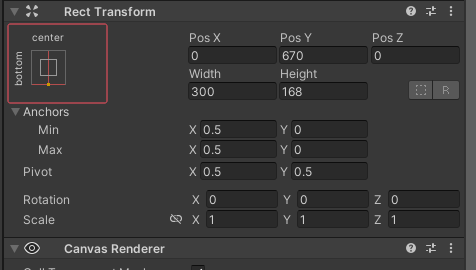

然后由于Start的先后顺序不一。忘了使用Invoke了，不过问题不大，毕竟Invoke虽然在Start之前调用，但是不同脚本之间，Invoke是否真的能在Start之前我就不确定了。

所以一开始在InitScreenSize.cs中修改屏幕大小，然后在BirdControoller计算暂停按钮的位置，但是由于脚本先后顺序原因，画面虽然调整了，但是Bird中获取到的暂停按钮的坐标是一开始调整之前的坐标，导致点击暂停按钮的计算出现错误，又不希望每次点击都反复计算暂停按钮所在的边框，所以将暂停按钮的坐标计算放在了InitScreenSize脚本中。

```csharp
using System.Collections;
using System.Collections.Generic;
using UnityEngine;
using UnityEngine.UI;

public class InitSceenSize : MonoBehaviour
{
    public RectTransform StartUI;
    public RectTransform GamingUI;
    public RectTransform FinishUI;

    private int screenWidth;
    private int screenHeight;

    public RectTransform pauseButtonRectTransform;

    private static float left;
    private static float right;
    private static float top;
    private static float bottom;

    void Start()
    {
        screenHeight = UnityEngine.Screen.height;
        screenWidth = UnityEngine.Screen.width;
        //int screen_min = Mathf.Min(screenHeight, screenWidth);
        //int screen_max = Mathf.Max(screenWidth, screenHeight);

        //GetComponent<CanvasScaler>().scaleFactor = screen_min / (float)1080;

        StartUI.sizeDelta = new Vector2(screenWidth, screenHeight);
        GamingUI.sizeDelta = new Vector2 (screenWidth, screenHeight);
        FinishUI.sizeDelta = new Vector2 (screenWidth, screenHeight);

        // 获取暂停按钮的世界坐标
        Vector3 buttonWorldPosition = pauseButtonRectTransform.position;

        // 获取暂停按钮的尺寸（宽度和高度）
        Vector2 buttonSize = pauseButtonRectTransform.rect.size;
        // 计算暂停按钮的四个边界位置
        left = buttonWorldPosition.x - buttonSize.x / 2;
        right = buttonWorldPosition.x + buttonSize.x / 2;
        top = buttonWorldPosition.y + buttonSize.y / 2;
        bottom = buttonWorldPosition.y - buttonSize.y / 2;

        //Debug.Log(pauseButtonRectTransform.position.y + "+" + pauseButtonRectTransform.rect.size.y / 2 + "=" + top);
    }

    public static bool ClickPause(Vector3 position)
    {
        if (position.x >= left && position.x <= right && position.y >= bottom && position.y <= top)
        {
            return true;
        }
        return false;
    }
}

```

## 参考链接

[【Unity游戏开发：Flappy Bird (01)】](https://www.bilibili.com/video/BV1Dy4y1T7sf/)

[这是全B站最还原的2025-02-12-FlappyBird飞翔的小鸟！2025-02-12-FlappyBird开发教学合集！](https://www.bilibili.com/video/BV1jK411V7V7/)

## 素材资源

https://github.com/GameDevStation/2025-02-12-FlappyBirdDemo/blob/main/2025-02-12-FlappyBirdTexture.rar

https://pan.baidu.com/s/1Mo8wZoTr9jjelMK-28b1Cw

素材我也放项目的Asset下备份了，以防两位的链接失效。

## 仓库链接

[MapleInori/2025-02-12-FlappyBird (github.com)](https://github.com/MapleInori/2025-02-12-FlappyBird)

## 闲话

梳理这种东西好累啊，感觉要考虑的东西好多，我还是太菜了呜呜，什么时候能成为大佬呢。

素材里还有菜单按钮和排行榜按钮和分享按钮，但是我没去补充这些东西，有点超过我这个菜鸟的能力。

应该没把什么搞错。
