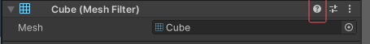

1. 运行模式下编辑器着色：修改编辑器在运行模式下的颜色以起到提示预警作用。

   - PlayModeTint：Edit->Preferences->Colors->Playmode tint
2. 复制和黏贴组件：巧用复制和黏贴组件来保留运行模式下本来即将要丢失的修改信息。

   - Copy changes from Playmode：在运行模式下移动或编辑组件，恢复到编辑模式前复制组件，然后回到编辑模式粘贴组件。
3. 单位快速对齐：将游戏对象按照一定的数量单位进行移动、缩放和旋转。

   - Unity Snapping：按住ctrl移动、缩放、旋转。
4. 顶点快速对齐：将游戏对象的任一顶点去重合另一个游戏对象的任一顶点。

   - Vertex Snapping：按住V然后移动。
5. 表面快速对齐：将游戏对象去贴合另一个游戏对象的碰撞体。

   - Surface Snapping：同时按住ctrl+shift再移动物体，可修改轴心或物体中心。
6. 网格快速对齐：将游戏对象对齐网格，以及如何开启自动网格快速对齐。

   - Grid Snapping：可修改global为local，点击All Axes是三个轴对齐，X,Y,Z是单个轴对齐。
   - 选中需要对其的物体：
   - 点击All Axes：
7. 网格显示和调整：控制场景窗口里作为视觉辅助的网格线，包括开启和关闭其显示，调整网格大小、颜色和透明度。

   - Show Grid：
8. 释放资源预览窗口：控制预览窗口，便于更好地观察资源。

   - Preview Window Undock：
   - 在Inspector下方，双击图片名称会收起来，再次双击出现：
   - 点击预览窗口三个点设置，点击Convert to Floating Window会成为独立窗口，关闭后回到右下角：
9. 场景视图中显示图标：视觉化原本看不见的游戏对象。

   - Custom icons for invisible Gameobject：
   - 添加图标，使得可以看到空的游戏对象，比如检查点，并且在游戏窗口依然看不见。
   - 
10. 场景视图中隐藏对象：在场景中隐藏游戏对象。

    - Scene Visibility：
    - 点击眼睛即可，不影响游戏窗口的渲染。
11. 场景视图中禁选对象：在场景中禁止选中游戏对象。

    - Object Picking：
    - 点击手指即可，使其在场景中无法选中，避免选中不想选的东西，在场景中点击时会穿过它，不影响Hierachy中的选中。
12. 场景视图中聚焦对象：将游戏对象显示在场景视图中央。

    - 选中对象，按F
    - 如果是移动的对象，按shift+f
13. 通过组件搜索对象：通过组件或附加的脚本来查找游戏对象。

    - Find objects by component name：在Hierarchy搜索栏中搜索使用了某个组件的游戏对象，需要输入正确且完整。
14. 通过标签搜索资源：给资源贴上标签，便于分类查找。

    - Search by Label：
    - 在Project窗口中按标签搜索资源，选中资源可以给它添加标签，一个资源可以有多个标签。
    - 可以手动输入，按回车即可添加，并不是只能添加列出来的标签。
15. 快速搜索：Quick Search：用Quick Search进行关于Unity的“各种搜”。

    - Window->Search->New Window（其他也差不多）：
    - 与Everything相似的搜索工具，可以搜（应该是当前项目）所有资源和设置所在。
16. 文档搜索捷径：如何快速链接到正确版本的Unity编辑器功能或工具包文档。

    - Documentation Shortcut：
    - 点击组件中的问号，立刻跳转到对应版本的文档。
    - 资源包则是在Package Manager中查看。
17. 新建脚本捷径：在检视窗口里快速新建脚本。

    - 在Add Component后直接输入要创建的脚本的名称即可。
18. 展收层级捷径：在层级窗口里快速进行查阅和整理。

    - Expand / Collapse all of the children：按住alt的时候在Hierarchy中点击展开三角，即可展开它以及它的所有子集，合上也是合上所有子集。
    - 当用Alt合上所有子集时，普通展开会发现子集中的子集是被合上的。
19. 摄像机摆位捷径：在场景视图和游戏视图里快速调整镜头。

    - Position Camera Easily：在预览场景中调整到合适的画面，选中摄像头，按ctrl+shift+f，可以立刻将摄像头调整为当前看到的画面。
    - 操作所在位置：GameObject->Align with view。
    - Align view to selected：在选中摄像头的情况下，快速定位到摄像头所看到的画面。
20. 快捷键管理器：了解Unity的预设快捷键信息或进行自定义快捷键设置。

    - Shortcuts Manager：Edit->ShortCuts

### 播放控制按钮

| 按钮名称        | 图片                                                                                                                                   | 快捷键       | 功能描述                                           |
| --------------- | -------------------------------------------------------------------------------------------------------------------------------------- | ------------ | -------------------------------------------------- |
| 播放 (Play)     |  | Ctrl+P       | 测试当前场景，在编辑器中实时试玩。                 |
| 暂停 (Pause)    | 同上                                                                                                                                   | Ctrl+Shift+P | 暂停Game窗口中的游戏，帮助发现视觉效果或体验问题。 |
| 单步执行 (Step) | 同上                                                                                                                                   | Ctrl+Alt+P   | 逐帧浏览暂停的场景，便于观察实时变化。             |

---

### 场景操作工具

| 工具名称                     | 图片                                                                                                                                  | 快捷键 | 功能描述                            |
| ---------------------------- | ------------------------------------------------------------------------------------------------------------------------------------- | ------ | ----------------------------------- |
| 手形工具 (Hand Tool)         |       | Q      | 移动场景视图，支持鼠标中键操作。    |
| 移动工具 (Move Tool)         |       | W      | 选择和移动游戏对象。                |
| 旋转工具 (Rotate Tool)       |     | E      | 选择和旋转游戏对象。                |
| 缩放工具 (Scale Tool)        |      | R      | 放大或缩小游戏对象。                |
| 矩形变换工具 (RectTransform) |  | T      | 结合移动、缩放、旋转，专用于2D/UI。 |
| 旋转/移动/缩放工具 (RMS)     |        | Y      | 结合移动、旋转、缩放，适合3D操作。  |

---

### 鼠标导航操作

| 操作         | 鼠标动作 | 按键辅助         | 功能描述                                         |
| ------------ | -------- | ---------------- | ------------------------------------------------ |
| 选择对象     | 左键单击 | 无               | 在场景中选择游戏对象。                           |
| 平移场景视图 | 中键拖动 | 无               | 使用手形工具移动摄像机。                         |
| 飞越模式     | 右键拖动 | W/A/S/D/Q/E 移动 | 旋转摄像机视角，并配合按键前后、左右、上下移动。 |

---

**备注**：按 **F** 键可快速聚焦所选对象（在 Hierarchy 中选择对象后，Scene 视图中按 F 使其居中）。
