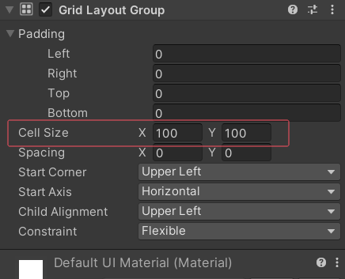
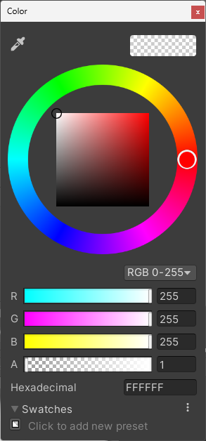
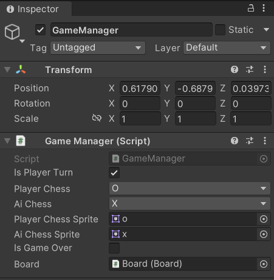
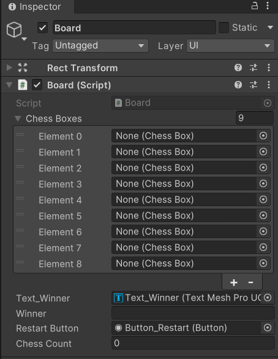
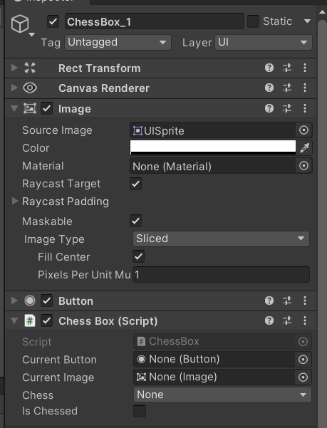

## Unity版本2022.3

## 场景布置


其中可以通过给Board对象添加Grid Layout Group，然后设置每个子物体所占宽高快速排整齐。用完删掉。每个落子的方格ChessBox都是一个Button。

根据Board的宽高除以三即可。

然后隐藏按钮，通过设置alpha值实现。

将ChessBox的Alpha值设置为1，如果是0-1的格式，设置为0.1即可，后续在代码里控制alpha值，让落子可以被看到。

看心情摆一摆就好了，然后是写代码放引用。

## 代码编写

### 棋子种类

```csharp
public enum Chess 
{
    None,
    X,
    O,
}
```

### 落子的九宫格

每个落子的方格都是一个Button，实现被点击的效果。可以加标识符拒绝再次点击，或者关闭button的交互。都行。

```csharp
using UnityEngine;
using UnityEngine.UI;

public class ChessBox : MonoBehaviour
{
    public Button currentButton;    // 当前脚本所在的按钮的引用
    public Image currentImage;      // 当前脚本所在的图片的引用
    public Chess chess;             // 当前格子的棋子
    public bool isChessed;          // 当前格子是否落子
    // Start is called before the first frame update
    void Start()
    {
        currentButton = GetComponent<Button>();
        currentButton.onClick.AddListener(DrawChess);
        currentImage = GetComponent<Image>();
        isChessed = false;
    }
}

```

其中CurrentButton和CurrentImage是预防需要反复getComponent写的，实际可以去掉，然后代码中用到的位置都用GetComponent。此处两个字段是引用，而非值类型，所以可以直接修改这两个字段实现修改组件内部的属性，避免使用Sprite sprite来控制Image的Sprite。如果通过保存Image的Sprite作为字段，此处sprite是值类型，不是引用，对它的修改不会应用到Image组件的Sprite参数。

```csharp
Sprite sprite;

    void Start()
    {
        sprite = GetComponent<Image>().sprite;
    }
```

这样后续修改sprite是无效的。

然后实现其中的落子函数，通过isChessed作为标识符判断是否可以落子，或者直接关闭按钮的交互，因为它是按钮。因为原本按钮是被设置为几乎不可见，所以落子后要重新设置alpha值，让他可见，R,G,B,A参数范围是0-1。

```csharp
// 落子
public void DrawChess()
{
    // 落子或游戏结束，直接返回，不处理
    if (isChessed || GameManager.Instance.isGameOver) return;

    if(GameManager.Instance.isPlayerTurn)
    {
        currentImage.sprite = GameManager.Instance.playerChessSprite;
        currentImage.color = new Color(1,1,1,1);
        chess = GameManager.Instance.playerChess;
    }
    else
    {
        currentImage.sprite = GameManager.Instance.aiChessSprite;
        currentImage.color = new Color(1, 1, 1, 1);
        chess = GameManager.Instance.aiChess;
    }
    isChessed = true;
    // 不用isChessed的话
    // currentButton.interactable = false;
    Board board = GetComponentInParent<Board>();
    board.OnChessBoxClicked(this);
}
```

落子后要让棋盘知道，所以这里使用的 `GetComponentInParent<Board>()`的方式。也可以给每个格子都像CurentButton那样保存对棋盘的引用。

这里暂时到这里。

### 棋盘

然后是棋盘的代码，判断游戏的进展之类的，还有重开。

实现格子落子时执行的棋盘的函数。

```csharp
using TMPro;
using UnityEngine;
using UnityEngine.UI;

public class Board : MonoBehaviour
{
    // 九个落子的格子
    public ChessBox[] chessBoxes = new ChessBox[9];
    // 获胜文本框
    public TextMeshProUGUI text_Winner;
    // 胜者
    public string winner;
    // 重开按钮
    public Button restartButton;
    // 落子数量
    public int chessCount;

    void Start()
    {
        chessCount = 0;
        chessBoxes = GetComponentsInChildren<ChessBox>();

        restartButton.onClick.AddListener(ReStart);
    }
    // 落子时调用
    public void OnChessBoxClicked(ChessBox chessBox)
    {
        chessCount++;
        if (CheckIfWin())
        {
            GameOver();
            return;
        }
        else if( chessCount == 9)   // 没赢但是满了
        {
            winner = "Nobody";
            GameOver();
            return;
        }
        GameManager.Instance.SwitchTurn();
    }
}

```

此处的pulic字段其实都应使用private，毕竟其他地方也不用，然后通过其他方式赋初值，写在Awake函数中，或者序列化私有字段。

就像这样。

```csharp
[SerializeField]private TextMeshProUGUI text_Winner;
```

这样可以在Unity中通过拖拽赋值，但是其他脚本访问不到。

每次落子后都要判断谁赢了或者是不是平局。

井字棋的获胜方式只有八种，即三行三列两个对角。
所以判断八种情况下的棋子有哪一种情况是相同的棋子，并且必须是其中一方的棋子，要避开初始情况下棋子全是None。

```csharp
// 检查是否获胜
public bool CheckIfWin()
{
    return ChessMatch(0, 1, 2) || ChessMatch(3, 4, 5) || ChessMatch(6, 7, 8) ||
           ChessMatch(0, 3, 6) || ChessMatch(1, 4, 7) || ChessMatch(2, 5, 8) ||
           ChessMatch(0, 4, 8) || ChessMatch(2, 4, 6);
}
// 棋子匹配检查，是否三连子
bool ChessMatch(int i, int j, int k)
{
    if(chessBoxes[i].chess == chessBoxes[j].chess && chessBoxes[j].chess == chessBoxes[k].chess )
    {
        if(chessBoxes[k].chess == GameManager.Instance.playerChess)
        {
            winner = "player";
            return true;
        }
        else if(chessBoxes[k].chess == GameManager.Instance.aiChess)
        {
            winner = "ai";
            return true;
        }
    }
    return false;
}
```

接下来是落子后如果游戏结束，显示文本和不允许落子即可。

```csharp
// 结束游戏,显示胜者
public void GameOver()
{
    text_Winner.text = $"{winner} is win!";
    GameManager.Instance.isGameOver = true;
    for (int i = 0; i < chessBoxes.Length; i++)
    {
        // 禁止所有格子落子
        chessBoxes[i].isChessed = true;
        // 不用isChessed的话
        // chessBoxes[i].GetComponent<Button>().interactable = false;
        // chessBoxes[i].currentButton.interactable = false;
    }
}
```

### 重新开始

让所有格子重置，所以棋盘上写：

```csharp
    // 清空棋盘状态，将上局最后一手设置为后手
    public void ReStart()
    {
        GameManager.Instance.isGameOver = false;
        for (int i = 0; i < chessBoxes.Length; i++)
        {
            chessBoxes[i].ReStart();
        }
        text_Winner.text = "gaming";
        GameManager.Instance.SwitchTurn();
    }
```

重置状态，alpha值要设置的小一些，不然会显示null的sprite是纯白的，会挡住背景，但不要设置为0，如果是0就点不到了。格子按钮上写：

```csharp
    public void ReStart()
    {
        isChessed = false;
        chess = Chess.None;
        currentImage.sprite = null;
        // 不用isChessed的话
        // GetComponent<Button>().interactable = true;
        currentImage.color = new Color(1, 1, 1, 0.01f);
    }
```

### GameManager

存一堆到处用的东西？大概吧。

```csharp
public class GameManager : MonoBehaviour
{
    public bool isPlayerTurn;   // 是否是玩家回合
    public Chess playerChess;   // 玩家棋子
    public Chess aiChess;       // ai棋子
    public Sprite playerChessSprite;    // 玩家的棋子精灵
    public Sprite aiChessSprite;        // ai的棋子精灵
    public bool isGameOver;             // 游戏是否已结束

    public Board board;     // 棋盘引用

    public static GameManager Instance { get; private set; }


    private void Awake()
    {
        // 不切换场景，这样就够了
        if (Instance == null)
        {
            Instance = this;
        }
        // 初始化状态
        isPlayerTurn = true;
        isGameOver = false;
        board = FindObjectOfType<Board>();
    }
```

在Inspector中给了Board引用后，其中的 `FindObjectOfType<Board>()`可以删除。

切换回合，很简单，如果不写AI行为，那AI其实算是P2。

```csharp
// 切换回合
public void SwitchTurn()
{
    isPlayerTurn = !isPlayerTurn;
    // 如果是 AI 的回合，调用 AI 落子逻辑
    if (!isPlayerTurn && !isGameOver)
    {
        AIPlay();
    }
}
```

### AI行为--基于规则的AI

由于井字棋很简单，所以AI的逻辑也很简单，如果玩家能赢，那就堵，如果AI能赢，那就填，不然随便放，也可以加一步，如果AI先手，即场上全空，那优先抢中间。

```csharp
    // 获取没落子的空位置
    private ChessBox[] GetEmptyChessBoxes()
    {
        // 获取所有 ChessBox
        ChessBox[] allBoxes = FindObjectsOfType<ChessBox>();

        // 过滤出空的 ChessBox
        List<ChessBox> emptyBoxes = new List<ChessBox>();
        foreach (ChessBox box in allBoxes)
        {
            if (box.chess == Chess.None)
            {
                emptyBoxes.Add(box);
            }
        }

        return emptyBoxes.ToArray();
    }
    // AI行为
    private void AIPlay()
    {
        ChessBox[] emptyBoxes = GetEmptyChessBoxes();

        //if(emptyBoxes.Length == 9)
        //{
        //    Board board = FindObjectOfType<Board>();
        //    board.chessBoxes[4].DrawChess();
        //    return;
        //}

        if (emptyBoxes.Length > 0)
        {
            // 检查是否有可以立即获胜的位置
            ChessBox winningBox = FindWinningBox(aiChess, emptyBoxes);
            if (winningBox != null)
            {
                winningBox.DrawChess();
                return;
            }

            // 检查玩家是否有即将获胜的位置
            ChessBox blockingBox = FindWinningBox(playerChess, emptyBoxes);
            if (blockingBox != null)
            {
                blockingBox.DrawChess();
                return;
            }

            // 随机选择一个空的位置
            int randomIndex = Random.Range(0, emptyBoxes.Length);
            ChessBox selectedBox = emptyBoxes[randomIndex];
            selectedBox.DrawChess();
        }
    }
    // 寻找可以获胜的格子
    private ChessBox FindWinningBox(Chess targetChess, ChessBox[] emptyBoxes)
    {
        foreach (ChessBox box in emptyBoxes)
        {
            // 模拟落子
            box.chess = targetChess;

            // 检查是否获胜
            if (board.CheckIfWin())
            {
                // 恢复 ChessBox 状态
                box.chess = Chess.None;
                return box;
            }

            // 恢复 ChessBox 状态
            box.chess = Chess.None;
        }

        return null;
    }
```

## 最后

在每次重开后，切换回合是为了避免上一局最后是玩家，那么玩家落子后就是AI了，而没有写AI先手。

可以改为重置为玩家回合，或者给Restart里写如果是AI那就执行一次AIplay。

直接执行切换回合，不仅使上一局最后一手为后手，还同时检测了是谁，如果是AI那就落子，如果是玩家那就玩家落子，同时做到了开局可以是玩家也可以是AI。

其实反正小东西，无脑public的好处是写得少，还能直接在Inspector里看情况，如果真需要调用，不用回来重新改private为public。

## 最后一点截图，场景中的引用



## 参考链接

[Unity tutorial - How to make Tic Tac Toe game [ Part 1 ] ](https://www.youtube.com/watch?v=t6rrTYR221w)

[Unity tutorial - How to make Tic Tac Toe game [ Part 2 ] ](https://www.youtube.com/watch?v=nRlf47js_lE&t=2s)
