## **开发环境配置**

### Unity版本2022.3

### 创建Photon账号以及申请Photon中国区服务

官网申请账号：[Multiplayer Game Development Made Easy  Photon Engine](https://www.photonengine.com/)

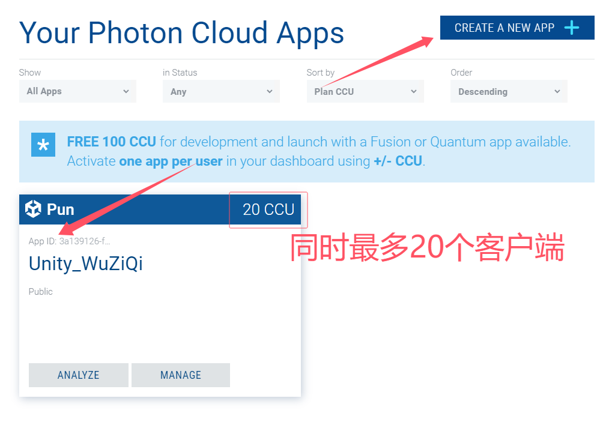

中国区服务： [光子引擎photonengine中文站 成都动联无限科技有限公司(vibrantlink.com)](https://vibrantlink.com/)

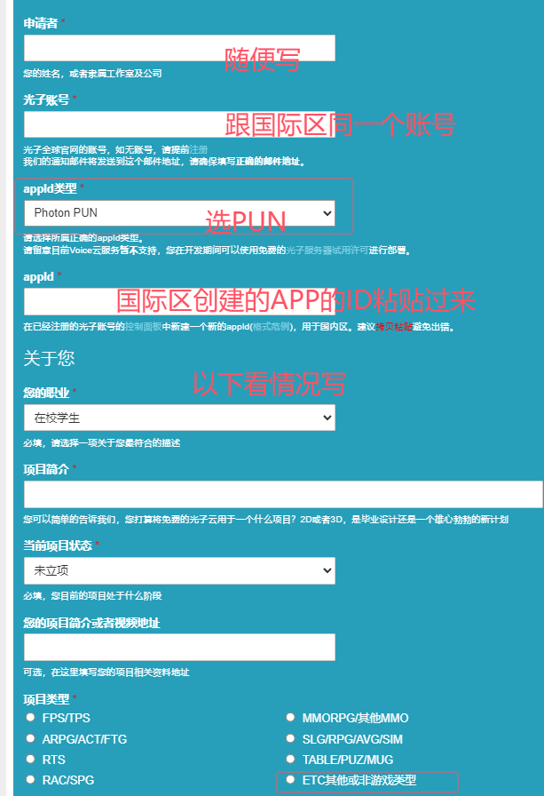

### 导入PUN2插件以及配置

Unity商城地址： [PUN 2 - FREE  网络  Unity Asset Store](https://assetstore.unity.com/packages/tools/network/pun-2-free-119922)

导入PUN2的时候会有一个填写APPID或者邮箱的窗口，跳过就行。

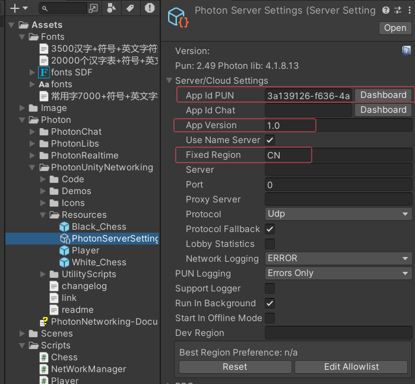

App ID PUN 在申请Photon服务器的时候会有，以及在申请中国区服务的时候邮箱里也会有。

App Version 应该不写也没事。

Fixed Region 填写CN。

修改代码  `Assets/Photon/PhotonRealtime/Code/LoadBalancingClient.cs` 

将上方一行改为下方一行。

```csharp
// public string NameServerHost = "ns.photonengine.io";
public string NameServerHost = "ns.photonengine.cn";
```

## 构建场景 制作联网的游戏对象预制体

### 资源处理

随便找三张图凑合一下，将图片修改为Sprite。由于图片自带阴影的问题，枢轴不在棋子中心，稍微调整一下。

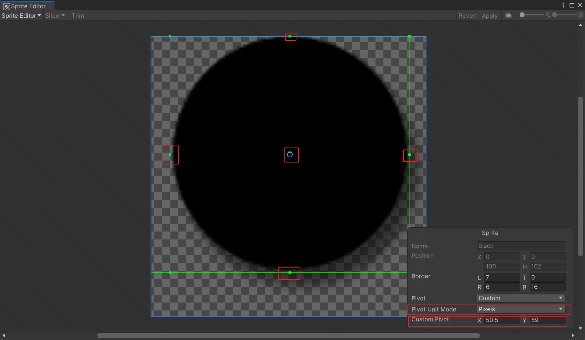

调整边框，改为像素模式，然后将蓝色圆圈（枢轴）移动到上下左右四个中心点，观察右下角X,Y的值，求和除以2即是中心点。

将棋盘棋子放入场景中调整为合适大小，棋子大小0.4看起来还行，通过对齐两个棋子在棋盘网格上时的枢轴，得出棋盘网格大小为0.35。

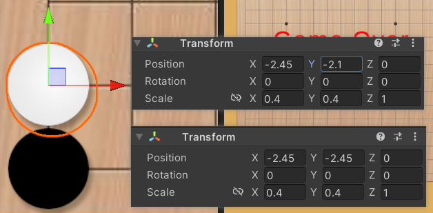

### 其他设置

如果创建的是3D项目，需要改相机的设置。

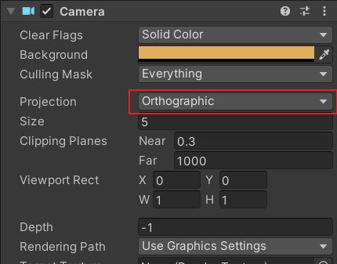

一定要改为Orthographic，不然鼠标点击时位置处理会出问题。

游戏场景大小设置为480*800（其他也行，场景中物体的大小适当改改就行，还有坐标计算时的零点会不一样）：

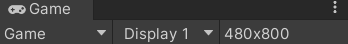

创建Player游戏对象（空对象），黑棋白棋游戏对象（将棋子图片拖拽进场景即可），将棋子的Order In Layer 设置的比棋盘大，确保棋子渲染在上层，不被遮挡。

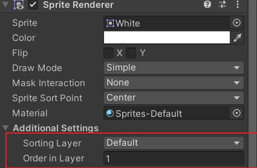

给Player，棋子，添加Photon View组件：Player不做处理，棋子额外设置

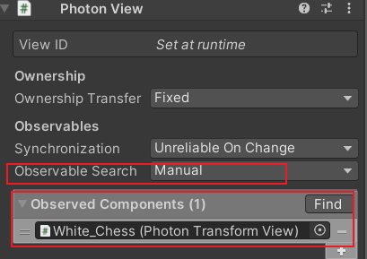

将Observable Search设置为Manual，并将他们的Transform拖拽到Observed Components中。此设置为同步棋子的transform组件，后边在生成棋子的时候让两边客户端的棋子位置一致。

将Player和黑白棋子保存到Resources中保存为预制体（Prefab），存在这个位置才能让PUN来控制生成需要的游戏对象，并且确保PUN在通知各个客户端生成游戏对象时物体信息的统一。

## 核心功能实现

### Chess.cs

```csharp
using UnityEngine;
using Photon.Pun;

// 棋子类型枚举，黑色或白色
public enum ChessType { Black,White}

public class Chess : MonoBehaviour
{
    public int row; // 棋子所在行
    public int column;  // 棋子所在列
    public ChessType chessType = ChessType.Black;   // 棋子类型

    [PunRPC]
    public void SetPositionInfo(int[] rowColumn)
    {
        row = rowColumn[0];
        column = rowColumn[1];
    }
}
```

给棋子添加脚本Chess.cs。我习惯了Chess，准确翻译应该是Piece。

然后给白棋预制体设置默认为白棋，

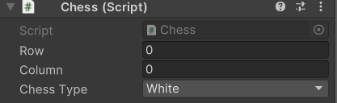

### Player.cs

给玩家添加Player.cs脚本。如果在场景中给Player添加脚本，记得覆盖修改到预制体。

玩家落子时通过坐标计算位置，所以需要有一个坐标轴，这里以棋盘左下角为原点，通过之前处理棋子时得知棋盘左下角的坐标是（-2.45，-2.45，0），还有格子宽度为0.35，所以玩家脚本保存这些信息。

首先要确保游戏开始，并且只能控制自己。（这里判断是否所有人都准备的代码应该有更合适的写法，不应该每次update都Find一遍所有Player，似乎可以利用NetWorkManager中的字典，查一个最多只有两个键值对的字典一定比在场景中FindObjectsOfType遍历一遍所有游戏对象快，懒得改了，算了。）

```csharp
// 只允许控制自己的玩家对象
if (!photonView.IsMine) return;
// 检查是否轮到当前玩家回合
if (netWorkManager.playerTurn != chessType) return;
// 验证所有玩家是否都已准备
var players = GameObject.FindObjectsOfType<Player>();
foreach (var player in players)
{
    if (player.playerState != PlayerState.Ready) return;
}
// 更新游戏状态为开始
netWorkManager.gameState = GameState.Start;
// 游戏未开始时禁止操作
if (netWorkManager.gameState != GameState.Start) return;
```

计算正确的落子位置，（棋子的保存也许应该保存在一个15*15的二维表中，那样同样能避免反复执行FindObjectsOfType遍历所有棋子，棋子中的RPC可以删掉，然后在Player写一个RPC同步二维表情况）

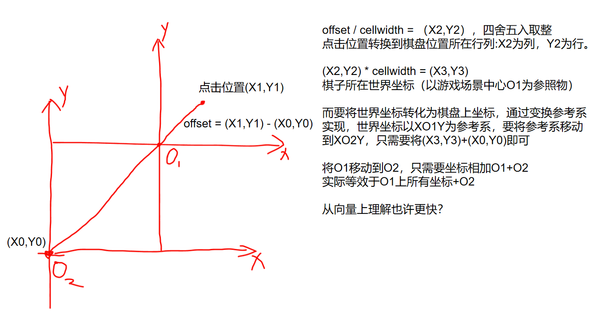

```csharp
// 将屏幕坐标转换为世界坐标
mousePos = Camera.main.ScreenToWorldPoint(Input.mousePosition);
// 计算相对于棋盘原点的偏移量
offset = mousePos - zeroPosition;

// 计算点击的棋盘行列号
column = (int)Mathf.Round(offset.x / cellWidth);  // X轴对应列号
row = (int)Mathf.Round(offset.y / cellWidth);     // Y轴对应行号
rowColumn[0] = row;  // 存储为数组[行,列]
rowColumn[1] = column;

// 落子合法性验证 ------------------------
// 边界检查（15x15棋盘）
if (row < 0 || row > 14 || column < 0 || column > 14) return;
// 检查是否已有棋子
chessList = GameObject.FindObjectsOfType<Chess>().ToList();
foreach (var chess in chessList)
{
    if (chess.row == row && chess.column == column) return;
}

// 计算棋子生成的世界坐标
generatePos = new Vector3(
    column * cellWidth,  // X轴位置 = 列号 * 格宽
    row * cellWidth,     // Y轴位置 = 行号 * 格宽 
    0) + zeroPosition;   // 加上棋盘原点偏移

// 生成棋子对象 --------------------------
Chess currentChess = null;
if (chessType == ChessType.Black && blackChess != null)
{
    // 生成黑棋并同步
    newChess = PhotonNetwork.Instantiate(blackChess.name, generatePos, Quaternion.identity);
    newChess.GetComponent<PhotonView>().RPC("SetPositionInfo", RpcTarget.All, rowColumn);
    currentChess = newChess.GetComponent<Chess>();
}
else if (whiteChess != null)
{
    // 生成白棋并同步
    newChess = PhotonNetwork.Instantiate(whiteChess.name, generatePos, Quaternion.identity);
    newChess.GetComponent<PhotonView>().RPC("SetPositionInfo", RpcTarget.All, rowColumn);
    currentChess = newChess.GetComponent<Chess>();
}
```

RPC方式同步不同客户端棋子的行列值，在Player中调用了Chess.cs的代码来设置棋子所在的行列。

```csharp
newChess.GetComponent<PhotonView>().RPC("SetPositionInfo", RpcTarget.All, rowColumn);
```

```csharp
using System.Collections.Generic;
using UnityEngine;
using Photon.Pun;
using System.Linq;

// 玩家状态枚举：未准备/已准备
public enum PlayerState
{
    NotReady,
    Ready
}

public class Player : MonoBehaviour
{
    // 棋盘相关参数
    public Vector3 zeroPosition;    // 棋盘左下角原点坐标（世界坐标系）
    public float cellWidth;         // 每个棋格宽度（世界单位）
    public ChessType chessType = ChessType.Black;   // 玩家棋子颜色（黑/白）
    private List<Chess> chessList = new List<Chess>();   // 已放置棋子列表

    // 网络组件
    [HideInInspector]public PhotonView photonView;  // 当前玩家对象的PhotonView组件
    private NetWorkManager netWorkManager;          // 场景中的网络管理器

    // 棋子放置相关变量
    private Vector3 generatePos;    // 棋子生成位置（世界坐标）
    private int row;                // 当前点击位置的行号（0-14）
    private int column;             // 当前点击位置的列号（0-14）
    private int[] rowColumn = new int[2];   // 行列号的数组形式（用于RPC参数）

    // 输入计算相关
    private Vector3 mousePos;   // 鼠标点击位置（屏幕坐标系）
    private Vector3 offset;     // 点击位置相对于棋盘原点的偏移量

    // 棋子预制体
    public GameObject blackChess;   // 黑棋预制体
    public GameObject whiteChess;   // 白棋预制体
    private GameObject newChess;    // 最新生成的棋子对象

    // 玩家状态
    public PlayerState playerState = PlayerState.NotReady;  // 玩家准备状态

    void Start()
    {
        photonView = GetComponent<PhotonView>();
        netWorkManager = GameObject.FindObjectOfType<NetWorkManager>();
        // 初始化玩家UI显示
        if (photonView.IsMine)
        {
            netWorkManager.SetSelfText(chessType);
        }
        else
        {
            netWorkManager.SetHostilefText(chessType);
        }

        // 注册玩家到网络管理器
        Photon.Realtime.Player photonPlayer = photonView.Owner;
        netWorkManager.RegisterPlayer(photonPlayer.ActorNumber, this);
    }

    void Update()
    {
        // 玩家控制权验证 --------------------------
        // 只允许控制自己的玩家对象
        if (!photonView.IsMine) return;
        // 检查是否轮到当前玩家回合
        if (netWorkManager.playerTurn != chessType) return;
        // 验证所有玩家是否都已准备
        var players = GameObject.FindObjectsOfType<Player>();
        foreach (var player in players)
        {
            if (player.playerState != PlayerState.Ready) return;
        }
        // 更新游戏状态为开始
        netWorkManager.gameState = GameState.Start;
        // 游戏未开始时禁止操作
        if (netWorkManager.gameState != GameState.Start) return;

        // 鼠标点击处理 ------------------------------
        if (Input.GetMouseButtonDown(0))
        {
            // 坐标转换计算 --------------------------
            // 将屏幕坐标转换为世界坐标
            mousePos = Camera.main.ScreenToWorldPoint(Input.mousePosition);
            // 计算相对于棋盘原点的偏移量
            offset = mousePos - zeroPosition;

            // 计算点击的棋盘行列号
            column = (int)Mathf.Round(offset.x / cellWidth);  // X轴对应列号
            row = (int)Mathf.Round(offset.y / cellWidth);     // Y轴对应行号
            rowColumn[0] = row;  // 存储为数组[行,列]
            rowColumn[1] = column;

            // 落子合法性验证 ------------------------
            // 边界检查（15x15棋盘）
            if (row < 0 || row > 14 || column < 0 || column > 14) return;
            // 检查是否已有棋子
            chessList = GameObject.FindObjectsOfType<Chess>().ToList();
            foreach (var chess in chessList)
            {
                if (chess.row == row && chess.column == column) return;
            }

            // 计算棋子生成的世界坐标
            generatePos = new Vector3(
                column * cellWidth,  // X轴位置 = 列号 * 格宽
                row * cellWidth,     // Y轴位置 = 行号 * 格宽 
                0) + zeroPosition;   // 加上棋盘原点偏移

            // 生成棋子对象 --------------------------
            Chess currentChess = null;
            if (chessType == ChessType.Black && blackChess != null)
            {
                // 生成黑棋并同步
                newChess = PhotonNetwork.Instantiate(blackChess.name, generatePos, Quaternion.identity);
                newChess.GetComponent<PhotonView>().RPC("SetPositionInfo", RpcTarget.All, rowColumn);
                currentChess = newChess.GetComponent<Chess>();
            }
            else if (whiteChess != null)
            {
                // 生成白棋并同步
                newChess = PhotonNetwork.Instantiate(whiteChess.name, generatePos, Quaternion.identity);
                newChess.GetComponent<PhotonView>().RPC("SetPositionInfo", RpcTarget.All, rowColumn);
                currentChess = newChess.GetComponent<Chess>();
            }

            // 游戏逻辑处理 --------------------------
            // 播放落子音效
            netWorkManager.GetComponent<PhotonView>().RPC("PlayMarkingAudio", RpcTarget.All);

            // 胜负判定
            chessList = GameObject.FindObjectsOfType<Chess>().ToList();
            bool isFive = JudgeFiveChess(chessList, currentChess);
            if (isFive)
            {
                // 游戏结束处理
                netWorkManager.GetComponent<PhotonView>().RPC("GameOver", RpcTarget.All, currentChess.chessType);
                netWorkManager.GetComponent<PhotonView>().RPC("ReSetGame", RpcTarget.All);
                return;
            }

            // 切换回合
            netWorkManager.GetComponent<PhotonView>().RPC("ChangeTurn", RpcTarget.All);
        }
    }

    /// <summary>
    /// 获取当前玩家的可序列化状态数据（用于网络同步）
    /// </summary>
    /// <returns>
    /// 返回包含玩家关键状态的对象数组：
    /// [0] ChessType - 棋子颜色类型
    /// [1] PlayerState - 玩家准备状态
    /// </returns>
    public object[] GetPlayerState()
    {
        return new object[] {
        chessType,       // 玩家当前棋子颜色（Black/White）
        playerState      // 玩家准备状态（NotReady/Ready）
    };
    }

    /// <summary>
    /// [PunRPC] 设置玩家棋子类型（网络同步方法）
    /// </summary>
    [PunRPC]
    public void SetChessType(ChessType type)
    {
        chessType = type;  // 设置当前玩家棋子颜色
    }

    /// <summary>
    /// [PunRPC] 设置玩家准备状态（网络同步方法）
    /// </summary>
    /// <remarks>
    /// 执行流程：
    /// 1. 修改本地玩家准备状态
    /// 2. 更新Photon网络自定义属性（自动同步到其他客户端）
    /// 3. 更新本地和对手的UI显示
    /// </remarks>
    [PunRPC]
    public void SetPlayerReady()
    {
        // 修改本地状态为已准备
        playerState = PlayerState.Ready;

        // 设置Photon自定义属性（自动同步到所有客户端）
        ExitGames.Client.Photon.Hashtable props = new ExitGames.Client.Photon.Hashtable
    {
        { "IsReady", true }  // 使用Hashtable键值对存储准备状态
    };
        PhotonNetwork.LocalPlayer.SetCustomProperties(props); // 触发OnPlayerPropertiesUpdate回调

        // 更新UI显示
        if (photonView.IsMine)
        {
            // 更新自己的准备状态显示
            netWorkManager.selfReadyText.text = "已准备";
        }
        else
        {
            // 更新对手的准备状态显示
            netWorkManager.hostileReadyText.text = "已准备";
        }
    }

    /// <summary>
    /// 判断是否形成五子连珠（核心胜负判定算法）
    /// </summary>
    /// <param name="chessList">棋盘上所有棋子列表</param>
    /// <param name="currentChess">当前刚落下的棋子</param>
    /// <returns>true表示五子连珠达成，false表示未达成</returns>
    /// <remarks>
    /// 检测逻辑：
    /// 1. 筛选出当前玩家颜色的所有棋子
    /// 2. 从当前棋子出发，向8个方向递归检测连续棋子
    /// 3. 合并相反方向的棋子数量，判断是否达到5连
    /// </remarks>
    bool JudgeFiveChess(List<Chess> chessList, Chess currentChess)
    {
        bool result = false;
        // 筛选当前玩家颜色的棋子（优化点：可缓存此列表避免重复筛选）
        List<Chess> currentChessTypeList = chessList.Where(en => en.chessType == chessType).ToList();

        // 八方向检测（实际只需四个轴线方向的检测）
        List<Chess> upList = GetSameChessByDirection(currentChessTypeList, currentChess, ChessDirection.Up);     // 正上方
        List<Chess> downList = GetSameChessByDirection(currentChessTypeList, currentChess, ChessDirection.Down); // 正下方
        List<Chess> leftList = GetSameChessByDirection(currentChessTypeList, currentChess, ChessDirection.Left); // 正左方
        List<Chess> rightList = GetSameChessByDirection(currentChessTypeList, currentChess, ChessDirection.Right);// 正右方
        List<Chess> leftUpList = GetSameChessByDirection(currentChessTypeList, currentChess, ChessDirection.LeftUp);    // 左上方
        List<Chess> rightDownList = GetSameChessByDirection(currentChessTypeList, currentChess, ChessDirection.RightDown);// 右下方
        List<Chess> leftDownList = GetSameChessByDirection(currentChessTypeList, currentChess, ChessDirection.LeftDown);  // 左下方
        List<Chess> rightUpList = GetSameChessByDirection(currentChessTypeList, currentChess, ChessDirection.RightUp);    // 右上方

        // 四轴线胜负判定（垂直/水平/左上右下斜线/左下右上斜线）
        if (upList.Count + downList.Count + 1 >= 5 ||          // 垂直方向（当前棋子+上方+下方）
           leftList.Count + rightList.Count + 1 >= 5 ||        // 水平方向（当前棋子+左方+右方）
           leftUpList.Count + rightDownList.Count + 1 >= 5 ||  // 主斜线（当前棋子+左上方+右下方）
           leftDownList.Count + rightUpList.Count + 1 >= 5)    // 副斜线（当前棋子+左下方+右上方）
        {
            result = true;
        }

        return result;
    }

    /// <summary>
    /// 递归获取指定方向上的连续同色棋子（深度优先搜索）
    /// </summary>
    /// <param name="currentChessTypeList">当前玩家颜色的所有棋子</param>
    /// <param name="currentChess">当前检测的基准棋子</param>
    /// <param name="direction">检测方向（八方向枚举）</param>
    /// <returns>沿指定方向的连续棋子列表（不包含当前棋子）</returns>
    /// <remarks>
    /// 实现原理：
    /// 1. 根据方向参数确定相邻棋子的行列偏移量
    /// 2. 递归检测相邻棋子的相邻棋子
    /// 3. 注意：递归深度最大为4层（五子棋规则）
    /// </remarks>
    List<Chess> GetSameChessByDirection(List<Chess> currentChessTypeList, Chess currentChess, ChessDirection direction)
    {
        List<Chess> result = new List<Chess>();

        switch (direction)
        {
            case ChessDirection.Up: // 正上方检测（行号+1，列号不变）
                foreach (Chess item in currentChessTypeList)
                {
                    if (item.row == currentChess.row + 1 && item.column == currentChess.column)
                    {
                        result.Add(item);
                        // 递归检测更上方的棋子
                        result.AddRange(GetSameChessByDirection(currentChessTypeList, item, ChessDirection.Up));
                    }
                }
                break;
            case ChessDirection.Down: // 正下方检测（行号-1，列号不变）
                foreach (Chess item in currentChessTypeList)
                {
                    if (item.row == currentChess.row - 1 && item.column == currentChess.column)
                    {
                        result.Add(item);
                        result.AddRange(GetSameChessByDirection(currentChessTypeList, item, ChessDirection.Down));
                    }
                }
                break;
            case ChessDirection.Left: // 正左方检测（列号-1，行号不变）
                foreach (Chess item in currentChessTypeList)
                {
                    if (item.row == currentChess.row && item.column == currentChess.column - 1)
                    {
                        result.Add(item);
                        result.AddRange(GetSameChessByDirection(currentChessTypeList, item, ChessDirection.Left));
                    }
                }
                break;
            case ChessDirection.Right: // 正右方检测（列号+1，行号不变）
                foreach (Chess item in currentChessTypeList)
                {
                    if (item.row == currentChess.row && item.column == currentChess.column + 1)
                    {
                        result.Add(item);
                        result.AddRange(GetSameChessByDirection(currentChessTypeList, item, ChessDirection.Right));
                    }
                }
                break;
            case ChessDirection.LeftUp: // 左上方检测（行号+1，列号-1）
                foreach (Chess item in currentChessTypeList)
                {
                    if (item.row == currentChess.row + 1 && item.column == currentChess.column - 1)
                    {
                        result.Add(item);
                        result.AddRange(GetSameChessByDirection(currentChessTypeList, item, ChessDirection.LeftUp));
                    }
                }
                break;
            case ChessDirection.RightDown: // 右下方检测（行号-1，列号+1）
                foreach (Chess item in currentChessTypeList)
                {
                    if (item.row == currentChess.row - 1 && item.column == currentChess.column + 1)
                    {
                        result.Add(item);
                        result.AddRange(GetSameChessByDirection(currentChessTypeList, item, ChessDirection.RightDown));
                    }
                }
                break;
            case ChessDirection.LeftDown: // 左下方检测（行号-1，列号-1）
                foreach (Chess item in currentChessTypeList)
                {
                    if (item.row == currentChess.row - 1 && item.column == currentChess.column - 1)
                    {
                        result.Add(item);
                        result.AddRange(GetSameChessByDirection(currentChessTypeList, item, ChessDirection.LeftDown));
                    }
                }
                break;
            case ChessDirection.RightUp: // 右上方检测（行号+1，列号+1）
                foreach (Chess item in currentChessTypeList)
                {
                    if (item.row == currentChess.row + 1 && item.column == currentChess.column + 1)
                    {
                        result.Add(item);
                        result.AddRange(GetSameChessByDirection(currentChessTypeList, item, ChessDirection.RightUp));
                    }
                }
                break;
        }

        return result;
    }
}

// 棋子寻找方向
public enum ChessDirection
{
    Up,
    Down,
    Left,
    Right,
    LeftUp,
    RightDown,
    LeftDown,
    RightUp
}
```

### NetWorkManager.cs

场景中创建空对象，命名为NetWokManager并添加NetWokManager.cs。

编写NetWokManager.cs，继承于MonoBehaviourPunCallbacks

在NetWorkManager中生成玩家：通过RPC的方式设置玩家的棋子类型，能让两边客户端同步，如果使用 `newPlayer.GetComponent<Player>``().chessType = ChessType.Black;`这种方式设置，只会在本地设置棋子类型。

比如当前默认玩家棋子类型是黑棋，A创建并进入房间后，将自己设置为黑棋，B进入房间后将自己设置为白棋。

在A客户端，B依旧是默认的黑棋，因为B修改自身棋子类型只在本地运行，

在B客户端，A是默认的黑棋，B是设置后的白棋，B客户端看起来正确只是因为刚好默认的是对的，而A客户端是错误的。

而RPC方式调用，参数RpcTarget.All，是让所有客户端都执行 `SetChessType`方法，所以这里其实主要是后进来的玩家需要通过RPC让两边都执行 `SetChessType`方法，将后来的玩家设置为白棋。

```csharp
using System.Collections.Generic;
using UnityEngine;
using Photon.Pun;
using Photon.Realtime;
using TMPro;
using System.Linq;


/// <summary>
/// 游戏状态枚举（对应游戏流程阶段）
/// </summary>
public enum GameState
{
    Ready = 1,     // 准备阶段（玩家未准备）
    Start = 2,     // 游戏进行阶段（双方已准备）
    GameOver = 3   // 游戏结束阶段（已分出胜负）
}


/// <summary>
/// 网络管理核心类（继承Photon回调接口）
/// 功能：处理网络连接、玩家管理、游戏状态同步
/// </summary>
public class NetWorkManager : MonoBehaviourPunCallbacks
{
    // 玩家预制体配置
    public GameObject player;   // 玩家角色预制体（需提前拖拽赋值）

    // 游戏回合控制
    public ChessType playerTurn = ChessType.Black;  // 当前回合玩家棋子类型（默认黑方先手）

    // 游戏状态管理
    public GameState gameState = GameState.Ready;   // 当前游戏状态

    // UI组件绑定
    public TextMeshProUGUI readyText;        // 准备按钮文本组件
    public TextMeshProUGUI selfChessText;    // 显示本机玩家棋子类型的文本
    public TextMeshProUGUI selfReadyText;    // 本机玩家准备状态文本
    public TextMeshProUGUI hostileChessText; // 显示对手棋子类型的文本
    public TextMeshProUGUI hostileReadyText; // 对手准备状态文本
    public TextMeshProUGUI turnText;         // 回合提示文本
    public TextMeshProUGUI gameOverText;     // 游戏结束提示文本
    public TextMeshProUGUI winText;          // 胜利者显示文本


    // 音效组件
    public AudioSource markingAudio;    // 落子音效组件

    // 玩家映射表（维护Photon玩家与本地Player实例的关系）
    // Key: Photon Player的ActorNumber, Value: 对应的MyGame.Player实例
    private Dictionary<int, Player> photonPlayerToLocalPlayer = new Dictionary<int, Player>();


    /// <summary>
    /// 注册玩家映射关系，用于当生成玩家对象时记录映射
    /// </summary>
    /// <param name="actorNumber">Photon玩家的唯一标识</param>
    /// <param name="localPlayer">对应的本地Player实例</param>
    public void RegisterPlayer(int actorNumber, Player localPlayer)
    {
        photonPlayerToLocalPlayer[actorNumber] = localPlayer;
    }

    void Start()
    {
        SetUIState();   // 初始化UI状态
        PhotonNetwork.ConnectUsingSettings(); // 连接到Photon云服务
    }

    /// <summary>
    /// 成功连接Photon主服务器回调
    /// 触发时机：完成网络握手并连接到区域服务器
    /// </summary>
    public override void OnConnectedToMaster()
    {
        base.OnConnectedToMaster();
        Debug.Log("成功连接至Photon主服务器");

        // 配置房间参数
        RoomOptions roomOptions = new RoomOptions();
        roomOptions.MaxPlayers = 2; // 设置最大玩家数为2（五子棋双人对战）

        // 加入或创建房间（房间名"WuZiQi"，类型为默认大厅）
        PhotonNetwork.JoinOrCreateRoom("WuZiQi", roomOptions, TypedLobby.Default);
    }

    /// <summary>
    /// 成功加入房间回调
    /// 触发时机：本地玩家加入指定房间后
    /// </summary>
    public override void OnJoinedRoom()
    {
        base.OnJoinedRoom();
        Debug.Log("成功加入房间，当前房间人数：" + PhotonNetwork.CurrentRoom.PlayerCount);

        // 安全检查：确保玩家预制体已配置
        if (player == null)
        {
            Debug.LogError("玩家预制体未配置！");
            return;
        }

        // 实例化网络玩家对象（在所有客户端同步生成）
        GameObject newPlayer = PhotonNetwork.Instantiate(player.name, Vector3.zero, Quaternion.identity);

        // 房主设置棋子颜色并同步
        if (PhotonNetwork.IsMasterClient)
        {
            // 使用RPC同步黑棋设置（All表示所有客户端执行）
            newPlayer.GetComponent<PhotonView>().RPC(
                "SetChessType",
                RpcTarget.All,
                ChessType.Black
            );
        }
        else
        {
            // 非房主设置白棋
            newPlayer.GetComponent<PhotonView>().RPC(
                "SetChessType",
                RpcTarget.All,
                ChessType.White
            );
        }
    }


    /// <summary>
    /// [PunRPC] 切换回合控制权（网络同步方法）
    /// </summary>
    /// <remarks>
    /// 在所有客户端同步更新回合状态和UI提示
    /// </remarks>
    [PunRPC]
    public void ChangeTurn()
    {
        // 切换当前回合玩家颜色
        playerTurn = playerTurn == ChessType.Black ? ChessType.White : ChessType.Black;
        // 更新回合提示文本
        turnText.text = playerTurn == ChessType.Black ? "请黑方落子" : "请白方落子";
    }

    /// <summary>
    /// [PunRPC] 游戏结束处理（网络同步方法）
    /// </summary>
    /// <param name="winChessType">胜利方棋子颜色</param>
    /// <remarks>
    /// 会在所有客户端显示游戏结束界面
    /// </remarks>
    [PunRPC]
    public void GameOver(ChessType winChessType)
    {
        // 更新游戏状态
        gameState = GameState.GameOver;

        // 安全检查UI组件引用
        if (gameOverText)
        {
            // 显示游戏结束界面
            gameOverText.gameObject.SetActive(true);
            gameOverText.text = "Game Over";
            // 设置胜利者文本
            winText.text = winChessType == ChessType.Black ? "黑方获胜" : "白方获胜";
        }
    }

    /// <summary>
    /// [PunRPC] 重置游戏到初始状态（网络同步方法）
    /// </summary>
    /// <remarks>
    /// 1. 重置UI状态
    /// 2. 重置所有玩家准备状态
    /// 3. 恢复默认回合顺序
    /// </remarks>
    [PunRPC]
    public void ReSetGame()
    {
        // 重置准备相关UI
        readyText.text = "准备";
        selfReadyText.text = "未准备";
        hostileReadyText.text = "未准备";

        // 重置所有玩家状态
        List<Player> players = GameObject.FindObjectsOfType<Player>().ToList();
        foreach (Player p in players)
        {
            p.playerState = PlayerState.NotReady;
        }

        // 恢复初始回合设置
        playerTurn = ChessType.Black;
        turnText.text = "请黑方落子";
    }

    /// <summary>
    /// [PunRPC] 播放落子音效（网络同步方法）
    /// </summary>
    /// <remarks>
    /// 所有客户端同步播放音效
    /// </remarks>
    [PunRPC]
    public void PlayMarkingAudio()
    {
        if (markingAudio == null) return;  // 空值保护
        markingAudio.Play();  // 播放音效文件
    }

    /// <summary>
    /// 准备按钮点击事件处理
    /// </summary>
    /// <remarks>
    /// 执行流程：
    /// 1. 防止重复准备
    /// 2. 更新本地UI
    /// 3. 网络同步准备状态
    /// 4. 重置游戏状态
    /// </remarks>
    public void OnClickReadyButton()
    {
        // 防止重复点击
        if (readyText.text == "已准备") return;

        // 更新准备按钮状态
        readyText.text = "已准备";

        // 遍历所有玩家对象
        var players = GameObject.FindObjectsOfType<Player>();
        foreach (Player p in players)
        {
            // 只同步当前客户端的玩家状态
            if (p.GetComponent<PhotonView>().IsMine)
            {
                p.GetComponent<PhotonView>().RPC("SetPlayerReady", RpcTarget.All);
            }
        }

        // 更新游戏状态
        gameState = GameState.Ready;

        // 隐藏结束界面
        gameOverText.gameObject.SetActive(false);

        // 清理棋盘上所有棋子
        List<Chess> chessList = GameObject.FindObjectsOfType<Chess>().ToList();
        foreach (Chess chess in chessList)
        {
            GameObject.Destroy(chess.gameObject);
        }
    }

    /// <summary>
    /// 初始化所有UI状态
    /// </summary>
    public void SetUIState()
    {
        // 准备相关控件
        readyText.text = "准备";
        selfChessText.text = "";
        selfReadyText.text = "";

        // 对手信息控件
        hostileChessText.text = "";
        hostileReadyText.text = "";

        // 游戏进程控件
        turnText.text = "请黑方落子";
        gameOverText.gameObject.SetActive(false);
        winText.text = "";
    }

    /// <summary>
    /// 设置本机玩家信息显示
    /// </summary>
    /// <param name="chessType">当前玩家的棋子颜色</param>
    public void SetSelfText(ChessType chessType)
    {
        selfChessText.text = chessType == ChessType.Black ? "黑方" : "白方";
        selfReadyText.text = "未准备";
    }

    /// <summary>
    /// 设置对手玩家信息显示
    /// </summary>
    /// <param name="chessType">对手玩家的棋子颜色</param>
    public void SetHostilefText(ChessType chessType)
    {
        hostileChessText.text = chessType == ChessType.Black ? "黑方" : "白方";
        hostileReadyText.text = "未准备";
    }


    /// <summary>
    /// 当有新玩家加入房间时的回调方法（Photon网络事件）
    /// </summary>
    /// <param name="newPhotonPlayer">新加入的Photon玩家对象</param>
    /// <remarks>
    /// 核心功能：房主向新玩家同步现有玩家的状态
    /// 执行逻辑：
    /// 1. 仅由房主执行同步操作
    /// 2. 遍历除新玩家外的所有已有玩家
    /// 3. 通过ActorNumber映射找到对应的本地Player实例
    /// 4. 向新玩家定向发送同步数据
    /// </remarks>
    public override void OnPlayerEnteredRoom(Photon.Realtime.Player newPhotonPlayer)
    {
        base.OnPlayerEnteredRoom(newPhotonPlayer);

        if (PhotonNetwork.IsMasterClient)
        {
            // 遍历房间内所有Photon玩家（包括自己）
            foreach (Photon.Realtime.Player photonPlayer in PhotonNetwork.PlayerList)
            {
                // 跳过新加入的玩家（只需要同步现有玩家状态）
                if (photonPlayer != newPhotonPlayer)
                {
                    // 通过Photon的ActorNumber查找对应的游戏内Player对象
                    if (photonPlayerToLocalPlayer.TryGetValue(photonPlayer.ActorNumber, out Player localPlayer))
                    {
                        // 向新玩家定向发送RPC（仅限新玩家接收）
                        photonView.RPC(
                            "SyncPlayerState",
                            newPhotonPlayer,          // 指定接收者：新玩家
                            photonPlayer.ActorNumber, // 目标玩家的唯一网络标识
                            localPlayer.chessType,    // 玩家棋子颜色状态
                            localPlayer.playerState   // 玩家准备状态
                        );
                    }
                }
            }
        }
    }

    /// <summary>
    /// [PunRPC] 同步玩家状态数据（网络同步方法）
    /// </summary>
    /// <param name="targetActorNumber">目标玩家的Photon ActorNumber</param>
    /// <param name="chessType">需要同步的棋子颜色</param>
    /// <param name="playerState">需要同步的准备状态</param>
    /// <remarks>
    /// 核心功能：根据网络同步数据更新本地玩家状态和UI
    /// 注意：由于是定向发送，该方法只会在新加入的客户端执行
    /// </remarks>
    [PunRPC]
    private void SyncPlayerState(int targetActorNumber, ChessType chessType, PlayerState playerState)
    {
        // 通过ActorNumber查找对应的本地Player实例
        if (photonPlayerToLocalPlayer.TryGetValue(targetActorNumber, out Player targetPlayer))
        {
            // 更新本地玩家眼中，其他玩家的状态
            targetPlayer.chessType = chessType;
            targetPlayer.playerState = playerState;

            // 更新UI，其实已经排除自己了，targetPlayer一定不会是自己
            if (targetPlayer.photonView.IsMine)
            {
                // 更新本机玩家UI
                selfChessText.text = chessType == ChessType.Black ? "黑方" : "白方";
                selfReadyText.text = playerState == PlayerState.NotReady ? "未准备" : "已准备";
            }
            else
            {
                // 更新对手玩家UI
                hostileChessText.text = chessType == ChessType.Black ? "黑方" : "白方";
                hostileReadyText.text = playerState == PlayerState.NotReady ? "未准备" : "已准备";
            }
        }
    }
    /// <summary>
    /// 当有玩家离开房间时的回调方法（Photon网络事件）
    /// </summary>
    /// <param name="otherPlayer">离开的Photon玩家对象</param>
    /// <remarks>
    /// 维护映射关系：及时清理已离开玩家的数据
    /// 防止后续操作访问到无效玩家引用
    /// </remarks>
    public override void OnPlayerLeftRoom(Photon.Realtime.Player otherPlayer)
    {
        // 从映射字典中移除离开的玩家
        photonPlayerToLocalPlayer.Remove(otherPlayer.ActorNumber);
    }

    /// <summary>
    /// 当房主切换时的回调方法（Photon网络事件）
    /// </summary>
    /// <param name="newMaster">新任房主的Photon玩家对象</param>
    /// <remarks>
    /// 特殊处理：新房主需要重新同步所有玩家状态
    /// 当前实现策略：
    /// 1. 新房主遍历本地维护的玩家映射表
    /// 2. 向其他客户端同步每个玩家的最新状态
    /// 优化建议：可在此处实现换先手逻辑（当前未实现）
    /// </remarks>
    public override void OnMasterClientSwitched(Photon.Realtime.Player newMaster)
    {
        if (PhotonNetwork.IsMasterClient)
        {
            // 遍历本地维护的所有玩家映射关系
            foreach (var kvp in photonPlayerToLocalPlayer)
            {
                // 向其他客户端同步玩家状态
                photonView.RPC(
                    "SyncPlayerState",
                    RpcTarget.Others,    // 发送给除自己外的其他玩家
                    kvp.Key,             // ActorNumber
                    kvp.Value.chessType, // 棋子颜色
                    kvp.Value.playerState// 准备状态
                );
            }
        }
    }
}

```

使用PhotonNetwork.Instantiate生成游戏对象，会在所有客户端都生成，确保同步。

如果要测试创建情况，将以下内容设置好后，构建并启动一个程序并且运行Unity编辑器中的场景，观察Player的创建情况。分别启动Editor版本+Build版本，可以更好的在Editor中观察运行情况，更好发现哪里有问题。

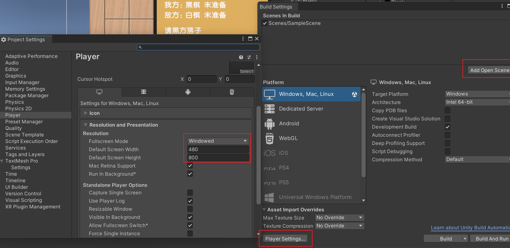

此时应该有两个Player（Clone）

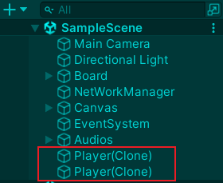

## **踩坑经验总结**

#### **问题现象**

1. 每次点击会生成两个棋子
2. 棋子位置固定，不跟随鼠标点击位置
3. 玩家准备状态不同步

---

### **原因分析**

1. **多Player实例冲突**

   * 场景中预先放置了一个静态Player对象，而Photon网络又动态生成了一个Player。
   * 两个Player的脚本同时运行，导致每次点击触发两次棋子生成。
2. **相机投影模式错误**

   * Unity默认的3D项目使用 **透视模式（Perspective）** ，导致 `ScreenToWorldPoint`坐标转换时Z轴计算错误。
   * 棋子实际生成在远离棋盘的3D空间中（比如Z轴位置不对），看起来像位置固定。
3. **准备状态仅在本地生效，其他客户端无法感知**

   * 新玩家加入时未获取房间内已有玩家的准备状态
   * 房主准备并同步信息时新玩家并不存在，新玩家到来时，房主的同步行为已经结束，新玩家看到的是默认状态

---

### **解决方案**

#### **1. 网络对象管理：一人一角色**

* **操作：**

  * 删除场景中预先放置的Player对象，其实是忘记删了。嘿嘿
  * 改为 **完全通过Photon动态生成Player** （在代码中调用 `PhotonNetwork.Instantiate`）。

#### **2. 相机设置：切换正交模式**

* **操作：**
  * 将相机 `Projection`从 `Perspective`（透视）改为 `Orthographic`（正交）。
  * 调整相机 `Size`值，确保整个棋盘可见。
* **原理：**
  正交模式忽略Z轴深度，鼠标坐标转换更简单直观（类似2D游戏）。

#### 3.使用字典将玩家实例(Photon.Realtime.Player)的ActorNumber与Player脚本对应映射，存储准备状态用于同步

* ```csharp
  // 玩家映射表（维护Photon玩家与本地Player实例的关系）
  // Key: Photon Player的ActorNumber, Value: 对应的MyGame.Player实例
  private Dictionary<int, Player> photonPlayerToLocalPlayer = new Dictionary<int, Player>();
  ```
* 在 `OnPlayerEnteredRoom` 中由房主遍历并同步所有玩家状态
* ```csharp
  // 向新玩家定向发送RPC（仅限新玩家接收）
  photonView.RPC(
      "SyncPlayerState",
      newPhotonPlayer,          // 指定接收者：新玩家
      photonPlayer.ActorNumber, // 目标玩家的唯一网络标识
      localPlayer.chessType,    // 玩家棋子颜色状态
      localPlayer.playerState   // 玩家准备状态
  );
  ```

---

## 参考链接

[从零手写Unity3D经典游戏五子棋开发+Photon网络联机游戏_哔哩哔哩_bilibili](https://www.bilibili.com/video/BV1BE421T7qR)

## 仓库地址

[MapleInori/WuZiQi: 学习记录 (github.com)](https://github.com/MapleInori/WuZiQi)

---

写文档真难啊，有点写不明白。
