## 需求分析（待补充）

流程图+类图

## 准备工作

1. 新建工程
2. 创建文件夹
   * Resources:存放面板预制体，用于动态加载
   * StreamingAssets:存放Json数据文件
   * Scripts:存放脚本
   * ArtRes:存放美术资源文件
3. 导入Json相关脚本
4. 导入资源
5. 创建UGUI关键对象，设置Canvas
   1. Canvas Render Mode设置为Screen Space - Camera模式
   2. 添加Camera放置于Canvas下，并设置
      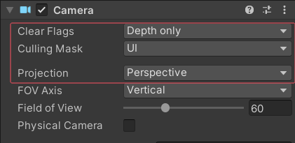
6. 设置CanvasScaler，参考分辨率参考最大背景图
   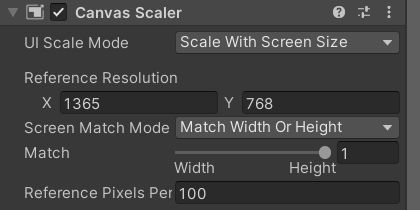

## 面板基类

显示自己：用淡入淡出控制

* 设置isShow=true
* 淡入：alpha=0，逐渐到1

隐藏自己：用淡入淡出控制

* 设置isShow=false
* 淡出：alpha=1，逐渐到0
* 通过UIManager删除自己

淡入淡出：通过控制每个面板上的CanvasGroup组件的Alpha值实现

* 在Update中使Alpha值随时间变化

### BasePanel.cs

```csharp
using System.Collections;
using System.Collections.Generic;
using UnityEngine;
using UnityEngine.Events;

public abstract class BasePanel : MonoBehaviour
{
    // 整体控制淡入淡出的画布组 组件
    private CanvasGroup canvasGroup;
    // 淡入淡出速度
    private float alphaSpeed = 10;

    // 是否开始显示
    private bool isShow;

    // 当自己淡出成功时，要执行的委托函数
    private UnityAction hideCallBack;

    protected virtual void Awake()
    {
        // 获取面板上的CanvasGroup组件，如果没有，自动添加
        canvasGroup = GetComponent<CanvasGroup>();
        if(canvasGroup == null)
        {
            canvasGroup = gameObject.AddComponent<CanvasGroup>();
        }
    }
    // Start is called before the first frame update
    protected virtual void Start()
    {
        Init();
    }

    /// <summary>
    /// 主要用于初始化按钮事件监听等等内容
    /// </summary>
    public abstract void Init();

    /// <summary>
    /// 显示自己时做的事情
    /// </summary>
    public virtual void ShowMe()
    {
        isShow = true;
        // 淡入，透明度从0开始到1
        canvasGroup.alpha = 0;
    }

    /// <summary>
    /// 隐藏自己时做的事情
    /// </summary>
    public virtual void HideMe(UnityAction callBack)
    {
        isShow = false;
        // 淡出，透明度从1开始到0
        canvasGroup.alpha = 1;

        // 记录传入的当淡出成功后会执行的函数
        hideCallBack = callBack;
    }


    // Update is called once per frame
    void Update()
    {
        // 淡入
        if(isShow && canvasGroup.alpha != 1)
        {
            canvasGroup.alpha += alphaSpeed * Time.deltaTime;
            if(canvasGroup.alpha >= 1) 
                canvasGroup.alpha = 1;
        }
        // 淡出
        else if( !isShow)
        {
            canvasGroup.alpha -= alphaSpeed * Time.deltaTime;
            if(canvasGroup.alpha <= 0)
            {
                canvasGroup.alpha = 0;
                // 让管理器删除自己
                hideCallBack?.Invoke();
            }
        }
    }
}
```

## UI管理器

通过单例模式控制所有面板的显示和隐藏。

### UIManager.cs

```csharp
using System.Collections;
using System.Collections.Generic;
using UnityEngine;

public class UIManager
{
    private static UIManager instance = new UIManager();

    public static UIManager Instance => instance;

    // 存储面板的容器，存储的是当前显示的面板,父类装子类
    private Dictionary<string,BasePanel> panelDic = new Dictionary<string,BasePanel>();

    // 一开始获取Canvas对象
    private Transform canvasTrans;

    private UIManager() 
    {
        // 得到场景上创建好的Canvas对象
        canvasTrans = GameObject.Find("Canvas").transform;
        // 将EventSystem和canvas的camera都作为Canvas的子对象，
        // 让Canvas对象过场景不移出
        // 由于通过动态创建和动态删除来显示和隐藏面板，所以不删除Canvas影响不大
        GameObject.DontDestroyOnLoad(canvasTrans.gameObject);
    }

    // 显示面板
    public T ShowPanel<T>() where T : BasePanel
    {
        // 保证 泛型T的类型和面板名字一致，基于这样的规则，更方便使用
        string panelName = typeof(T).Name;

        // 是否已经有显示着的该面板了，如果有，则不用创建，直接返回给外部使用
        if (panelDic.ContainsKey(panelName) )
            return panelDic[panelName] as T;

        // 显示面板就是动态创建面板预制体，设置父对象
        // 根据得到的类名就是预制体的名字，动态创建即可
        GameObject panelObj = GameObject.Instantiate(Resources.Load<GameObject>("UI/"+panelName));
        panelObj.transform.SetParent(canvasTrans,false);

        // 得到面板对应的面板脚本，脚本名称与其泛型一致
        T panel = panelObj.GetComponent<T>();
        // 把面板脚本存储到面板容器（字典）之中，可以更方便的获取
        panelDic.Add(panelName, panel);
        // 面板本身执行自己的显示逻辑
        panel.ShowMe();

        return panel;
    }

    // 隐藏面板
    // 如果希望淡出，默认传true，如果希望直接隐藏面板，则传false
    public void HidePanel<T>(bool isFade = true) where T : BasePanel
    {
        // 根据泛型类型得到面板名字
        string panelName = typeof(T).Name;
        // 判断当前显示的面板有没有该名字的面板
        if (panelDic.ContainsKey(panelName))
        {
            if (isFade)
            {
                panelDic[panelName].HideMe(() =>
                {
                    // 淡出成功后，删除面板
                    GameObject.Destroy(panelDic[panelName].gameObject);
                    // 删除面板后，从字典移除
                    panelDic.Remove(panelName);
                });
            }
            else
            {
                // 删除面板
                GameObject.Destroy(panelDic[panelName].gameObject);
                // 删除面板后，从字典移除
                panelDic.Remove(panelName);
            }
        }
    }

    // 获得面板
    public T GetPanel<T>() where T:BasePanel
    {
        string panelName = typeof(T).Name;
        if(panelDic.ContainsKey(panelName))
        {
            // 因为字典用父类装子类，得到的值是父类，所以要as为子类
            return panelDic[panelName] as T;
        }

        // 如果没有，返回空
        return null;
    }


}
```

## 提示面板

制作提示面板预制体

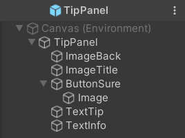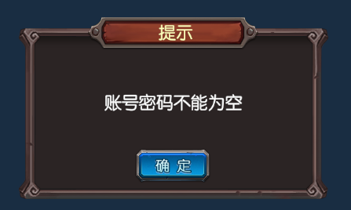

### TipPanel.cs

```csharp
using UnityEngine.UI;

public class TipPanel : BasePanel
{
    // 确定按钮
    public Button buttonSure;
    // 提示文字
    public Text textInfo;

    public override void Init()
    {
        // 初始化按钮事件监听
        buttonSure.onClick.AddListener(()=>
        {
            // 隐藏自己
            UIManager.Instance.HidePanel<TipPanel>();
        });
    }

    /// <summary>
    /// 提示内容改变，供外部使用
    /// </summary>
    /// <param name="info">提示内容</param>
    public void ChangeInfo(string info)
    {
        textInfo.text = info;
    }
}
```

## 登陆面板

登陆界面背景，以及主要输入部分面板。将背景图和主要操作部分拆开分别控制。

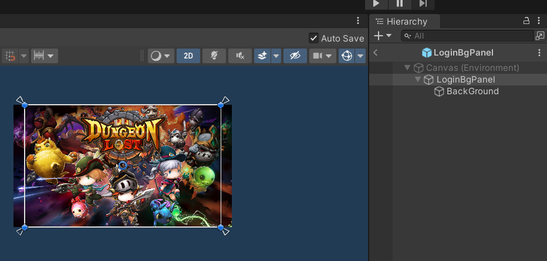

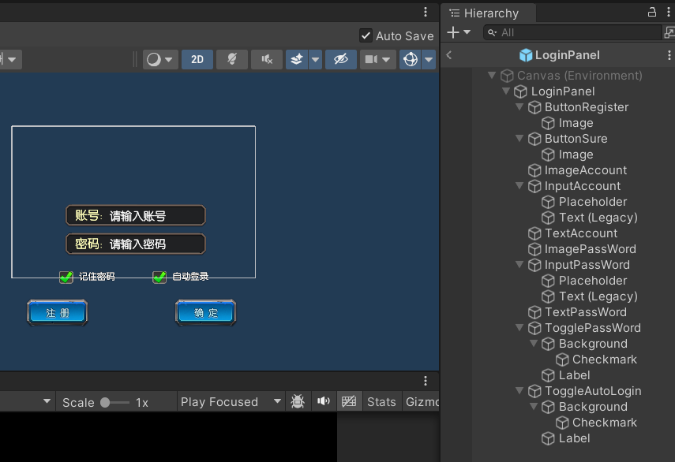

登陆界面需要保存玩家输入的数据

### LoginData.cs

```csharp

/// <summary>
/// 登录界面可能需要记住的玩家操作相关数据
/// </summary>
public class LoginData
{
    // 账号
    public string account;
    // 密码
    public string passWord;


    // 是否记住密码
    public bool rememberPw;
    // 是否自动登录
    public bool autoLogin;

    // 服务器相关
    // -1表示没有选择过服务器，新号或本地未登陆过
    public int lastServerID = -1;
}

```

需要一个登陆管理器来管理登录流程上的数据

### LoginManager.cs

```csharp
using System.Collections.Generic;
using UnityEngine;

public class LoginManager
{
    private static LoginManager instance = new LoginManager();
    public static LoginManager Instance => instance;

    private LoginData loginData;
    public LoginData LoginData => loginData;

    // 注册数据
    public RegisterData registerData;
    public RegisterData RegisterData => registerData;

    // 所有服务器数据
    private List<ServerInfo> serverData;
    public List<ServerInfo> ServerData => serverData;


    private LoginManager() 
    {
        // 直接通过json管理器来读取对应数据
        loginData = JsonMgr.Instance.LoadData<LoginData>("LoginData");
        // 读取注册数据
        registerData = JsonMgr.Instance.LoadData<RegisterData>("RegisterData");

        // 读取服务器数据
        serverData = JsonMgr.Instance.LoadData<List<ServerInfo>>("ServerInfo");
    }

    #region 登录相关
    // 存储登录数据相关
    public void SaveLoginData()
    {
        JsonMgr.Instance.SaveData(loginData,"LoginData");
    }

    // 主要用于注册成功后清理登录数据
    public void ClearLoginData()
    {
        loginData.lastServerID = 0;
        loginData.autoLogin = false;
        loginData.rememberPw = false;
    }

    // 验证账号密码是否合法
    public bool CheckInfo(string account, string passWord)
    {
        TipPanel tipPanel;

        // 是否存在该账号
        if (registerData.registerInfo.ContainsKey(account))
        {
            // 密码是否正确
            if (registerData.registerInfo[account] == passWord)
            {
                return true;
            }
            //Debug.Log("密码错误");
            tipPanel = UIManager.Instance.ShowPanel<TipPanel>();
            tipPanel.ChangeInfo("密码错误");
            return false;
        }

        //Debug.Log("该账号不存在");
        tipPanel = UIManager.Instance.ShowPanel<TipPanel>();
        tipPanel.ChangeInfo("该账号不存在");
        return false;
    }
    #endregion

    #region 注册相关

    // 存储注册数据
    public void SaveRegisterData()
    {
        JsonMgr.Instance.SaveData(registerData, "RegisterData");
    }

    // 注册方法
    public bool RegisterAccount(string account, string passWord)
    {
        TipPanel tipPanel;
        if (account.Length <= 6 || passWord.Length <= 6)
        {
            tipPanel = UIManager.Instance.ShowPanel<TipPanel>();
            tipPanel.ChangeInfo("账号和密码长度都必须大于6位");
            return false;
        }
        // 判断是否已存在账号
        if (registerData.registerInfo.ContainsKey(account))
        {
            tipPanel = UIManager.Instance.ShowPanel<TipPanel>();
            tipPanel.ChangeInfo("该账号已存在");
            return false;
        }

        // 如果不存在，则可以注册
        // 存储新账号和密码
        registerData.registerInfo.Add(account, passWord);
        // 本地存储
        SaveRegisterData();
        // 注册成功
        return true;
    }

    #endregion
}

```

登陆面板本身的逻辑控制，与后续内容有关联。

### LoginPanel.cs

```csharp
using UnityEngine.UI;

public class LoginPanel : BasePanel
{
    // 注册按钮
    public Button btnRegister;
    // 确认登录按钮
    public Button btnSure;

    // 账号密码控件
    public InputField inputAccount;
    public InputField inputPassWord;

    // 记住密码和自动登录 多选框
    public Toggle togPW;
    public Toggle togAuto;

    public override void Init()
    {
        // 点击注册
        btnRegister.onClick.AddListener(() =>
        {
            // 显示注册面板
            UIManager.Instance.ShowPanel<RegisterPanel>();
            // 隐藏自己
            UIManager.Instance.HidePanel<LoginPanel>();
        });
        // 点击登录
        btnSure.onClick.AddListener(() =>
        {
            // 验证账号密码是否正确
            if (LoginManager.Instance.CheckInfo(inputAccount.text, inputPassWord.text))
            {
                // 登陆成功

                // 记录数据
                LoginManager.Instance.LoginData.account = inputAccount.text;
                LoginManager.Instance.LoginData.passWord = inputPassWord.text;
                LoginManager.Instance.LoginData.rememberPw = togPW.isOn;
                LoginManager.Instance.LoginData.autoLogin = togAuto.isOn;
                LoginManager.Instance.SaveLoginData();

                // 进入选服界面/服务器面板
                if (LoginManager.Instance.LoginData.lastServerID <= 0) 
                {
                    // 没有选择过服务器，进入选服面板
                    UIManager.Instance.ShowPanel<ChooseServerPanel>();
                }
                else
                {
                    // 选择过服务器，进入服务器面板
                    UIManager.Instance.ShowPanel<ServerPanel>();
                }


                // 隐藏自己
                UIManager.Instance.HidePanel<LoginPanel>();
            }
            else
            {
                // 登陆失败，CheckInfo里实现了提示。登陆面板无变化
            }
        });
        // 点击记住密码
        togPW.onValueChanged.AddListener((isOn) =>
        {
            // 当记住密码取消选中时，自动登录也要取消选中
            if (!isOn)
            {
                togAuto.isOn = false;
            }
        });
        // 点击自动登录
        togAuto.onValueChanged.AddListener((isOn) =>
        {
            // 当选中自动登陆时，如果没有选中记住密码，则选中记住密码
            if (isOn)
            {
                togPW.isOn = true;
            }
        });
    }

    public override void ShowMe()
    {
        base.ShowMe();
        // 显示自己时，根据数据更新面板上的内容

        // 得到数据
        LoginData loginData = LoginManager.Instance.LoginData;

        // 初始化面板显示
        // 更新两个多选框
        togPW.isOn = loginData.rememberPw;
        togAuto.isOn = loginData.autoLogin;

        // 更新账号密码
        inputAccount.text = loginData.account;
        if (togPW.isOn)
            inputPassWord.text = loginData.passWord;

        // 如果自动登录
        if (togAuto.isOn)
        {
            // 自动去验证账号密码
            if(LoginManager.Instance.CheckInfo(inputAccount.text,inputPassWord.text))
            {
                // 进入选服界面/服务器面板
                if (LoginManager.Instance.LoginData.lastServerID <= 0)
                {
                    // 没有选择过服务器，进入选服面板
                    UIManager.Instance.ShowPanel<ChooseServerPanel>();
                }
                else
                {
                    // 选择过服务器，进入服务器面板
                    UIManager.Instance.ShowPanel<ServerPanel>();
                }
                // 隐藏自己
                UIManager.Instance.HidePanel<LoginPanel>(false);
            }
        }

    }

    /// <summary>
    /// 提供给外部快捷设置账号密码的方法
    /// </summary>
    /// <param name="account"></param>
    /// <param name="passWord"></param>
    public void SetInfo(string account, string passWord)
    {
        inputAccount.text = account;
        inputPassWord.text = passWord;
    }
}

```

## 注册面板

注册面板与登陆面板极其相似，部分内容可以直接复制。

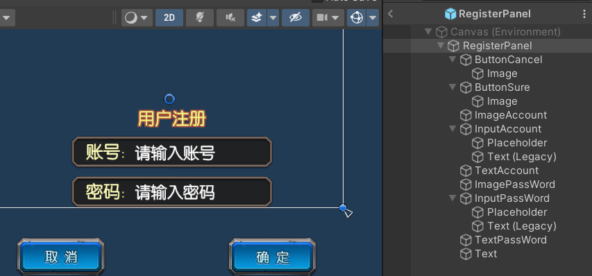

### RegisterData.cs

注册面板同样有数据需要保存。保存账号密码信息。

```csharp
using System.Collections.Generic;
using UnityEngine;

/// <summary>
/// 注册数据
/// </summary>
public class RegisterData
{
    public Dictionary<string,string> registerInfo = new Dictionary<string,string>();
}

```

### RegisterPanel.cs

注册面板逻辑

```csharp
using UnityEngine;
using UnityEngine.UI;

public class RegisterPanel : BasePanel
{
    // 确定和取消按钮
    public Button btnSure;
    public Button btnCancel;

    // 账号密码输入框
    public InputField inputAccount;
    public InputField inputPassWord;

    public override void Init()
    {
        btnCancel.onClick.AddListener(() =>
        {
            // 隐藏自己
            UIManager.Instance.HidePanel<RegisterPanel>();
            // 显示登录面板
            UIManager.Instance.ShowPanel<LoginPanel>();
        });

        btnSure.onClick.AddListener(() =>
        {          
            // 去注册账号密码
            // 判断输入的账号密码是否合法
            if(LoginManager.Instance.RegisterAccount(inputAccount.text,inputPassWord.text))
            {
                // 注册成功
                // 清理上次登录数据残留
                LoginManager.Instance.ClearLoginData();

                // 显示登录面板，此时会记录当前账号信息，所以先清理残留数据再显示
                LoginPanel loginPanel = UIManager.Instance.ShowPanel<LoginPanel>();
                // 更新登陆面板上的账号密码
                loginPanel.SetInfo(inputAccount.text,inputPassWord.text);


                // 隐藏注册面板
                UIManager.Instance.HidePanel<RegisterPanel>();
            }
            else
            {
                // 注册失败，提示在RegisterAccount里有实现
                // 清空输入的账号密码，也可以不清空
                //inputAccount.text = "";
                //inputPassWord.text = "";
            }

        });
    }
}

```

## 服务器面板

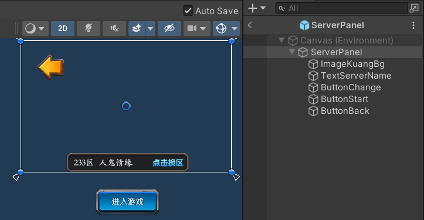

显示选择的服务器，如果没选择则无法开始，当返回到登陆界面时取消自动登录。

### ServerPanel.cs

服务器面板逻辑

```csharp
using UnityEngine.SceneManagement;
using UnityEngine.UI;


public class ServerPanel : BasePanel
{
    // 开始按钮，返回按钮，换区按钮
    public Button btnStart;
    public Button btnBack;
    public Button btnChange;
    // 服务器名字
    public Text serverName;

    public override void Init()
    {
        btnBack.onClick.AddListener(() =>
        {
            // 清空本次选择，防止覆盖其他账号的上次登录
            LoginManager.Instance.LoginData.currentServerID = -1;
            // 如果从服务器面板返回，则把自动登录关掉
            LoginManager.Instance.LoginData.autoLogin = LoginManager.Instance.LoginData.autoLogin ? false : false;
            // 回到登录面板
            UIManager.Instance.ShowPanel<LoginPanel>();
            // 隐藏自己
            UIManager.Instance.HidePanel<ServerPanel>();
        });

        btnStart.onClick.AddListener(() =>
        {
            // 进入游戏
            if(serverName.text == "未选择")
            {
                TipPanel tipPanel = UIManager.Instance.ShowPanel<TipPanel>();
                tipPanel.ChangeInfo("请先选择服务器");
                return;
            }
            // 由于Canvas不会被移除，所以要隐藏自己
            // 隐藏自己
            UIManager.Instance.HidePanel<ServerPanel>();
            // 隐藏登陆背景面板
            UIManager.Instance.HidePanel<LoginBgPanel>();
            // 存储数据，登陆后再保存本次选择覆盖上次选择,清空本次选择，防止下次登录覆盖
            LoginManager.Instance.LoginData.lastServerID = LoginManager.Instance.LoginData.currentServerID;
            LoginManager.Instance.LoginData.currentServerID = -1;
            LoginManager.Instance.SaveLoginData();
            // 切换场景
            SceneManager.LoadScene("GameScene");
        });

        btnChange.onClick.AddListener(() =>
        {
            // 显示选择服务器面板
            UIManager.Instance.ShowPanel<ChooseServerPanel>();
            // 隐藏自己
            UIManager.Instance.HidePanel<ServerPanel>();
        });
    }


    public override void ShowMe()
    {
        base.ShowMe();

        // 根据选择服务器更新文本，之后根据上次登录的服务器ID来更新内容

        // 2025.4
        // 从服务器界面返回到登陆界面重新登陆时，是刚刚选择的服务器，而不是上次登录的服务器，
        // 是因为在选择服务器之后将服务器保存为了上次选择=上次登录，
        // 返回时上次登录仅保存在缓存里，而重新登陆时会将登录数据持久化保存，所以没进入游戏但是将选择的服务器保存为了上次登录
        // 如果选择服务器后不重新登陆或者直接退出，则不会将其保存为上次登录
        // 2025.5
        // 已修改，选择面板选择后赋值当前选择，这里可以显示当前选择的服务器，只有登陆后才会覆盖上次登录选择的服务器。
        // 个人认为应该将上次选择与登陆账号在本地绑定，显示上次登录时跟随本地上次登录该账号的选择
        // 可以修改保存逻辑，也可以就这样。王者荣耀好像是上次登录跟随账号的。

        // 显示当前选择，而有上次选择的，在登陆时会覆盖一次当前选择。
        int cur_id = LoginManager.Instance.LoginData.currentServerID;

        if (cur_id <=0)
        {
            serverName.text = "未选择";
        }
        else if(cur_id >0)
        {
            ServerInfo info = LoginManager.Instance.ServerData[cur_id - 1];
            serverName.text = info.id + "区 " + info.name;
        }

    }
}

```

## 选服面板

分为背景和左右三部分。列表通过ScrollView制作。

### ChooseServerPanel.cs

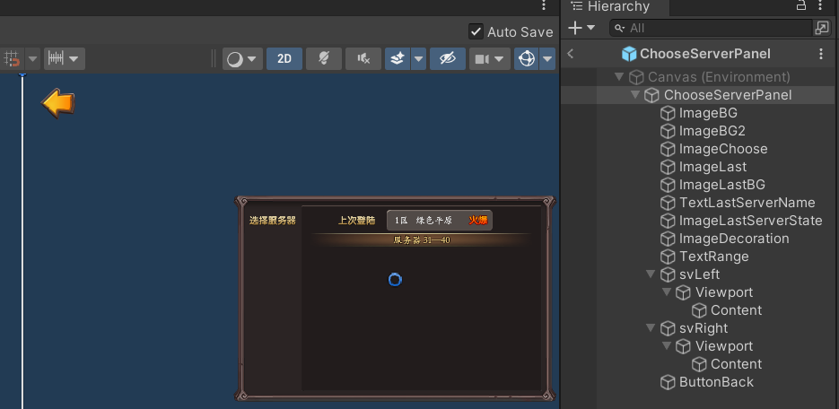

选服面板整体控制逻辑，按钮通过代码生成。

```csharp
using System.Collections;
using System.Collections.Generic;
using UnityEngine;
using UnityEngine.U2D;
using UnityEngine.UI;


public class ChooseServerPanel : BasePanel
{
    // 返回到服务器面板按钮
    public Button btnBack;

    // 左右两侧服务器的滚动组件
    public ScrollRect svLeft;
    public ScrollRect svRight;

    // 上次登录相关信息
    public Text textName;
    public Image imgState;

    // 当前选择的区间范围
    public Text textRange;

    // 存储右侧按钮们
    private List<GameObject> itemList = new List<GameObject>();

    // 一组服务器区间大小
    public int serverListStep = 10;

    public override void Init()
    {
        btnBack.onClick.AddListener(() =>
        {
            // 回到服务器面板
            UIManager.Instance.ShowPanel<ServerPanel>();
            // 隐藏自己
            UIManager.Instance.HidePanel<ChooseServerPanel>();
        });

        // 动态创建左侧的区间按钮
        // 获取到服务器列表的数据
        List<ServerInfo> infoList = LoginManager.Instance.ServerData;

        // 创建num个区间按钮，由于向下取整，截掉余数，余数再作为一个区间
        int num = infoList.Count / serverListStep + 1;
        for (int i = 0; i < num; i++)
        {
            // 动态创建区间按钮
            GameObject item = Instantiate(Resources.Load<GameObject>("UI/ServerLeftItem"));
            item.transform.SetParent(svLeft.content, false);
            // 初始化按钮信息
            ServerLeftItem serverLeft = item.GetComponent<ServerLeftItem>();
            int beginIdnex = i * serverListStep + 1;
            int endIndex = (i + 1) * serverListStep;

            // 判断最大索引是否超过服务器总数
            if (endIndex > infoList.Count)
            {
                endIndex = infoList.Count;
            }

            serverLeft.InitInfo(beginIdnex, endIndex);
        }
    }

    public override void ShowMe()
    {
        base.ShowMe();

        int id = LoginManager.Instance.LoginData.lastServerID;
        // 显示自己时应该显示上次选择的服务器
        if (id <= 0)
        {
            textName.text = "无";
            imgState.gameObject.SetActive(false);
        }
        else
        {
            // id从1开始，索引从0开始
            // 根据上一次登录的服务器ID，获取服务器信息用于界面更新
            ServerInfo serverInfo = LoginManager.Instance.ServerData[id - 1];
            // 拼接显示上次登录服务器的名字
            textName.text = serverInfo.id + "区  " + serverInfo.name;
            imgState.gameObject.SetActive(true);
            // 状态
            // 加载图集
            SpriteAtlas spriteAtlas = Resources.Load<SpriteAtlas>("Login");
            switch (serverInfo.state)
            {
                case 0: // 无状态
                    imgState.gameObject.SetActive(false);
                    break;
                case 1: // 流畅
                    imgState.sprite = spriteAtlas.GetSprite("ui_DL_liuchang_01");
                    break;
                case 2: // 繁忙
                    imgState.sprite = spriteAtlas.GetSprite("ui_DL_fanhua_01");
                    break;
                case 3: // 火爆
                    imgState.sprite = spriteAtlas.GetSprite("ui_DL_huobao_01");
                    break;
                case 4: // 维护
                    imgState.sprite = spriteAtlas.GetSprite("ui_DL_weihu_01");
                    break;
            }
        }
        // 更新当前的选择
        UpdatePanel(1, serverListStep > LoginManager.Instance.ServerData.Count ? LoginManager.Instance.ServerData.Count : serverListStep);
    }

    /// <summary>
    /// 提供给其他地方，用于更新当前选择区间的右侧服务器
    /// </summary>
    /// <param name="beginIndex"></param>
    /// <param name="endIndex"></param>
    public void UpdatePanel(int beginIndex, int endIndex)
    {
        // 更新服务器区间显示
        textRange.text = "服务器 " + beginIndex + "——" + endIndex;

        // 删除之前的右侧按钮列表
        for (int i = 0; i < itemList.Count; i++)
        {
            Destroy(itemList[i]);
        }
        // 清空列表
        itemList.Clear();

        // 创建新的按钮列表
        for (int i = beginIndex; i <= endIndex; i++)
        {
            // 获取服务器信息
            ServerInfo serverInfo = LoginManager.Instance.ServerData[i - 1];

            // 动态创建预制体
            GameObject serverItem = Instantiate(Resources.Load<GameObject>("UI/ServerRightItem"));
            serverItem.transform.SetParent(svRight.content, false);

            // 根据信息更新按钮数据
            ServerRightItem rightItem = serverItem.GetComponent<ServerRightItem>();
            rightItem.InitInfo(serverInfo);

            // 创建成功后，将它记录到列表中
            itemList.Add(serverItem);
        }
    }
}

```


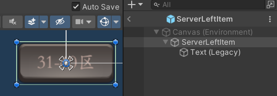

### ServerLeftItem.cs

左侧列表按钮逻辑

```csharp
using System.Collections;
using System.Collections.Generic;
using UnityEngine;
using UnityEngine.UI;

public class ServerLeftItem : MonoBehaviour
{
    // 按钮自己
    public Button btnSelf;
    // 按钮文本显示的区间范围
    public Text textInfo;

    // 区间范围
    private int beginIndex;
    private int endIndex;
    // Start is called before the first frame update
    void Start()
    {
        btnSelf.onClick.AddListener(() =>
        {
            // 通知选服面板改变右侧的具体服务器列表
            ChooseServerPanel chooseServerPanel = UIManager.Instance.GetPanel<ChooseServerPanel>();
            chooseServerPanel.UpdatePanel(beginIndex,endIndex);
        });
    }

    public void InitInfo(int beginIndex,int endIndex)
    {
        // 记录当前按钮的列表区间
        this.beginIndex = beginIndex;
        this.endIndex = endIndex;

        textInfo.text = beginIndex + "-" + endIndex+ "区";
    }
}

```


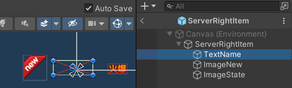

### ServerRightItem.cs

右侧列表按钮逻辑

```csharp
using System.Collections;
using System.Collections.Generic;
using UnityEngine;
using UnityEngine.U2D;
using UnityEngine.UI;

public class ServerRightItem : MonoBehaviour
{
    // 按钮本身
    public Button btnSelf;
    // 是否是新服
    public Image imgNew;
    // 状态图片
    public Image imgState;
    // 名字
    public Text textName;
    // 当前按钮所代表服务器的信息，包含ID,名字，状态，是否是新服
    public ServerInfo nowServerInfo;
    // Start is called before the first frame update
    void Start()
    {
        btnSelf.onClick.AddListener(() =>
        {
            // 记录选择的服务器的信息
            LoginManager.Instance.LoginData.currentServerID = nowServerInfo.id;

            // 关闭选服按钮，
            UIManager.Instance.HidePanel<ChooseServerPanel>();
            // 打开服务器面板
            UIManager.Instance.ShowPanel<ServerPanel>();
        });
    }

    /// <summary>
    /// 初始化方法，用于更新按钮显示相关
    /// </summary>
    /// <param name="serverInfo"></param>
    public void InitInfo(ServerInfo serverInfo)
    {
        // 记录下数据
        nowServerInfo = serverInfo;

        // 更新按钮上的信息
        // （区号）+名字，是否是新服，服务器状态
        textName.text = serverInfo.id + "区 " + serverInfo.name;
        imgNew.gameObject.SetActive(serverInfo.isNew);
        imgState.gameObject.SetActive(true);
        // 状态
        // 加载图集
        SpriteAtlas spriteAtlas = Resources.Load<SpriteAtlas>("Login");
        switch (serverInfo.state)
        {
            case 0: // 无状态
                imgState.gameObject.SetActive(false);
                break;
            case 1: // 流畅
                imgState.sprite = spriteAtlas.GetSprite("ui_DL_liuchang_01");
                break;
            case 2: // 繁忙
                imgState.sprite = spriteAtlas.GetSprite("ui_DL_fanhua_01");
                break;
            case 3: // 火爆
                imgState.sprite = spriteAtlas.GetSprite("ui_DL_huobao_01");
                break;
            case 4: // 维护
                imgState.sprite = spriteAtlas.GetSprite("ui_DL_weihu_01");
                break;
        }
    }
}

```


### ServerInfo.cs

服务器列表数据，用于读取Json时接收服务器列表，需要与Json的数据结构对应。

```csharp
/// <summary>
/// 单个服务器数据
/// </summary>
public class ServerInfo
{
    // 区号ID
    public int id;
    // 服务器名字
    public string name;
    // 服务器状态0-4
    public int state;
    // 是否是新服务器
    public bool isNew;
}

```

## 其他（待补充）

图片处理：九宫格切片拉伸，避开形变部分，避免拉伸缺口一类的形变部分。

服务器列表json：写Excel用在线工具转，或写工具读取Excel。json存储在StreamingAssets中。

图集打包：将使用的图片打包成图集，创建Sprite Atlas并将图片放入，可以降低DrawCall，选服面板最明显20降到8（减少60%DrawCall！60%提升！）。

Json管理器：保存注册的账号信息，读取本地上次登录的信息，读取服务器列表。

## 预览图

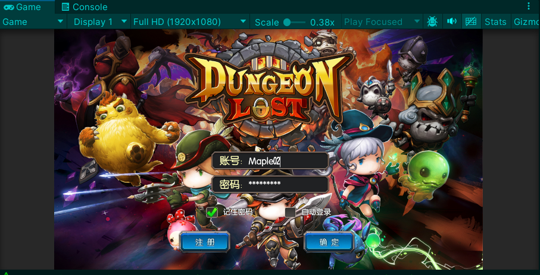

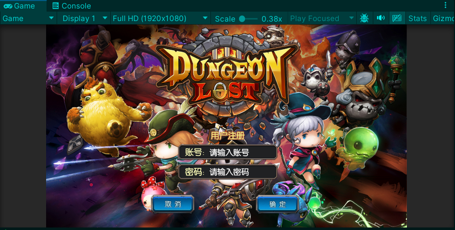

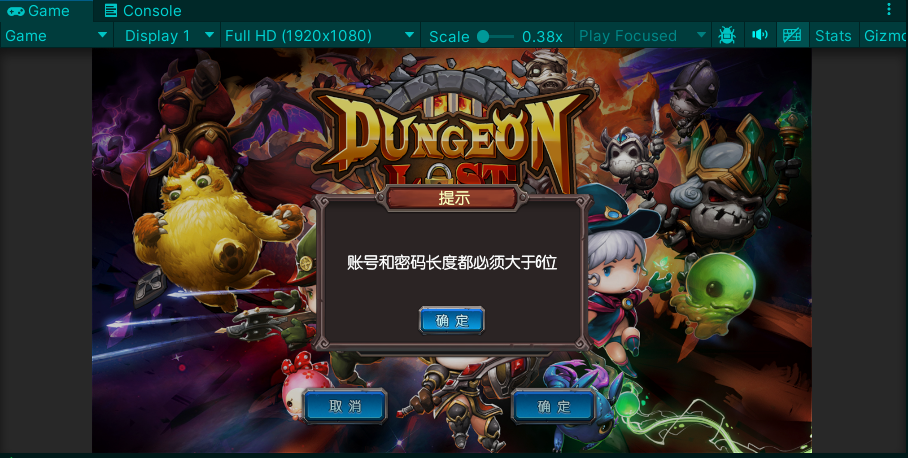

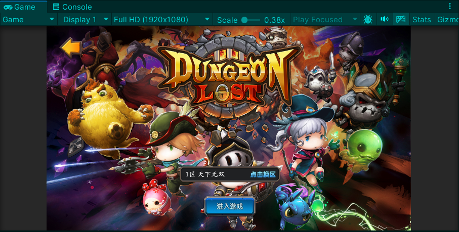

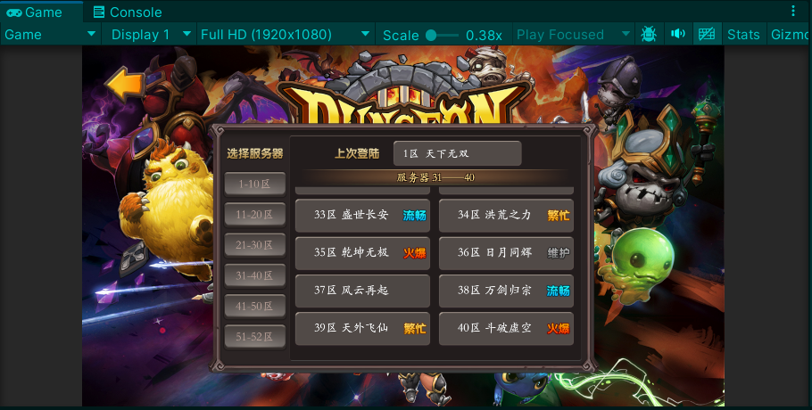
