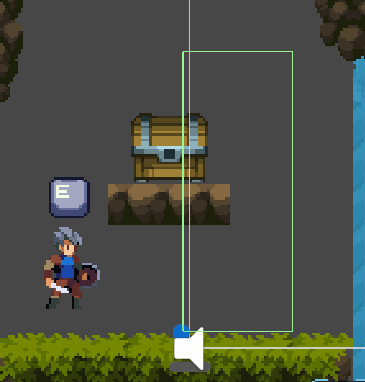
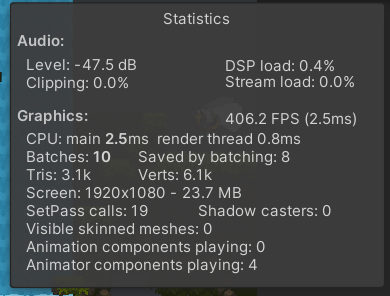
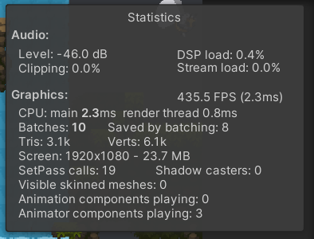

## 开发笔记

实现玩家的行走、奔跑、跳跃、受伤、死亡、三段攻击、滑铲、蹬墙跳功能，以及人物和场景互动。

实现敌人的受伤、死亡、以及巡逻、追击与攻击的状态切换。

实现了玩家的UI界面，人物状态栏的显示以及血量更新，音量设置。

实现了相机跟随和攻击抖动。

实现了场景切换和地图传送，游戏存档和存档加载。

勇士传说：

Tile Palette使用笔记：详细介绍插件信息以及使用方式和具体的使用示例。 CSDN可发

2D-Tiles：各种Tiles都是什么以及用处

composite collidor 2d：outline和polygons区别

用到过的所有组件的英文文档翻译都写写看看吧

inpute SYSTEM（new）：是一个package。input action

在受伤方法中打印日志发现日志打印两次，后来我通过先打印血量发现两次血量不对，然后才发现其实时因为该脚本在Boar上也有一个，而Boar本身并不会受伤，因为玩家碰野猪不会造成伤害，但是野猪身上也会打印这个日志。Debug.Log("Gameobject" + gameObject.name);这样可以看到，其实第二个是野猪身上打印的该内容。（计划）最后区分，重新写Player和Enemy继承于Character，然后修改attack的

```c#
    private void OnTriggerStay2D(Collider2D collision)
    {
        // 受伤的是玩家
        collision.GetComponent<Character>()?.TakeDamage(this);
    }
```

动画的层级，权重，参数

将教程过程中的问题也写成笔记，动画三连击的combo是一个问题，在第三段攻击0.9内再按，会触发第一段，攻击动画结束后设置isattack为false的话，不让三段攻击后立刻衔接第一段攻击，如果不添加这个可以立刻衔接第一段攻击继续攻击。

在AttackFinish中

```C#
    override public void OnStateExit(Animator animator, AnimatorStateInfo stateInfo, int layerIndex)
    {
        // 攻击动画结束后设置isattack为false的话，不让三段攻击后立刻衔接第一段攻击，如果不添加这个可以立刻衔接第一段攻击继续攻击。
        animator.GetComponent<PlayerController>().isAttack = false;
    }
```

站在原地连续攻击野猪，只有第一下攻击野猪才掉血，后面的攻击野猪不掉血

出现这个现象是因为OnTriggerStay2D有个休眠时间，它被触发一段时间后自动停止。要想再次触发该函数需要稍微移动其中一个碰撞盒，也就是玩家需要移动到不同位置攻击野猪它才会掉血。后面的课程会让野猪动起来，这样这个问题就不存在了。当然也可以修改OnTriggerStay2D的休眠时间，使之变长，这样即使在原地攻击野猪它也会持续掉血。修改OnTriggerStay2D的休眠时间方法：点击Edit -> Project Settings，然后选择Physics 2D，如下图所示，在General Settings中将Time To Sleep修改为一个较大的值，如10000（默认情况下是0.5）

修改野猪无敌时间为0.2，低于0.2概率造成帧伤，过大的话多段攻击只能命中一次

动画里的Trigger同样是个bool值，只不过在动画期间设置的trigger会保留状态，当经过过度检测使用之后，会自动重置。通过将动画设置为特别慢能观察到，动画期间继续按攻击键后Attack的Trigger会持续为True，之后动画结束后才重置为false，就是为了在结束后过度条件检测trigger的状态。

物理检测他的计算公式有点问题，普通的转向没有调整检测位置，受击转向之后，物理检测也没有跟随调整，第三章第五集剩余9分44秒处可以看到检测范围异常。

蜗牛的动画保持效果，某帧开始再移动，以及保持到某帧不动，直到某个时间后再继续

蹬墙跳时，会被update中不断你更新的CheckState()把速度砍半，导致起跳没有正常情况高，是否能说明新输入系统的事件发生在update之前？需要看周期函数确定。通过增加判断，当在墙上向下滑时速度减半，避免在墙上蹬墙跳时一瞬间跳跃的力被减半。这样后跳跃恢复正常。

```
        // 如果在墙上，下落速度减半。同时避免砍半蹬墙跳时的力
        if (physicsCheck.onWall && rb.velocity.y<0f)
        {
            // 跳跃的一瞬间速度也会被砍半导致跳不高，说明update在input之后执行
            rb.velocity = new Vector2(rb.velocity.x, rb.velocity.y / 2);
        }
```

蹬墙跳后，我希望能反向移动回原高度的墙上，可以将反向的力的大小设置为跟正常跳跃时空中移动的力的大小一样。

场景激活卸载。

可交互触发器退出时问题，如果退出时不加判断，在以下情况下会出现按钮被关闭一瞬间：



从右侧触发器范围进入宝箱范围，然后离开右侧触发器范围，但是依然在宝箱上，退出时按钮会被关闭一瞬间，因为只要离开了某个触发器，就会执行该方法，所以最好加上if判断，避免当场景中有堆叠的触发器时误判问题。

```csharp
    private void OnTriggerExit2D(Collider2D collision)
    {
        if (collision.CompareTag("Interactable"))
        {
            canPress = false;
        }
    }
```

InputAction.CallbackContext是什么

协程是什么

cinemachine package

关闭动画控制器对性能的影响，单独场景创建1000个对比性能分析。

如果没有关闭动画控制器，让他虽然看不见，但依旧在播放



如果添加if判断



```csharp
    private void OnTriggerStay2D(Collider2D collision)
    {
        if(collision.CompareTag("Interactable"))
        {
            canPress = true;
            // 启用动画控制
            if (!signAnimator.enabled)
                signAnimator.enabled = true;
        }
    }

    private void OnTriggerExit2D(Collider2D collision)
    {
        if (collision.CompareTag("Interactable"))
        {
            canPress = false;
            // 关闭动画控制，虽然看不到动画，但动画依然在播放，只是节省了GPU资源，在看不到的情况下，关闭动画控制，同时节省CPU资源
            if(signAnimator.enabled)
                signAnimator.enabled = false;
        }
    }
```

addressables

传送音效可以跨场景，不会由于上个场景的删除而被截断，应该是因为触发后音频通过SFXeventSO保存了，所以AudioManager可以正常播放，但是如果进行攻击会覆盖传送音效。（我用长时间的音乐暂替传送音效测试是否会被截断）如果传送音效很短的话，传送过去就播放完了，没影响。

**各种角色的属性能否做成表格类插件，总览一起改，同时能应用到脚本中？**

实现内容：目录每一节，实现方式，.....，这样写个大纲，让ds帮我写简历

ruby's adventure：

角色控制和键盘输入，

相机

粒子系统用例。

生命值UI遮罩

对话
