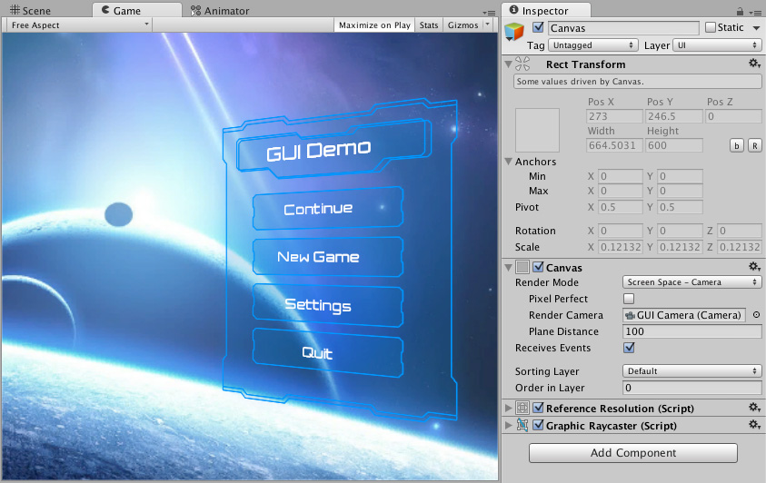
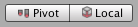
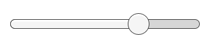

# Canvas（画布）

Canvas（画布）是所有 UI 元素都必须包含在其中的区域。Canvas 是一个带有 Canvas 组件的游戏对象（Game Object），所有的 UI 元素都必须是该 Canvas 的子对象。

在场景中如果还没有 Canvas，使用菜单 **GameObject > UI > Image** 创建一个新的 UI 元素（比如图像 Image）时，会自动创建一个 Canvas。所创建的 UI 元素将作为该 Canvas 的子对象存在。

在场景视图（Scene View）中，Canvas 区域会以一个矩形显示，这样可以方便地定位 UI 元素，而无需始终显示游戏视图（Game View）。

Canvas 使用 EventSystem 对象来协助消息传递系统（Messaging System）的工作。

## Draw order of elements

Canvas 中的 UI 元素会按照它们在层级面板（Hierarchy）中的顺序进行绘制。第一个子对象最先被绘制，第二个子对象接着被绘制，依此类推。如果两个 UI 元素发生重叠，后绘制的元素将显示在先绘制的元素之上。

要更改某个元素显示在其他元素之上的顺序，只需在层级面板中拖动它们重新排序即可。你也可以通过脚本控制顺序，使用 Transform 组件上的以下方法：`SetAsFirstSibling`、`SetAsLastSibling` 和 `SetSiblingIndex`。

## Render Modes（渲染模式）

Canvas 拥有一个 **Render Mode（渲染模式）** 设置，可以用来指定它是在屏幕空间（Screen Space）还是世界空间（World Space）中进行渲染。

### Screen Space - Overlay（屏幕空间 - 覆盖）

这种渲染模式会将 UI 元素直接渲染在场景之上，显示在屏幕上。如果屏幕尺寸发生变化或分辨率改变，Canvas 会自动调整大小以适应新的屏幕设置。


### Screen Space - Camera（屏幕空间 - 摄像机）

这种模式与 Screen Space - Overlay 类似，但不同的是，Canvas 会被放置在指定摄像机（Camera）前方的某个距离处。UI 元素将由该摄像机进行渲染，这意味着摄像机的设置会影响 UI 的显示效果。如果摄像机设置为透视模式（Perspective），UI 元素也会以透视方式渲染，透视扭曲的程度可以通过摄像机的视野角（Field of View）来控制。如果屏幕尺寸或分辨率发生变化，或者摄像机视锥体（frustum）发生变化，Canvas 也会自动调整大小以适应这些变化。



### World Space（世界空间）

在这种渲染模式下，Canvas 的行为与场景中的其他对象相同。可以通过 Rect Transform 手动设置 Canvas 的大小，UI 元素将根据其 3D 位置显示在其他场景对象的前方或后方。这种模式适用于需要成为场景一部分的 UI，也被称为“具象化界面（diegetic interface）”。


# Basic Layout

在本节中，我们将学习如何将 UI 元素相对于 Canvas 以及其他元素进行定位。如果你希望边阅读边练习，可以通过菜单 **GameObject -> UI -> Image** 创建一个图像（Image）对象。

## The Rect Tool（矩形工具）

每一个 UI 元素在布局时都会被表示为一个矩形。这个矩形可以通过工具栏中的 **Rect 工具** 在场景视图中进行操作。Rect 工具既用于 Unity 的 2D 功能，也用于 UI，实际上也可以用于 3D 对象。


Rect 工具可以用来移动、调整大小和旋转 UI 元素。当你选中一个 UI 元素后，可以点击矩形内部任意位置并拖动来移动它；点击边缘或角落并拖动可以调整大小；将鼠标悬停在角落稍远处，当鼠标指针变成旋转图标时，就可以点击并向任意方向拖动以旋转元素。

与其他工具一样，Rect 工具也会使用当前工具栏中设置的 **轴心模式（Pivot Mode）**和**坐标空间（Space）** 。在处理 UI 时，通常建议将这两个选项分别设置为 **Pivot** 和  **Local（本地坐标）** 。



## Rect Transform（矩形变换）

Rect Transform 是专为 UI 元素设计的新变换组件，用于替代常规的 Transform 组件。


Rect Transform 和普通的 Transform 一样，拥有位置（Position）、旋转（Rotation）和缩放（Scale）属性，但它还额外具有宽度（Width）和高度（Height），用于定义矩形区域的尺寸。

### Resizing Versus Scaling（调整大小 vs 缩放）

当使用 Rect 工具改变对象的尺寸时，通常对于 2D 系统中的精灵（Sprite）或 3D 对象来说，会改变对象的本地缩放（Local Scale）。然而，当该对象使用的是 Rect Transform 时，Rect 工具会直接修改宽度和高度，而不会改变缩放比例（Local Scale）。

这种“调整大小”不会影响字体大小、切片图像的边框等属性。

### Pivot（轴心点）

旋转、尺寸和缩放操作都是围绕轴心点进行的，因此轴心点的位置会影响旋转、调整大小或缩放的结果。当工具栏上的 Pivot 按钮设置为 **Pivot 模式** 时，可以在场景视图中移动 Rect Transform 的轴心点。


### Anchors（锚点）

Rect Transform 引入了一种称为“锚点”的布局概念。锚点在场景视图中会显示为四个小三角形控制柄，其锚点信息也会在检视器（Inspector）中显示出来。

如果一个 Rect Transform 的父对象也是一个 Rect Transform，那么这个子对象就可以以多种方式锚定在父对象上。例如，子对象可以锚定在父对象的中心，或者锚定在某个角落。


锚点还允许子对象随父对象的宽度或高度一起拉伸。矩形的每个角都相对于其对应的锚点有一个固定的偏移量，比如，矩形的左上角相对于左上锚点有一个固定的偏移。通过这种方式，矩形的不同角可以锚定到父矩形的不同位置。


锚点的位置是以父矩形宽度和高度的比例（百分比）来定义的。`0.0`（0%）代表左侧或底部，`0.5`（50%）代表中间，`1.0`（100%）代表右侧或顶部。但锚点并不限于边缘或中心，它们可以设置在父矩形内部的任意位置。


你可以单独拖动每一个锚点；如果锚点重合在一起，也可以通过点击它们之间的中间位置并拖动来一起移动它们。如果在拖动锚点的同时按住  **Shift 键** ，那么矩形对应的角也会和锚点一起移动。

锚点控制柄的一个实用特性是：它们会自动吸附到兄弟矩形的锚点上，从而实现精确对齐。

### Anchor presets（锚点预设）

在检视器（Inspector）中，**锚点预设按钮（Anchor Preset）** 位于 Rect Transform 组件的左上角。点击该按钮会打开锚点预设下拉菜单，你可以在这里快速选择一些常见的锚定方式。你可以将 UI 元素锚定到父对象的边缘或中间位置，或者设置为随父对象尺寸一起拉伸。 **水平锚定和垂直锚定是彼此独立的** 。


锚点预设按钮会显示当前选中的预设选项（如果有的话）。如果锚点在水平或垂直方向上的设置与任何预设都不匹配，则会显示为“自定义（custom）”。

### Anchor and position fields in the Inspector（检视器中的锚点和位置字段）

你可以点击 Anchors 的展开箭头来显示锚点数值字段（如果它们还未显示）。Anchor Min 对应于场景视图中的左下锚点控制柄，而 Anchor Max 对应于右上控制柄。

矩形的位置字段会根据锚点是否重合显示为不同的样式。锚点重合时表示固定宽度和高度；锚点分离时则表示矩形会随父级矩形拉伸。


当所有锚点控制柄重合时，显示的字段是 Pos X、Pos Y、Width 和 Height。Pos X 和 Pos Y 表示轴心点（pivot）相对于锚点的位置。

当锚点分离时，字段可能部分或完全变为 Left、Right、Top 和 Bottom。这些字段定义的是矩形在锚点区域内部的边距。如果锚点在水平方向上分离，则使用 Left 和 Right 字段；如果在垂直方向上分离，则使用 Top 和 Bottom 字段。

请注意，更改锚点或轴心（pivot）字段中的数值时，通常会自动调整定位字段的值，以使矩形保持在原来的位置。如果你不希望出现这种情况，可以点击 Inspector 中的 R 按钮启用 Raw edit mode（原始编辑模式）。此模式下，锚点和轴心值可以单独修改，而不会影响其他值。不过这很可能会导致矩形在视觉上被移动或缩放，因为其位置和大小是依赖于锚点和轴心值的。

# Visual Components（可视组件）

随着 UI 系统的引入，Unity 添加了一些新的组件，用于实现 GUI（图形用户界面）相关的功能。本节将介绍可以创建的新组件的基础内容。

## Text（文本）


Text 组件，也被称为 Label（标签），包含一个 Text（文本）区域用于输入将要显示的文本。你可以设置字体（Font）、字体样式（Font Style）、字体大小（Font Size），以及是否启用富文本功能（Rich Text）。

此外，还有文本对齐方式（Alignment）、水平和垂直溢出设置（Horizontal Overflow 和 Vertical Overflow），用于控制当文本超出矩形宽度或高度时的显示方式。Best Fit（最佳适配）选项可以让文本自动缩放以适应可用空间。

## Image（图像）


Image（图像）包含一个 Rect Transform（矩形变换）组件和一个 Image（图像）组件。在 Target Graphic（目标图像）字段中可以设置一个精灵（Sprite），在 Color（颜色）字段中可以设置其颜色。也可以在 Image 组件上应用材质（Material）。Image Type（图像类型）字段定义精灵的显示方式，可选项包括：

* **Simple（简单）** - 等比例缩放整个精灵。
* **Sliced（切片）** - 利用 3x3 切片区域，使在调整大小时不拉伸四个角，只拉伸中心部分。
* **Tiled（平铺）** - 与 Sliced 类似，但中心部分不拉伸，而是重复平铺。若精灵没有边框，则整个精灵将被平铺。
* **Filled（填充）** - 类似 Simple 显示精灵，但从某一原点按照指定方向、方式和比例填充精灵。

当选择 Simple 或 Filled 类型时，Set Native Size（设置原生尺寸）选项将图片重置为原始精灵尺寸。

将图像导入为 UI 精灵的方法是在 Texture Type（纹理类型）设置中选择 Sprite(2D/UI)。与旧版 GUI 精灵相比，UI 精灵具有额外的导入设置，其中最显著的区别是新增了 Sprite Editor（精灵编辑器）。精灵编辑器提供了 9-slice（九宫格）切片选项，用于将图像分成 9 个区域，这样在缩放精灵时，四个角不会被拉伸或变形。


## Raw Image（原始图像）

与 Image 组件使用精灵（Sprite）不同，Raw Image 使用的是纹理（Texture），没有边框等设置。Raw Image 仅在必要时使用，其他大多数情况下建议使用 Image 组件。

## Mask（遮罩）

Mask（遮罩）不是一个可见的 UI 控件，而是一种用于修改子元素外观的方式。遮罩会将子元素限制在父对象的形状内（即“遮罩”子元素）。因此，如果子元素比父元素大，那么只有在父元素范围内的部分才会被显示。

## Effects（效果）

可视组件还可以应用各种简单的效果，如投影（Drop Shadow）或描边（Outline）。更多信息请参阅 UI Effects（UI 效果）参考页面。

# Interaction Components（交互组件）

本节介绍 UI 系统中用于处理交互的组件，如鼠标或触摸事件，以及通过键盘或控制器进行的交互。

交互组件本身是不可见的，必须与一个或多个可视组件（Visual Components）结合使用才能正常工作。

## Common Functionality（通用功能）

大多数交互组件具有一些共同点。它们都是  **Selectables（可选项）** ，这意味着它们拥有共享的内建功能，可用于可视化状态间的过渡（Normal（正常）、Highlighted（高亮）、Pressed（按下）、Disabled（禁用）），以及通过键盘或控制器进行的导航。这些共享功能在 **Selectable 页面** 中有详细描述。

交互组件通常包含至少一个  **UnityEvent（Unity 事件）** ，当用户以特定方式与组件交互时该事件将被触发。如果连接到 UnityEvent 的代码中有异常抛出，UI 系统会捕获并记录这些异常。

## Button（按钮）

Button（按钮）组件拥有一个  **OnClick（点击时）UnityEvent** ，用于定义按钮被点击时执行的操作。


详见 Button 页面以了解如何使用 Button 组件。

## Toggle（开关）

Toggle（开关）组件包含一个 **Is On（是否开启）** 复选框，用于确定当前 Toggle 是开启还是关闭。用户点击 Toggle 时该值会被切换，并且视觉上的对勾标记会相应地显示或隐藏。它还有一个  **OnValueChanged（值变化时）UnityEvent** ，用于定义值变更时要执行的操作。


详见 Toggle 页面以了解如何使用 Toggle 组件。

## Toggle Group（开关组）

Toggle Group（开关组）可用于对一组相互排斥的 Toggle 进行分组。属于同一 Toggle Group 的 Toggle 会被限制为一次只能选择一个 —— 选择其中一个时其他将自动取消选中。


详见 Toggle Group 页面以了解如何使用 Toggle Group 组件。

## Slider（滑动条）

Slider（滑动条）有一个十进制数值  **Value（数值）** ，用户可以在最小值与最大值之间拖动滑块。它可以是水平或垂直方向的。它还有一个  **OnValueChanged（值变化时）UnityEvent** ，用于定义值改变时的响应操作。



详见 Slider 页面以了解如何使用 Slider 组件。

## Scrollbar（滚动条）

Scrollbar（滚动条）有一个介于 0 到 1 之间的十进制数值  **Value（数值）** 。当用户拖动滚动条时，该数值会随之改变。

Scrollbar 通常与 **Scroll Rect（滚动矩形）** 和 **Mask（遮罩）** 一起使用，以创建一个  **Scroll View（滚动视图）** 。Scrollbar 还有一个 **Size（尺寸）** 值，取值范围在 0 到 1 之间，用于决定滑块（Handle）在整个滚动条中的长度比例。这个值通常由另一个组件控制，用于表示滚动视图中可见内容的比例。 **Scroll Rect 组件可以自动完成这一功能** 。

Scrollbar 可以是水平或垂直方向的。它也包含一个  **OnValueChanged（值变化时）UnityEvent** ，用于定义数值变化时的操作。


详见 Scrollbar 页面以了解如何使用 Scrollbar 组件。

## Dropdown（下拉菜单）

Dropdown（下拉菜单）包含一个可供选择的选项列表。每个选项可以指定一个文本字符串，并可选附加一个图像。这些内容可以在 **Inspector（检查器）** 中设置，也可以通过代码动态设置。它包含一个  **OnValueChanged（值变化时）UnityEvent** ，用于定义当前选项改变时要执行的操作。


详见 Dropdown 页面以了解如何使用 Dropdown 组件。

## Input Field（输入字段）

Input Field（输入字段）用于让用户编辑 **Text（文本）元素** 中的文字内容。它包含一个  **UnityEvent（Unity 事件）** ，用于定义文本内容变更时要执行的操作，另一个事件则用于定义用户完成编辑时要执行的操作。


详见 Input Field 页面以了解如何使用 Input Field 组件。

## Scroll Rect /Scroll View（滚动矩形/滚动视图）

Scroll Rect（滚动矩形）用于在一个较小的区域中显示占据大量空间的内容。Scroll Rect 提供了滚动浏览内容的功能。

通常 Scroll Rect 与 **Mask（遮罩）** 一起使用，以创建一个  **Scroll View（滚动视图）** ，使得只有 Scroll Rect 内的滚动内容是可见的。它还可以与一个或两个 Scrollbar（滚动条）组合，允许用户通过拖动滚动条进行水平或垂直滚动。


详见 Scroll Rect 页面以了解如何使用 Scroll Rect 组件。

# Animation Integration（动画集成）

Animation（动画）允许在控件状态之间的每一次过渡中使用 Unity 的动画系统进行完整的动画表现。由于可以同时对多个属性进行动画处理，这是最强大的 Transition Mode（过渡模式）之一。


要使用  **Animation transition mode（动画过渡模式）** ，必须在控件元素上附加一个  **Animator Component（动画器组件）** 。这可以通过点击“ **Auto Generate Animation（自动生成动画）** ”来自动完成。同时这也会生成一个已配置好状态的  **Animator Controller（动画器控制器）** ，需要对其进行保存。

新的 Animator Controller 立即可用。与大多数 Animator Controller 不同，该控制器还会存储控件过渡所需的动画，这些动画可以根据需要进行自定义。


例如，如果选择了一个附加了 Animator Controller 的 Button（按钮）元素，可以通过打开  **Animation Window（动画窗口）** （菜单路径： **Window > Animation（窗口 > 动画）** ）来编辑该按钮各个状态的动画。

可以通过 **Animation Clip（动画片段）** 的弹出菜单选择所需的动画片段。选项包括：“ **Normal（正常）** ”、“ **Highlighted（高亮）** ”、“ **Pressed（按下）** ”和“ **Disabled（禁用）** ”。


Normal State（正常状态）由按钮元素本身的属性值决定，因此可以留空。在其他状态下，最常见的设置是在时间轴起始处设定一个关键帧（Keyframe）。状态之间的过渡动画将由 Animator 负责处理。

例如，可以通过如下步骤修改按钮在 Highlighted State（高亮状态）下的宽度：

* 从 **Animation Clip 弹出菜单**中选择 **Highlighted（高亮）** 状态
* 将播放头（Playhead）移动到时间轴起点
* 选择 **Record Button（录制按钮）**
* 在 **Inspector（检查器）** 中修改 Button（按钮）的宽度
* 退出录制模式（Record Mode）
* 切换到 Play Mode（播放模式）查看按钮在高亮时如何变宽

在同一个关键帧中，可以为任意数量的属性设置其参数。

多个按钮可以通过共享 Animator Controller 来共用相同的行为。

请注意，**UI Animation transition mode** 与 Unity 的 **Legacy Animation System（传统动画系统）** 不兼容。你应当只使用  **Animator Component（动画器组件）** 。

# Auto Layout（自动布局）

Rect Transform（矩形变换）布局系统足够灵活，能够处理多种不同类型的布局，并允许以完全自由的方式放置元素。然而，有时候可能需要更具结构性的一些方式。

Auto Layout System（自动布局系统）提供了一种在嵌套的布局组中放置元素的方法，例如： **Horizontal Groups（水平组）** 、**Vertical Groups（垂直组）** 或  **Grids（网格）** 。它还允许元素根据其包含的内容自动调整大小。例如，一个 Button（按钮）可以根据其文本内容加上一些填充动态调整尺寸，使其刚好适配。

Auto Layout System 是建立在基本的 Rect Transform 布局系统之上的。它可以选择性地应用于部分或全部元素。

## Understanding Layout Elements（理解布局元素）

Auto Layout System 基于 Layout Elements（布局元素）与 Layout Controllers（布局控制器）的概念。

一个 **Layout Element（布局元素）** 是一个带有 **Rect Transform** 的 Game Object（游戏对象），还可以附带其他组件。布局元素本身“知道”它应该拥有什么尺寸。它不会直接设置自己的尺寸，而是由其他作为布局控制器的组件使用其提供的信息，来计算出应该分配给它的尺寸。

一个布局元素具备以下属性：

* **Minimum width（最小宽度）**
* **Minimum height（最小高度）**
* **Preferred width（首选宽度）**
* **Preferred height（首选高度）**
* **Flexible width（弹性宽度）**
* **Flexible height（弹性高度）**

使用这些布局信息的布局控制器组件示例包括：**Content Size Fitter（内容尺寸适配器）** 和各种  **Layout Group Components（布局组组件）** 。布局组中布局元素尺寸的基本分配原则如下：

1. 先分配  **最小尺寸** ；
2. 如果有足够的空间，则分配  **首选尺寸** ；
3. 如果还有额外空间，则分配  **弹性尺寸** 。

任何带有 Rect Transform 的 Game Object 都可以作为布局元素。默认情况下，它们的最小、首选和弹性尺寸为 0。某些组件添加到 Game Object 上时，会改变这些布局属性。

**Image（图像）** 和 **Text（文本）** 组件就是会提供布局属性的两个示例。它们会根据图片或文本内容，改变其首选宽度和高度。

### Layout Element Component（布局元素组件）

如果你想要覆盖默认的最小尺寸、首选尺寸或弹性尺寸，可以通过为 Game Object 添加 **Layout Element Component（布局元素组件）** 来实现。


该组件允许你自定义一个或多个布局属性的值。启用你想要覆盖的属性的复选框，然后输入你希望使用的数值。

更多信息请参阅 Layout Element 的参考页面。

## Understanding Layout Controllers（理解布局控制器）

Layout Controllers（布局控制器）是控制一个或多个 **Layout Elements（布局元素）** 的组件，即带有 **Rect Transform（矩形变换）** 的 Game Object（游戏对象）。布局控制器可以控制它自身所在的布局元素，也可以控制其子对象中的布局元素。

一个作为布局控制器的组件也可以同时作为布局元素本身存在。

### Content Size Fitter（内容大小适配器）

**Content Size Fitter** 是一个控制自身布局元素尺寸的布局控制器。观察自动布局系统最简单的方式就是将 **Content Size Fitter** 组件添加到一个带有 **Text（文本）** 组件的 Game Object 上。


如果你将 **Horizontal Fit（水平适配）** 或 **Vertical Fit（垂直适配）** 设置为  **Preferred（首选）** ，那么 **Rect Transform** 将自动调整其宽度和/或高度，以适配文本内容。

更多信息请参阅 Content Size Fitter 的参考页面。

### Aspect Ratio Fitter（宽高比适配器）

**Aspect Ratio Fitter** 是一个控制自身布局元素尺寸的布局控制器。


它可以调整高度以适应宽度，或反之；也可以使该元素适应其父对象或包裹其父对象。**Aspect Ratio Fitter** 不考虑布局信息，如最小尺寸或首选尺寸。

更多信息请参阅 Aspect Ratio Fitter 的参考页面。

### Layout Groups（布局组）

**Layout Group（布局组）** 是控制其子布局元素的尺寸与位置的布局控制器。例如，**Horizontal Layout Group（水平布局组）** 会将子元素并排排列，而 **Grid Layout Group（网格布局组）** 则将子元素以网格方式排列。

一个布局组不会控制自身的尺寸。相反，它本身作为一个布局元素存在，可以被其他布局控制器控制，或者手动设置其尺寸。

无论布局组被分配到什么尺寸，它通常会尝试根据其子元素提供的最小、首选和弹性尺寸，为每个子元素分配适当的空间。布局组也可以任意嵌套使用。

更多信息请参阅  **Horizontal Layout Group** 、**Vertical Layout Group** 和 **Grid Layout Group** 的参考页面。

### Driven Rect Transform properties（被驱动的 Rect Transform 属性）

由于自动布局系统中的布局控制器可以自动控制某些 UI 元素的尺寸和位置，因此这些尺寸和位置不应同时通过 **Inspector（检查器）** 或 **Scene View（场景视图）** 手动编辑。这类手动更改的值会在下一次布局计算时被布局控制器重置。

**Rect Transform** 提供了一个 **Driven Properties（被驱动属性）** 的概念来处理这种情况。例如，当 **Content Size Fitter** 的 **Horizontal Fit（水平适配）** 被设置为 **Minimum（最小）** 或 **Preferred（首选）** 时，会驱动该 Game Object 上 Rect Transform 的宽度。此时宽度字段会变为只读，Rect Transform 顶部会显示一个提示框，告知其一个或多个属性正被 **Content Size Fitter** 驱动。

被驱动的 Rect Transform 属性不只是为了防止手动修改。一个布局可能仅仅因为 Game View（游戏视图）的分辨率或尺寸变化而发生改变。这种变化会影响布局元素的尺寸或位置，从而改变被驱动属性的值。但我们并不希望场景因此被标记为“有未保存的更改”。为防止这种情况，被驱动属性的值不会作为场景的一部分被保存，对它们的修改也不会标记场景为已更改。

## Technical Details（技术细节）

自动布局系统内置了一些组件，但也可以创建自定义的组件以特定方式控制布局。这可以通过让组件实现被自动布局系统识别的特定接口来完成。

### Layout Interfaces（布局接口）

如果一个组件实现了接口  **ILayoutElement** ，那么自动布局系统会将该组件视为一个  **Layout Element（布局元素）** 。

如果一个组件实现了接口  **ILayoutGroup** ，则期望它驱动其子对象的  **Rect Transform（矩形变换）** 。

如果一个组件实现了接口  **ILayoutSelfController** ，则期望它驱动其自身的  **RectTransform** 。

### Layout Calculations（布局计算）

自动布局系统按照以下顺序对布局进行评估和执行：

1. 通过调用 **ILayoutElement** 组件的 `CalculateLayoutInputHorizontal` 方法，计算布局元素的最小、首选和弹性  **宽度** 。

   这个过程是自底向上的，先计算子对象，再计算父对象，以便父对象在计算时可以考虑其子对象提供的信息。
2. 通过调用 **ILayoutController** 组件的 `SetLayoutHorizontal` 方法，计算并设置布局元素的实际  **宽度** 。

   这个过程是自顶向下的，先计算父对象，再计算子对象，因为子对象的宽度分配需要基于父对象提供的总宽度。

   在此步骤之后，布局元素的 **Rect Transform** 将拥有新的宽度。
3. 通过调用 **ILayoutElement** 组件的 `CalculateLayoutInputVertical` 方法，计算布局元素的最小、首选和弹性  **高度** 。

   这个过程也是自底向上的，先计算子对象，再计算父对象，使得父对象可以参考子对象提供的信息。
4. 通过调用 **ILayoutController** 组件的 `SetLayoutVertical` 方法，计算并设置布局元素的实际  **高度** 。

   这个过程是自顶向下的，先计算父对象，再计算子对象，因为子对象的高度分配需要基于父对象提供的总高度。

   在此步骤之后，布局元素的 **Rect Transform** 将拥有新的高度。

从上述过程可以看出，自动布局系统会先评估  **宽度** ，再评估  **高度** 。因此，计算出的高度可以依赖于宽度，但计算出的宽度不能依赖于高度。

### Triggering Layout Rebuild（触发布局重新构建）

当某个组件的属性发生变化，从而导致当前布局无效时，需要重新计算布局。可以使用以下调用触发重建：

```csharp
LayoutRebuilder.MarkLayoutForRebuild (transform as RectTransform);
```

布局重建不会立即发生，而是在当前帧结束、渲染开始之前执行。这样做的原因是，如果立刻重建，可能会在同一帧内多次执行布局重建，从而影响性能。

**建议在以下情况中触发布局重建：**

* 在可能改变布局的属性的 setter 中；
* 在以下回调方法中：
  * `OnEnable`
  * `OnDisable`
  * `OnRectTransformDimensionsChange`
  * `OnValidate`（仅编辑器中需要，运行时不需要）
  * `OnDidApplyAnimationProperties`

# Rich Text

## Markup format

### Nested elements

### Tag parameters

## Supported tags

### Supported colors

## Editor GUI
