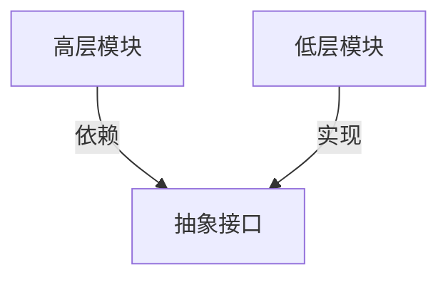

**SOLID原则**是面向对象设计中的五个基本原则，它们分别是

* 单一职责原则（SRP）
* 开闭原则（OCP）
* 里氏替换原则（LSP）
* 接口隔离原则（ISP）
* 依赖倒置原则（DIP）。

这些原则旨在提高代码的可维护性、可扩展性和复用性，同时降低修改代码时的风险。

## 单一职责原则（SRP）

SRP全称Single Responsibility Principle。

单一职责原则指出，一个类应该只有一个引起变化的原因。这意味着一个类应该只负责一项任务或功能。例如，如果一个类负责处理用户信息和生成报告，那么它违反了单一职责原则。这个原则有助于降低类的复杂性，使代码更易于理解和维护。

### 核心思想

* **单一功能**：一个类或模块应该只负责一个功能或业务逻辑，避免承担过多的职责。
* **高内聚**：通过将功能拆分到不同的类中，提高代码的内聚性，使每个类的职责更加明确。
* **低耦合**：减少类之间的依赖关系，使系统更易于修改和扩展。

### 为什么需要SRP？

* **可维护性**：当一个类只负责一项功能时，修改或修复问题会更加容易，不会影响到其他功能。
* **可读性**：代码结构更清晰，开发者可以快速理解每个类的作用。
* **可测试性**：单一职责的类更容易进行单元测试，因为测试用例可以更专注于特定功能。
* **复用性**：功能单一的类更容易被其他模块复用。

### 如何识别违反SRP的情况？

* **类的方法和属性是否属于同一逻辑范畴？**例如，一个 `User` 类如果同时包含用户信息管理（如 `saveUser()`）和用户数据统计（如 `generateUserReport()`），则可能违反SRP。
* **类的代码量是否过大？**如果一个类的代码过长（比如超过几百行），可能意味着它承担了过多职责。
* **修改代码时是否频繁影响其他功能？**
  如果修改一个功能经常需要改动同一个类的其他部分，说明职责划分不清晰。

### 如何应用SRP？

* **拆分类**：将多职责的类拆分为多个单一职责的类。例如：将 `User` 类拆分为 `User`（管理用户信息）和 `UserReportGenerator`（生成报告）。
* **使用组合而非继承**：通过组合其他类来实现功能，而不是在一个类中堆积所有逻辑。
* **依赖注入**：将外部依赖（如数据库操作、日志记录）分离到单独的类中。

### SRP 的实际示例

**违反 SRP 的代码：**

```csharp
class Order {
    public void CalculateTotal() { /* 计算订单总价 */ }
    public void SaveToDatabase() { /* 保存订单到数据库 */ }
    public void SendEmailConfirmation() { /* 发送邮件通知 */ }
}
```

**符合 SRP 的改进：**

```csharp
class Order {
    public void CalculateTotal() { /* 计算订单总价 */ }
}

class OrderRepository {
    public void SaveToDatabase(Order order) { /* 保存订单 */ }
}

class EmailService {
    public void SendConfirmation(Order order) { /* 发送邮件 */ }
}
```

### SRP 的边界与误区

* **不要过度拆分** ：
  如果拆分过细，可能导致类数量爆炸，增加系统复杂度。需要根据实际场景权衡。
* **职责的粒度** ：
  职责的划分没有绝对标准，通常以“业务变化的原因”为判断依据。
* **与其他原则的关系** ：
  SRP 是 SOLID 原则的基础，通常与开闭原则（OCP）、依赖倒置原则（DIP）结合使用。

### SRP 在不同层面的应用

* **方法级别** ：一个方法应该只做一件事（如 `calculateTax()` 而不是 `calculateTaxAndSave()`）。
* **模块/服务级别** ：微服务架构中，每个服务应专注于单一业务领域（如用户服务、订单服务）。

## 开闭原则（OCP）

OCP全称Open/Closed Principle

开闭原则强调软件实体（如类、模块、函数等）应该对扩展开放，对修改关闭。这意味着应该能够在不修改现有代码的情况下，通过添加新代码来扩展功能。这有助于减少对现有系统的影响，从而降低引入错误的风险。

### 核心思想

* **对扩展开放** ：允许通过添加新代码（如新类、新方法）来扩展系统的功能。
* **对修改关闭** ：尽量避免修改已有的、经过测试的代码，以保持系统的稳定性。
* **抽象与多态** ：通过抽象（接口或抽象类）定义扩展点，利用多态实现动态行为扩展。

### 为什么需要 OCP？

* **降低风险** ：修改已有代码可能引入新 Bug，OCP 通过扩展而非修改减少这种风险。
* **提高复用性** ：通过抽象层定义通用行为，新功能只需实现抽象，无需重复已有逻辑。
* **适应变化** ：在需求频繁变动的系统中，OCP 使扩展更灵活，减少开发成本。

### 如何实现 OCP？

* **依赖抽象** ：
  通过接口或抽象类定义行为，具体实现通过派生类扩展。
  例如：

```csharp
interface IPaymentProcessor {
    void Process(Payment payment);
}

class CreditCardProcessor : IPaymentProcessor { /* 实现 */ }
class PayPalProcessor : IPaymentProcessor { /* 新增实现 */ }
```

* **策略模式** ：
  将可变行为封装为独立的策略类，通过组合动态切换行为。
* **装饰器模式** ：
  通过装饰器动态添加功能，而不修改原始类（如 Java 的 `InputStream` 和 `BufferedInputStream`）。

### 违反 OCP 的典型场景

* **直接修改已有类** ：
  例如，添加新功能时直接在原有类中增加 `if-else` 分支：

```csharp
class Logger {
    public void log(String message, String type) {
        if (type.equals("FILE")) { /* 写文件 */ }
        else if (type.equals("DB")) { /* 写数据库 */ }
        // 新增类型需修改此类
    }
}
```

* 高层模块直接依赖具体实现类，而非抽象。

### 符合 OCP 的改进示例

**问题代码（违反 OCP）：**

```csharp
class Shape {
    private String type;

    public void draw() {
        if (type.equals("Circle")) { /* 画圆 */ }
        else if (type.equals("Square")) { /* 画方形 */ }
    }
}
```

**改进代码（符合 OCP）：**

```csharp
interface IShape {
    void draw();
}

class Circle : Shape { /* 实现画圆 */ }
class Square : Shape { /* 实现画方形 */ }
// 新增形状只需添加新类，无需修改已有代码
```

### OCP 的适用边界

* **不要过度设计** ：
  对稳定不变的部分无需抽象，避免“抽象地狱”。例如，工具类方法可能无需扩展。
* **权衡成本** ：
  如果需求极少变化，直接修改可能比设计扩展点更高效。

### OCP 与其他原则的关系

* **依赖倒置原则（DIP）** ：
  OCP 的实现常依赖于 DIP，即高层模块依赖抽象而非具体实现。
* **单一职责原则（SRP）** ：
  职责单一的类更容易通过扩展修改行为。
* **里氏替换原则（LSP）** ：
  子类必须能替换父类，这是 OCP 中多态扩展的基础。

### 实际应用场景

* **插件架构** ：
  如 IDE（VSCode、Eclipse）通过插件机制扩展功能，无需修改核心代码。
* **支付系统** ：
  支持新增支付方式（如加密货币）时，只需实现 `PaymentProcessor` 接口。
* **日志框架** ：
  允许用户自定义日志输出目标（文件、数据库、云服务）。

## 里氏替换原则（LSP）

LSP全称Liskov Substitution Principle

里氏替换原则指出，程序中的对象应该可以被它们的子类所替换，而不会影响程序的正确性。这意味着子类应该能够完全代替其父类。违反这个原则可能会导致代码的脆弱性和不可预测的行为。

### 核心思想

* **子类必须完全替代父类** ：任何父类出现的地方，子类都应该能无缝替换，且程序行为保持一致。
* **契约式设计** ：子类必须遵守父类的“契约”（包括方法签名、前置条件、后置条件、不变量）。
* **行为一致性** ：子类不应改变父类的核心行为（例如，父类的方法实现是“加法”，子类不能改为“减法”）。

### 为什么需要 LSP？

* **维护多态的正确性** ：确保继承关系符合“is-a”语义（如 `Square` 是 `Rectangle` 的子类，但数学上正方形是长方形，代码中可能违反 LSP）。
* **减少隐藏的 Bug** ：违反 LSP 可能导致运行时错误，例如子类抛出父类未声明的异常。
* **提高代码复用性** ：符合 LSP 的继承体系更容易被安全复用。

### 违反 LSP 的典型场景

* **子类修改父类行为** ：
  例如，父类 `Bird` 有 `fly()` 方法，子类 `Penguin` 重写为“无法飞行”，违反 LSP。

  ```csharp
  class Bird {
      public virtual void Fly() { /* 飞行逻辑 */ }
  }
  class Penguin : Bird {
      public override void Fly() {
          throw new NotSupportedException("企鹅不能飞！");
      }
  }
  ```

  * 子类强化前置条件或弱化后置条件：

    父类方法允许参数为任意整数，子类要求参数必须为正数（强化前置条件）。

    父类方法保证返回非负数，子类可能返回负数（弱化后置条件）。
  * 子类破坏不变量：
    父类规定“宽度和高度可独立修改”，但子类 Square 强制宽高相等：

    ```csharp
    class Rectangle {
        protected int width, height;
        void setWidth(int w) { width = w; }
        void setHeight(int h) { height = h; }
    }
    class Square : Rectangle {
        public override void setWidth(int w) { 
            width = height = w; // 强制宽高相等
        }
        // 同理重写 setHeight
    }
    ```

### 如何设计符合 LSP 的继承？

* **优先组合而非继承** ：如果子类无法完全替代父类，改用组合（如 `Penguin` 不继承 `Bird`，而是包含 `SwimBehavior`）。
* **通过接口定义角色** ：
  将“可飞行”抽象为接口 `Flyable`，只有能飞的鸟实现该接口：

```csharp
  interface IFlyable {
      void fly();
  }
  class Eagle : Flyable { /* 实现飞行 */ }
  class Penguin { /* 无 fly() 方法 */ }
```

* **避免子类覆盖父类具体方法** ：
  使用模板方法模式，将核心逻辑放在父类，子类仅扩展可变部分。

### LSP 与设计模式的关系

* **模板方法模式** ：父类定义算法骨架，子类实现特定步骤，确保行为一致性。
* **策略模式** ：通过接口替换继承，避免子类行为冲突。
* **适配器模式** ：解决接口不兼容问题，而非通过继承强制适配。

### 实际应用案例

* **集合框架** ：
  Java 的 `List` 接口的子类（如 `ArrayList`、`LinkedList`）必须支持相同的操作（如 `add()`、`get()`），尽管内部实现不同。
* **支付系统** ：
  父类 `Payment` 定义 `process()` 方法，子类 `CreditCardPayment`、`PayPalPayment` 实现时不能修改支付的核心契约（如金额必须一致）。

### LSP 的数学基础

* **子类型化（Subtyping）** ：
  在类型理论中，子类型必须满足“强行为子类型化”（即子类型的行为不能弱于父类型）。
* **历史约束** ：
  子类方法不能修改父类已存在的状态（如父类的私有字段）。

### 常见误区

* **“is-a”关系不等于继承** ：
  例如，“正方形是长方形”在数学上成立，但在代码中可能违反 LSP（因为正方形修改了长方形宽高独立变化的特性）。
* **过度依赖继承** ：
  继承是强耦合关系，若子类无法完全替代父类，应改用组合或接口。

## 接口隔离原则（ISP）

ISP全称Interface Segregation Principle

接口隔离原则建议不应该强迫客户依赖于他们不使用的接口。这意味着应该创建专门的接口，而不是一个大而全的接口。这有助于减少不必要的依赖，提高系统的灵活性和可维护性。

### 核心思想

* **拆分臃肿接口** ：将“全能接口”拆分为多个小接口，每个接口专注于一个功能领域。
* **客户端不应被迫依赖无用方法** ：避免客户端实现它们不需要的方法（例如空实现或抛异常）。
* **高内聚低耦合** ：接口应只包含密切相关的方法，减少依赖关系的复杂度。

### 为什么需要 ISP？

* **减少接口污染** ：防止一个接口的修改影响所有实现类。
* **避免“胖接口”陷阱** ：大接口会导致实现类必须处理无关逻辑（如 `IDevice` 同时包含打印、扫描、传真方法）。
* **提高可维护性** ：小接口更易于理解、测试和重构。

### 违反 ISP 的典型场景

问题代码：一个臃肿的“全能”接口

```csharp
// 违反 ISP：打印机接口强迫所有实现类处理无关方法
public interface IMultiFunctionDevice {
    void Print(Document document);
    void Scan(Document document);
    void Fax(Document document);
}

// 老式打印机被迫实现无用的方法（可能抛出异常）
public class OldPrinter : IMultiFunctionDevice {
    public void Print(Document document) { /* 实现打印 */ }
    public void Scan(Document document) => throw new NotSupportedException();
    public void Fax(Document document) => throw new NotSupportedException();
}
```

 **问题** ：`OldPrinter` 被迫实现无用的 `Scan` 和 `Fax`，违反了 ISP。

### 符合 ISP 的改进方案

方案1：拆分为多个专用接口

```csharp
// 拆分后的接口
public interface IPrinter {
    void Print(Document document);
}
public interface IScanner {
    void Scan(Document document);
}
public interface IFax {
    void Fax(Document document);
}

// 老式打印机只需实现所需接口
public class OldPrinter : IPrinter {
    public void Print(Document document) { /* 仅实现打印 */ }
}

// 高级设备可选择实现多个接口
public class MultiFunctionMachine : IPrinter, IScanner, IFax {
    public void Print(Document document) { /* 实现打印 */ }
    public void Scan(Document document) { /* 实现扫描 */ }
    public void Fax(Document document) { /* 实现传真 */ }
}
```

方案2：接口组合（更灵活）

```csharp
// 通过接口继承组合功能
public interface IMultiFunctionDevice : IPrinter, IScanner, IFax { }

// 具体实现
public class OfficeMachine : IMultiFunctionDevice {
    // 必须实现所有方法
}
```

### ISP 与设计模式结合

* **适配器模式** ：
  为不兼容的接口提供转换，避免污染原有接口。

```csharp
public class LegacyPrinterAdapter : IPrinter {
    private readonly LegacyPrinter _legacyPrinter;
    public LegacyPrinterAdapter(LegacyPrinter printer) {
        _legacyPrinter = printer;
    }
    public void Print(Document document) {
        _legacyPrinter.PrintDocument(document.ToLegacyFormat());
    }
}
```

* **装饰器模式** ：
  动态添加功能，避免修改原始接口。

```csharp
public class LoggingPrinter : IPrinter {
    private readonly IPrinter _printer;
    public LoggingPrinter(IPrinter printer) {
        _printer = printer;
    }
    public void Print(Document document) {
        Console.WriteLine($"Printing {document.Name}");
        _printer.Print(document);
    }
}
```

### C# 特有技巧

* **显式接口实现** ：
  解决多重接口的方法名冲突，同时隐藏非核心方法。

```csharp
public class MultiFunctionDevice : IPrinter, IScanner {
    void IPrinter.Print(Document document) { /* 显式实现 */ }
    void IScanner.Scan(Document document) { /* 显式实现 */ }
}

// 使用时需要强制转换：
var device = new MultiFunctionDevice();
((IPrinter)device).Print(doc);
```

* **默认接口方法（C# 8+）** ：
  在接口中提供默认实现，减少对实现类的强制要求。

```csharp
public interface IPrinter {
    void Print(Document document);
    // 默认实现
    void PrintBatch(IEnumerable<Document> docs) {
        foreach (var doc in docs) Print(doc);
    }
}
```

### 实际应用场景

* **微服务 API 设计** ：
  每个服务接口应专注于单一职责（如 `IOrderService` 不应包含 `IUserService` 的方法）。
* **插件系统** ：
  插件接口应最小化（如 `IPlugin` 只定义 `Load()` 和 `Unload()`，其他功能通过专用接口扩展）。
* **UI 组件** ：
  分离 `IClickable`、`IDraggable` 等接口，避免控件被迫实现无关行为。

### 常见误区

* **过度拆分** ：
  将接口拆得过细（如 `ISaveToFile`、`ISaveToDatabase`），可能导致接口爆炸。应根据业务逻辑合理聚合。
* **忽视接口语义** ：
  接口命名应体现其职责（如 `IReportGenerator` 而非 `IReportOperations`）。
* **混淆 ISP 与 SRP** ：
* SRP 关注“类的职责单一性”。
* ISP 关注“接口的客户依赖性”。

## 依赖倒置原则（DIP）

DIP全称Dependency Inversion Principle

依赖倒置原则强调高层模块不应该依赖低层模块，它们都应该依赖抽象。抽象不应该依赖细节，细节应该依赖抽象。这意味着代码应该依赖于接口或抽象类，而不是具体的实现。这有助于降低耦合度，提高代码的复用性和可扩展性。

### DIP的核心理念进阶

* **控制反转（IoC）与DIP的关系**
  DIP是设计原则，IoC是实现方式。通过IoC容器（如.NET的 `IServiceCollection`）自动管理抽象与实现的绑定：

```csharp
services.AddTransient<IPaymentService, CreditCardPaymentService>(); // 配置抽象与实现的映射
```

* **依赖方向革命**
  传统分层架构中高层调用低层，DIP后低层实现高层的抽象接口：



### C#中的DIP实现模式

* **构造函数注入（推荐方式）**
  显式声明依赖，避免隐藏耦合：

```csharp
public class OrderService {
    private readonly IPaymentService _paymentService;

    public OrderService(IPaymentService paymentService) { // 通过构造函数注入抽象
        _paymentService = paymentService;
    }
}
```

* **属性注入（灵活但易滥用）**
  适用于可选依赖：

```csharp
public class ReportGenerator {
    public IDataFormatter? Formatter { get; set; } // 可选的依赖
}
```

* **方法注入（临时依赖）**
  将依赖作为方法参数传递：

```csharp
public void ProcessOrder(IPaymentService paymentService, Order order) { ... }
```

### DIP在架构中的应用

* **清洁架构（Clean Architecture）**
  依赖规则：内层（领域层）定义接口，外层（基础设施层）实现接口：

```csharp
// 领域层定义接口
public interface IEmailSender {
    void SendEmail(string to, string body);
}

// 基础设施层实现
public class SmtpEmailSender : IEmailSender {
    public void SendEmail(string to, string body) { /* 使用SMTP发送 */ }
}
```

* **六边形架构（Ports & Adapters）**
  通过"端口"（接口）隔离核心业务与外部系统：

```csharp
// 端口（接口）
public interface IInventoryServicePort {
    bool CheckStock(int productId);
}

// 适配器（实现）
public class ExternalInventoryAdapter : IInventoryServicePort {
    public bool CheckStock(int productId) {
        // 调用第三方库存系统API
    }
}
```

### 高级应用场景

* **策略模式 + DIP**
  动态切换算法实现：

  ```csharp
  public interface IDiscountStrategy {
      decimal ApplyDiscount(decimal price);
  }

  public class SeasonalDiscount : IDiscountStrategy { ... }
  public class MemberDiscount : IDiscountStrategy { ... }

  public class PricingService {
      private readonly IDiscountStrategy _strategy;
      public PricingService(IDiscountStrategy strategy) { ... }
  }
  ```
* **装饰器模式 + DIP**
  透明地扩展功能：

```csharp
public class LoggingPaymentDecorator : IPaymentService {
    private readonly IPaymentService _inner;
    private readonly ILogger _logger;

    public LoggingPaymentDecorator(IPaymentService inner, ILogger logger) {
        _inner = inner;
        _logger = logger;
    }

    public void ProcessPayment() {
        _logger.Log("支付开始");
        _inner.ProcessPayment();
        _logger.Log("支付完成");
    }
}
```

### DIP与测试的强关联

* **单元测试的基石**
  通过Mock抽象接口实现隔离测试：

```csharp
[Test]
public void OrderService_Should_ProcessPayment() {
    // 1. 创建Mock依赖
    var mockPayment = new Mock<IPaymentService>();
    mockPayment.Setup(x => x.Process()).Returns(true);

    // 2. 注入测试
    var service = new OrderService(mockPayment.Object);
    var result = service.PlaceOrder();

    // 3. 验证行为
    Assert.IsTrue(result);
    mockPayment.Verify(x => x.Process(), Times.Once);
}
```

* **测试驱动开发（TDD）**
  先定义接口再实现，自然符合DIP。

### 常见反模式与陷阱

* **服务定位器模式（伪DIP）**
  隐藏依赖关系，应避免：

```csharp
// 反例：通过静态类获取依赖
var paymentService = ServiceLocator.Resolve<IPaymentService>();
```

* **过度依赖IoC容器**
  手动 `new`实现类时仍应遵循DIP：

```csharp
// 正确：即使手动创建也依赖抽象
IPaymentService paymentService = new CreditCardPaymentService(logger);
```

* **接口膨胀**
  单个接口包含太多方法，违反ISP的同时也弱化DIP效果。

### 现代.NET生态中的DIP实践

* **ASP.NET Core依赖注入**
  原生支持的DI容器：

```csharp
// 注册服务
builder.Services.AddScoped<IUserRepository, SqlUserRepository>();

// 使用服务
public class UserController : Controller {
    private readonly IUserRepository _repo;
    public UserController(IUserRepository repo) { _repo = repo; }
}
```

* **领域驱动设计（DDD）**
  通过仓储模式实现持久化层抽象：

```csharp
public interface IOrderRepository {
    Order GetById(int id);
    void Save(Order order);
}

public class EfOrderRepository : IOrderRepository { ... }
```

### DIP的量化评估

* **指标**
  * 抽象依赖率 = 依赖抽象数 / 总依赖数 × 100%
  * 稳定抽象原则（SAP）：抽象接口应位于依赖关系图的顶层
* **工具支持**
  使用NDepend或Roslyn分析器检测违反DIP的代码：

```plaintext
// 检测到违反DIP
Warning: Class 'OrderService' directly depends on 'SmtpEmailSender' (concrete)
```

**SOLID原则**的应用有助于构建更健壮、更易于维护和扩展的软件系统。它们之间相互关联，共同促进了良好的面向对象设计。遵循这些原则可以使开发者编写出更优质的代码，成为更优秀的开发者。
