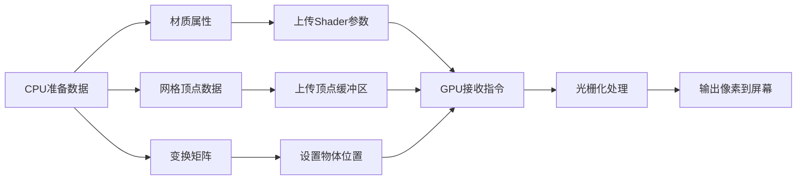

## DrawCall是什么

Draw Call是CPU向GPU发起的一种在屏幕上绘制内容的请求。

CPU具体如何向GPU发送绘制请求。

1、CPU提交材质（Shader，Uniform，纹理，渲染状态）、顶点数据

### 如何查看DrawCall

1. **通过Game视口的Stats面板** 在运行游戏时，点击Game视口右上角的“Stats”按钮，会弹出一个窗口。在窗口中找到“Batches”字段，其后面的数值即为当前场景的DrawCall数量。
2. **通过Profiler工具** 在Unity菜单栏中，选择 *Window -> Analysis -> Profiler* ，打开Profiler窗口。切换到*Rendering*选项卡，在底部可以看到“Draw Calls”字段，显示当前的DrawCall数量。

### 游戏初始的两次DrawCall

如果Camera的Clear flags是Skybox则是2，如果是Solider color则是1，如果是其他则是3。这几个Drawcall分别是什么

### 什么情况下会产生额外DrawCall

### 降低DrawCall的好处

CPU，GPU

### 如何降低DrawCall

* 合并材质和纹理，确保使用相同的Shader和纹理。
* 使用图集（Sprite Atlas）来减少UI的DrawCall。
* 对静态物体启用静态批处理（Static Batching），动态物体使用动态批处理（Dynamic Batching）。
* 减少实时光照和阴影的使用，尽量使用Lightmap。

### 两个Label几个DrawCall

### DrawCall打断

由于画面遮挡关系，在不影响场景效果的情况下，Unity会对UGUI渲染顺序进行优化？

## Text与DrawCall

Text的主要原理与Drawcall的影响* Text与Image用同样的shader，其实Text和Image一样，是文字贴图

* 通过Text组件+矢量字库+字体大小+文本内容 --》生成一个文本贴图
* 那么TextMeshPro呢？

## RawImage与DrawCall

* RawImage对Drawcall的影响
  * RawImage和Image的区别
  * UV坐标是什么

## OnGUI与DrawCall

* OnGUI对Drawcall的影响
  * OnGUI是什么
  * OnGUI做调试就可以了，怎么做？

## OverDraw是什么

* OverDraw的概念（重叠位置反复渲染，下方渲染无效的问题，因为只有最上边的可以被看到）以及优化

### 如何避免OverDraw

## 参考

[Unity3D性能优化《UGUI的Drawcall合批优化》_哔哩哔哩_bilibili](https://www.bilibili.com/video/BV1S7BBYbEkB/)，

[Unity基础：DrawCall从入门到精通 - 知乎](https://zhuanlan.zhihu.com/p/352715430)，
