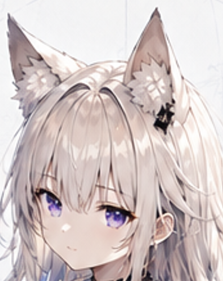

# Unity 中图片 MaxSize 限制反而导致占用变大

这篇记录一个在 Unity 里比较反直觉的现象：给图片设置 MaxSize 限制，本意是缩小图片、减少占用，结果图片的内存占用反而暴涨了。

## 现象

用一张 768×1344 的 PNG 图片（海底2.png，磁盘占用 798KB）导入 Unity，压缩格式为 DXT。

**不限制 MaxSize（默认 2048）时**，768×1344 恰好都是 4 的倍数，宽高不会被压缩，Unity 内部占用 504.0KB：

**限制 MaxSize 为 1024 时**，图片自动缩小为 585×1024，Unity 内部占用反而变成 1.7MB：

对比一下原图的磁盘占用：

| 场景         | 尺寸      | 宽高是否为4的倍数 | Unity 内部占用   |
| ------------ | --------- | ----------------- | ---------------- |
| 原图 PNG     | 768×1344 | ✅ 是             | —（磁盘 798KB） |
| MaxSize=2048 | 768×1344 | ✅ 是             | 504 KB           |
| MaxSize=1024 | 585×1024 | ❌ 585 不是       | **1.7 MB** |

缩小了图片，占用反而从 504KB 涨到 1.7MB，涨了三倍多。

## 原因

DXT 压缩是以 4×4 像素为一个块（block）来处理的，要求图片的宽和高都必须是 4 的倍数。

当图片宽高不是 4 的倍数时，Unity 无法正常使用 DXT 压缩，会回退到未压缩格式（RGBA32，每像素 4 字节）。这就是占用暴涨的真正原因。

简单算一下：

- **768×1344（4的倍数）**，DXT5 压缩：768 × 1344 × 0.5 bytes/pixel = **504KB** ✅
- **585×1024（585不是4的倍数）**，回退 RGBA32：585 × 1024 × 4 bytes/pixel = 2340KB ≈ **2.3MB**

实际 Unity 显示 1.7MB，是因为 Unity 内部还做了一些对齐处理，但量级就是这样的——从压缩格式回退到未压缩格式，占用直接翻几倍。

所以结论是：**原图的宽高是 4 的倍数时，如果限制 MaxSize 导致缩放后的宽高不再是 4 的倍数，DXT 压缩失效，回退到 RGBA32，图片占用反而会暴涨。**

## 怎么避免

1. **手动缩放到 4 的倍数**：在导入 Unity 之前，用图片编辑工具把图片缩放到宽高都是 4 的倍数的尺寸，比如 512×1024，而不是让 Unity 自动缩放到 585×1024。
2. **调整 Non-Power-of-2 策略**：在图片的导入设置里，`Non-Power of 2` 选项可以选择 `ToNearest`、`ToLarger`、`ToSmaller`，让 Unity 自动把尺寸对齐到最近的 4 的倍数（或 2 的幂），而不是保留非 4 倍数的尺寸。
3. **合理设置 MaxSize**：如果原图尺寸本来就是 4 的倍数，选择一个 MaxSize 让缩放后的结果仍然是 4 的倍数。
4. **检查实际压缩格式**：在 Inspector 里选中图片，切换到对应平台的设置，确认 Format 列显示的是 DXT5 / BC7 等压缩格式，而不是 RGBA32。如果发现回退成了 RGBA32，就说明尺寸有问题。

测试图片
