**转载整理**

[【杂项】Cheat Engine 抓游戏基址：内存找基址脚本](https://blog.csdn.net/wanderer__/article/details/127814515)

本文整理使用 Cheat Engine（简称 CE）定位动态内存地址，并通过指针扫描寻找较稳定指针路径的基本流程。

## 1. 基本思路

游戏运行时，角色属性、货币和道具数量等数据会保存在内存中。程序每次重新启动后，数据所在的动态地址可能发生变化。

如果每次启动游戏后都重新扫描数据，会比较麻烦。CE 的指针扫描可以根据多次运行时记录的地址，尝试找到一条较稳定的访问路径：

```text
较稳定的模块地址
-> 多级指针
-> 偏移量
-> 当前数据地址
```

找到候选指针路径后，还需要多次重启游戏验证。某条路径在一次运行中有效，不代表它在其他运行环境中也一定有效。

## 2. 手动定位数据地址

首先启动游戏和 CE，并在 CE 中选择目标进程。本例以阳光数量为例，初始值为 `50`：


在 CE 中首次扫描十进制数值 `50`。此时通常会得到大量结果：

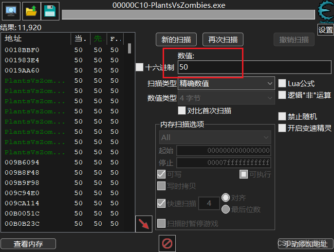

回到游戏，让阳光数量发生变化。本例中，阳光数量变为 `75`：


回到 CE，根据新的数值继续扫描。重复“修改游戏中的数值，再次扫描”的过程，直到候选地址足够少：

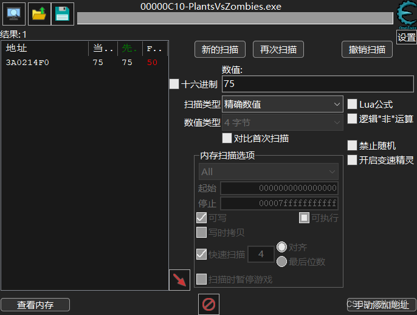

尝试修改候选地址中的数值。如果游戏中的阳光数量同步变化，说明已经找到了本次运行中的数据地址：

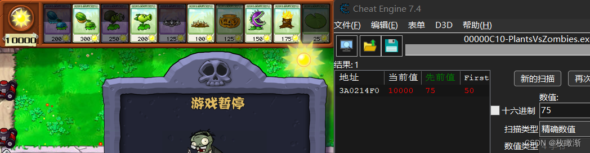

## 3. 生成第一次指针映射

双击找到的数据地址，将它加入下方地址列表：

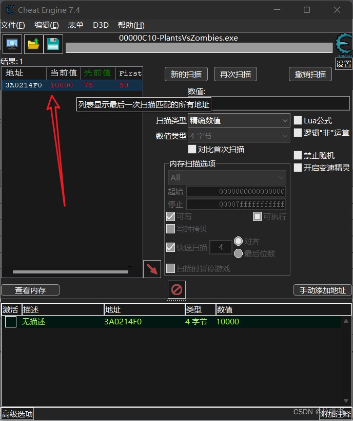

右键地址，选择生成指针映射。指针映射会记录当前运行环境中的指针信息，供后续扫描比较：

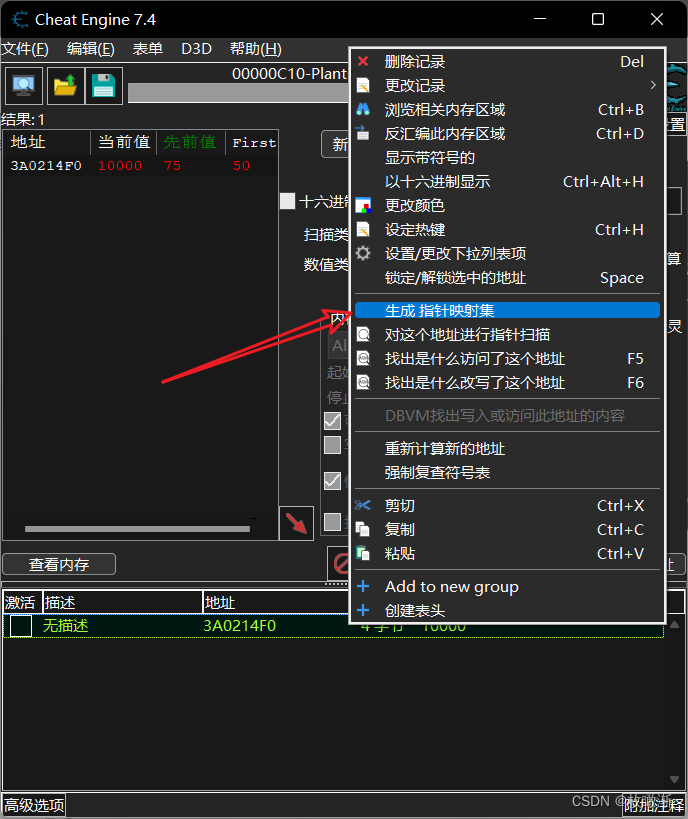

保存映射文件。文件名可以自行决定，但建议标注目标数据和生成顺序：

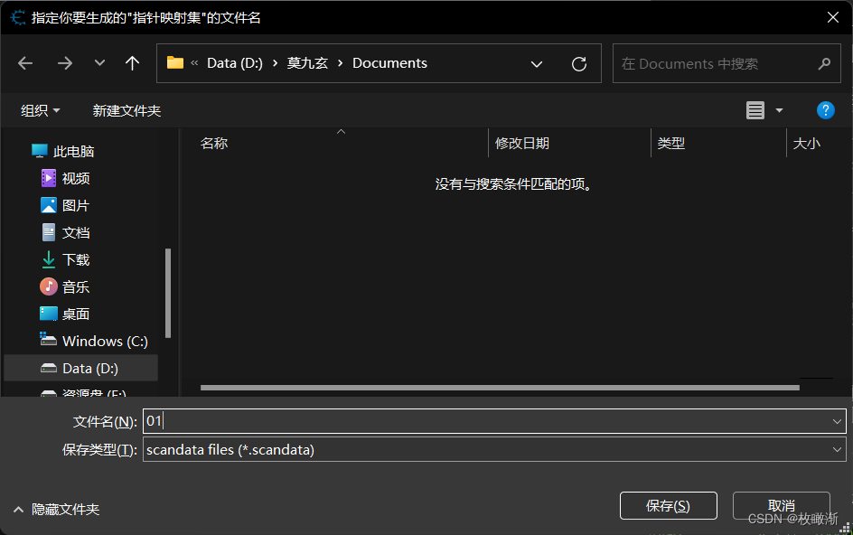

例如：

```text
sunshine_pointermap_01.scandata
```

## 4. 重新启动游戏并定位新地址

退出游戏并重新启动。由于内存布局可能发生变化，需要再次按照前面的步骤定位阳光数量，并将新的指针映射保存到同一个目录：

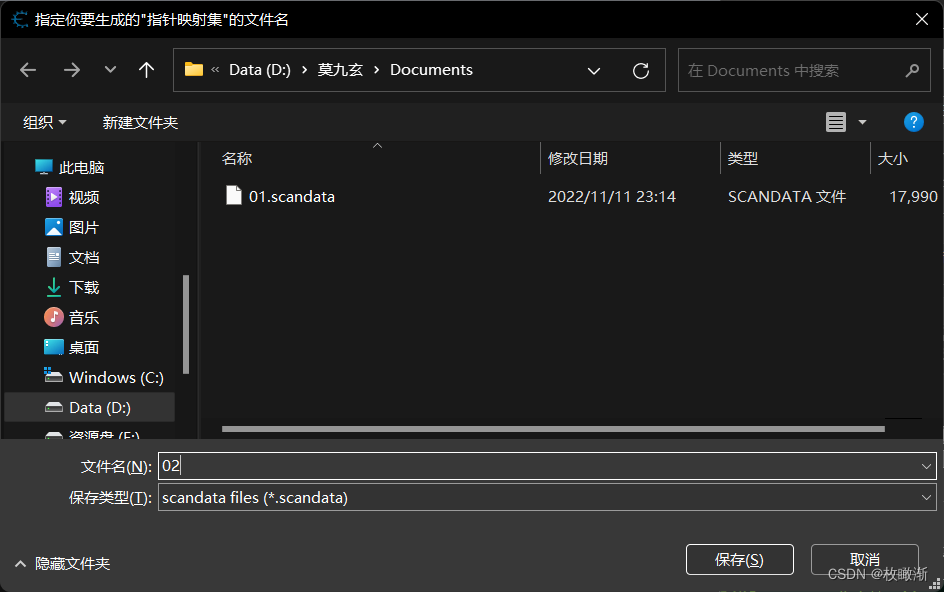

为了缩小扫描范围，还可以右键当前地址，选择查找“是什么改写了这个地址”：

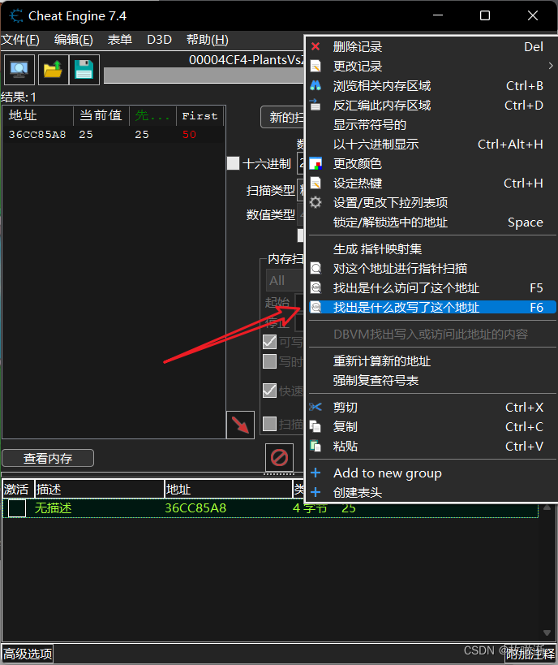

回到游戏触发一次数据变化，例如拾取一个阳光。CE 会捕获修改该地址的汇编指令：

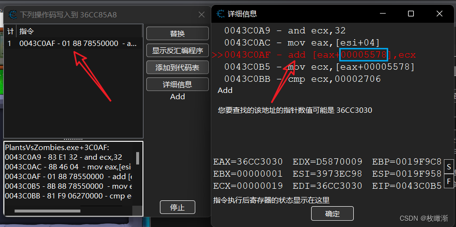

本例中的指令包含偏移量 `5578`。不同游戏、不同数据和不同版本使用的偏移量可能不同，需要以实际捕获结果为准。

## 5. 使用两次映射扫描指针

回到 CE 主界面，对当前数据地址执行指针扫描：

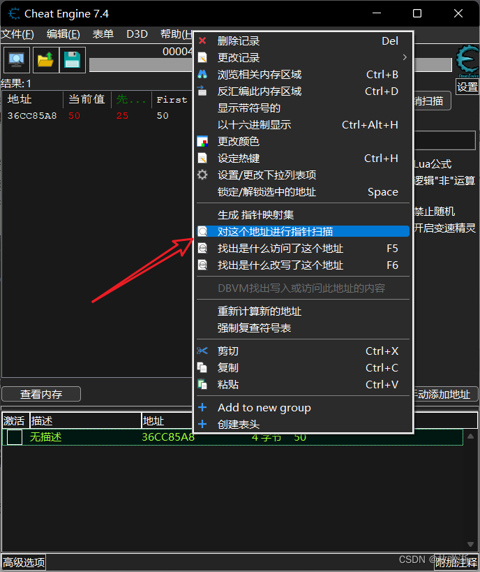

在扫描界面中：

标注点1，2勾选并选择本次运行生成的指针映射。

标注点3，4勾选并选择之前保存的指针映射。

标注点5填写第一次运行时定位到的数据地址。

标注点6，7勾选使用偏移量，并填入刚才捕获到的偏移量。

开始扫描。

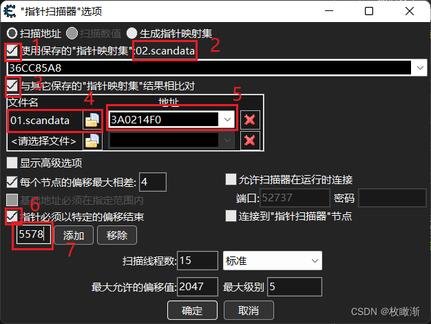

扫描完成后会得到候选指针路径。双击其中一个结果，将它加入地址列表：

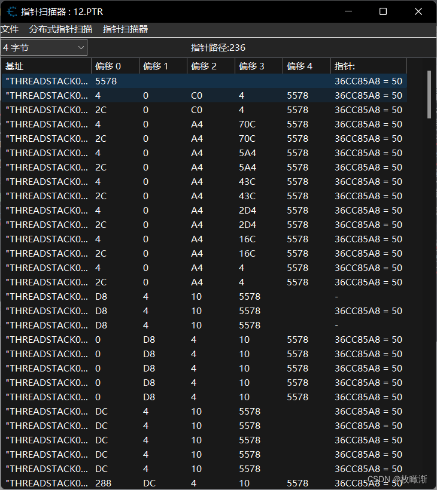

地址列表中的记录会变成指针形式。尝试修改数值并观察游戏中的数据是否同步变化：

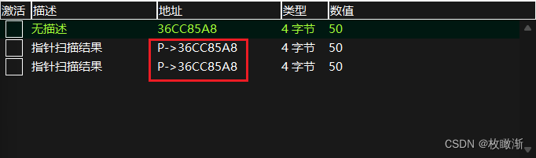

如果候选路径有效，重新启动游戏后再继续验证。必要时可以增加更多指针映射，进一步筛选结果。

## 6. 保存并复用 CT 文件

验证指针路径后，可以删除地址列表中不需要的临时记录，只保留有效指针：

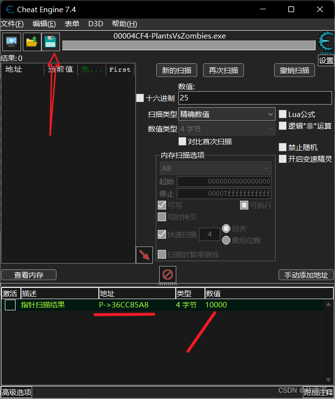

点击保存，将当前地址列表保存为 `.CT` 文件：

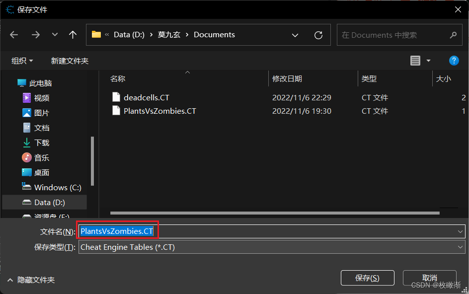

`.CT` 是 Cheat Table 文件，可以保存地址记录、指针路径以及可选的脚本配置。它不等于游戏本体，也不会保证所有记录在游戏更新后仍然有效。

下次启动游戏后，在 CE 中加载保存的 `.CT` 文件：

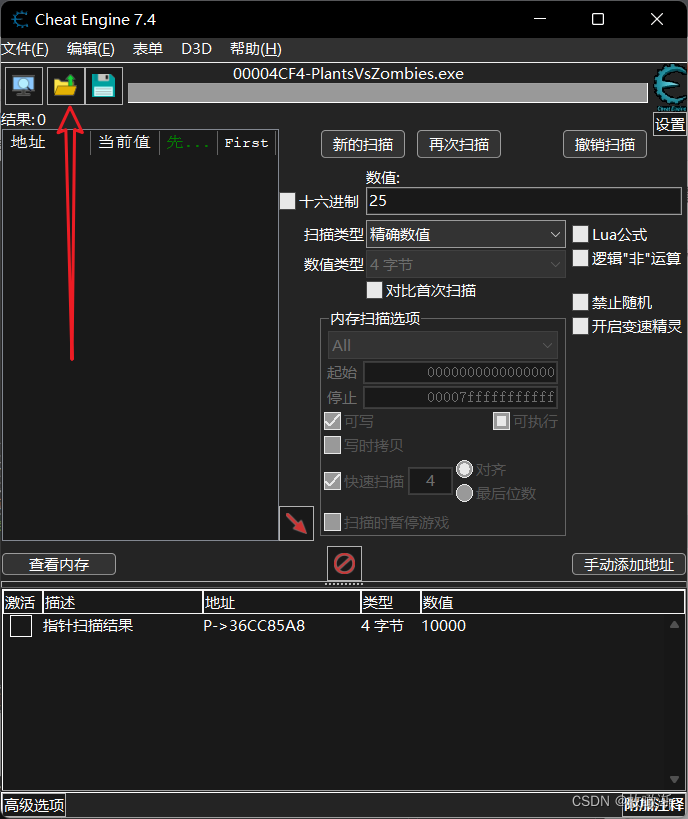

地址列表会恢复：

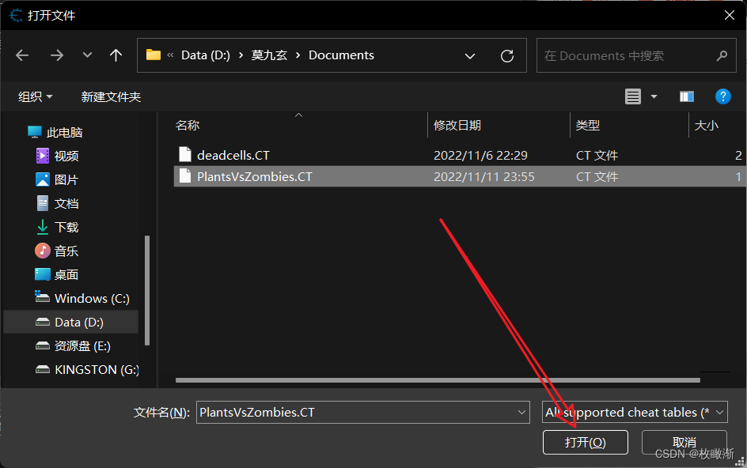

确认目标进程和游戏版本正确后，再验证指针记录是否仍然有效：


## 7. 注意事项

- 动态地址会变化，找到单次运行中的地址只是第一步。
- 指针扫描得到的是候选路径，需要通过多次重启验证稳定性。
- 游戏更新后，内存布局、模块地址和偏移量都可能变化。
- 不要加载来源不明的 `.CT` 文件，其中可能包含不可信脚本。
