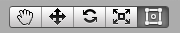
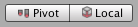
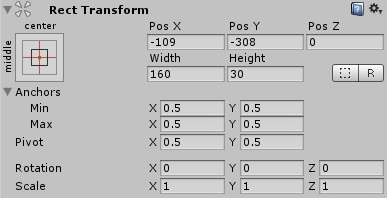
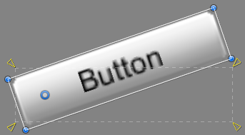

# Basic Layout

在本节中，我们将学习如何将 UI 元素相对于 Canvas 以及其他元素进行定位。如果你希望边阅读边练习，可以通过菜单 **GameObject -> UI -> Image** 创建一个图像（Image）对象。

## The Rect Tool（矩形工具）

每一个 UI 元素在布局时都会被表示为一个矩形。这个矩形可以通过工具栏中的 **Rect 工具** 在场景视图中进行操作。Rect 工具既用于 Unity 的 2D 功能，也用于 UI，实际上也可以用于 3D 对象。

Rect 工具可以用来移动、调整大小和旋转 UI 元素。当你选中一个 UI 元素后，可以点击矩形内部任意位置并拖动来移动它；点击边缘或角落并拖动可以调整大小；将鼠标悬停在角落稍远处，当鼠标指针变成旋转图标时，就可以点击并向任意方向拖动以旋转元素。

与其他工具一样，Rect 工具也会使用当前工具栏中设置的 **轴心模式（Pivot Mode）**和**坐标空间（Space）** 。在处理 UI 时，通常建议将这两个选项分别设置为 **Pivot** 和  **Local（本地坐标）** 。

## Rect Transform（矩形变换）

Rect Transform 是专为 UI 元素设计的新变换组件，用于替代常规的 Transform 组件。

Rect Transform 和普通的 Transform 一样，拥有位置（Position）、旋转（Rotation）和缩放（Scale）属性，但它还额外具有宽度（Width）和高度（Height），用于定义矩形区域的尺寸。

### Resizing Versus Scaling（调整大小 vs 缩放）

当使用 Rect 工具改变对象的尺寸时，通常对于 2D 系统中的精灵（Sprite）或 3D 对象来说，会改变对象的本地缩放（Local Scale）。然而，当该对象使用的是 Rect Transform 时，Rect 工具会直接修改宽度和高度，而不会改变缩放比例（Local Scale）。

这种“调整大小”不会影响字体大小、切片图像的边框等属性。

### Pivot（轴心点）

旋转、尺寸和缩放操作都是围绕轴心点进行的，因此轴心点的位置会影响旋转、调整大小或缩放的结果。当工具栏上的 Pivot 按钮设置为 **Pivot 模式** 时，可以在场景视图中移动 Rect Transform 的轴心点。

### Anchors（锚点）

Rect Transform 引入了一种称为“锚点”的布局概念。锚点在场景视图中会显示为四个小三角形控制柄，其锚点信息也会在检视器（Inspector）中显示出来。

如果一个 Rect Transform 的父对象也是一个 Rect Transform，那么这个子对象就可以以多种方式锚定在父对象上。例如，子对象可以锚定在父对象的中心，或者锚定在某个角落。

锚点还允许子对象随父对象的宽度或高度一起拉伸。矩形的每个角都相对于其对应的锚点有一个固定的偏移量，比如，矩形的左上角相对于左上锚点有一个固定的偏移。通过这种方式，矩形的不同角可以锚定到父矩形的不同位置。

锚点的位置是以父矩形宽度和高度的比例（百分比）来定义的。`0.0`（0%）代表左侧或底部，`0.5`（50%）代表中间，`1.0`（100%）代表右侧或顶部。但锚点并不限于边缘或中心，它们可以设置在父矩形内部的任意位置。

你可以单独拖动每一个锚点；如果锚点重合在一起，也可以通过点击它们之间的中间位置并拖动来一起移动它们。如果在拖动锚点的同时按住  **Shift 键** ，那么矩形对应的角也会和锚点一起移动。

锚点控制柄的一个实用特性是：它们会自动吸附到兄弟矩形的锚点上，从而实现精确对齐。

### Anchor presets（锚点预设）

在检视器（Inspector）中，**锚点预设按钮（Anchor Preset）** 位于 Rect Transform 组件的左上角。点击该按钮会打开锚点预设下拉菜单，你可以在这里快速选择一些常见的锚定方式。你可以将 UI 元素锚定到父对象的边缘或中间位置，或者设置为随父对象尺寸一起拉伸。 **水平锚定和垂直锚定是彼此独立的** 。

锚点预设按钮会显示当前选中的预设选项（如果有的话）。如果锚点在水平或垂直方向上的设置与任何预设都不匹配，则会显示为“自定义（custom）”。

### Anchor and position fields in the Inspector（检视器中的锚点和位置字段）

你可以点击 Anchors 的展开箭头来显示锚点数值字段（如果它们还未显示）。Anchor Min 对应于场景视图中的左下锚点控制柄，而 Anchor Max 对应于右上控制柄。

矩形的位置字段会根据锚点是否重合显示为不同的样式。锚点重合时表示固定宽度和高度；锚点分离时则表示矩形会随父级矩形拉伸。

当所有锚点控制柄重合时，显示的字段是 Pos X、Pos Y、Width 和 Height。Pos X 和 Pos Y 表示轴心点（pivot）相对于锚点的位置。

当锚点分离时，字段可能部分或完全变为 Left、Right、Top 和 Bottom。这些字段定义的是矩形在锚点区域内部的边距。如果锚点在水平方向上分离，则使用 Left 和 Right 字段；如果在垂直方向上分离，则使用 Top 和 Bottom 字段。

请注意，更改锚点或轴心（pivot）字段中的数值时，通常会自动调整定位字段的值，以使矩形保持在原来的位置。如果你不希望出现这种情况，可以点击 Inspector 中的 R 按钮启用 Raw edit mode（原始编辑模式）。此模式下，锚点和轴心值可以单独修改，而不会影响其他值。不过这很可能会导致矩形在视觉上被移动或缩放，因为其位置和大小是依赖于锚点和轴心值的。
