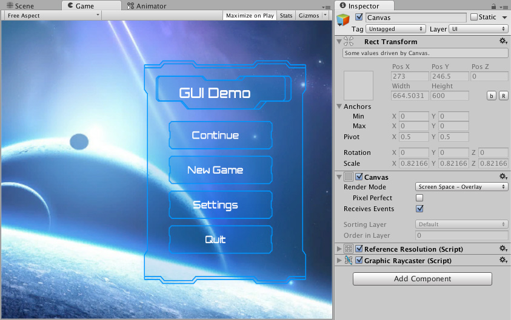

# Canvas（画布）

Canvas（画布）是所有 UI 元素都必须包含在其中的区域。Canvas 是一个带有 Canvas 组件的游戏对象（Game Object），所有的 UI 元素都必须是该 Canvas 的子对象。

在场景中如果还没有 Canvas，使用菜单 **GameObject > UI > Image** 创建一个新的 UI 元素（比如图像 Image）时，会自动创建一个 Canvas。所创建的 UI 元素将作为该 Canvas 的子对象存在。

在场景视图（Scene View）中，Canvas 区域会以一个矩形显示，这样可以方便地定位 UI 元素，而无需始终显示游戏视图（Game View）。

Canvas 使用 EventSystem 对象来协助消息传递系统（Messaging System）的工作。

## Draw order of elements

Canvas 中的 UI 元素会按照它们在层级面板（Hierarchy）中的顺序进行绘制。第一个子对象最先被绘制，第二个子对象接着被绘制，依此类推。如果两个 UI 元素发生重叠，后绘制的元素将显示在先绘制的元素之上。

要更改某个元素显示在其他元素之上的顺序，只需在层级面板中拖动它们重新排序即可。你也可以通过脚本控制顺序，使用 Transform 组件上的以下方法：`SetAsFirstSibling`、`SetAsLastSibling` 和 `SetSiblingIndex`。

## Render Modes（渲染模式）

Canvas 拥有一个 **Render Mode（渲染模式）** 设置，可以用来指定它是在屏幕空间（Screen Space）还是世界空间（World Space）中进行渲染。

### Screen Space - Overlay（屏幕空间 - 覆盖）

这种渲染模式会将 UI 元素直接渲染在场景之上，显示在屏幕上。如果屏幕尺寸发生变化或分辨率改变，Canvas 会自动调整大小以适应新的屏幕设置。

### Screen Space - Camera（屏幕空间 - 摄像机）

这种模式与 Screen Space - Overlay 类似，但不同的是，Canvas 会被放置在指定摄像机（Camera）前方的某个距离处。UI 元素将由该摄像机进行渲染，这意味着摄像机的设置会影响 UI 的显示效果。如果摄像机设置为透视模式（Perspective），UI 元素也会以透视方式渲染，透视扭曲的程度可以通过摄像机的视野角（Field of View）来控制。如果屏幕尺寸或分辨率发生变化，或者摄像机视锥体（frustum）发生变化，Canvas 也会自动调整大小以适应这些变化。

### World Space（世界空间）

在这种渲染模式下，Canvas 的行为与场景中的其他对象相同。可以通过 Rect Transform 手动设置 Canvas 的大小，UI 元素将根据其 3D 位置显示在其他场景对象的前方或后方。这种模式适用于需要成为场景一部分的 UI，也被称为“具象化界面（diegetic interface）”。

