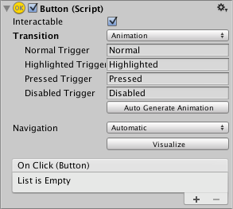
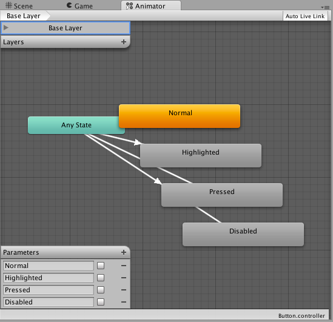
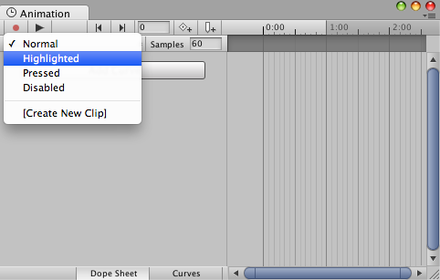

# Animation Integration（动画集成）

Animation（动画）允许在控件状态之间的每一次过渡中使用 Unity 的动画系统进行完整的动画表现。由于可以同时对多个属性进行动画处理，这是最强大的 Transition Mode（过渡模式）之一。

要使用  **Animation transition mode（动画过渡模式）** ，必须在控件元素上附加一个  **Animator Component（动画器组件）** 。这可以通过点击“ **Auto Generate Animation（自动生成动画）** ”来自动完成。同时这也会生成一个已配置好状态的  **Animator Controller（动画器控制器）** ，需要对其进行保存。

新的 Animator Controller 立即可用。与大多数 Animator Controller 不同，该控制器还会存储控件过渡所需的动画，这些动画可以根据需要进行自定义。

例如，如果选择了一个附加了 Animator Controller 的 Button（按钮）元素，可以通过打开  **Animation Window（动画窗口）** （菜单路径： **Window > Animation（窗口 > 动画）** ）来编辑该按钮各个状态的动画。

可以通过 **Animation Clip（动画片段）** 的弹出菜单选择所需的动画片段。选项包括：“ **Normal（正常）** ”、“ **Highlighted（高亮）** ”、“ **Pressed（按下）** ”和“ **Disabled（禁用）** ”。

Normal State（正常状态）由按钮元素本身的属性值决定，因此可以留空。在其他状态下，最常见的设置是在时间轴起始处设定一个关键帧（Keyframe）。状态之间的过渡动画将由 Animator 负责处理。

例如，可以通过如下步骤修改按钮在 Highlighted State（高亮状态）下的宽度：

* 从 **Animation Clip 弹出菜单**中选择 **Highlighted（高亮）** 状态
* 将播放头（Playhead）移动到时间轴起点
* 选择 **Record Button（录制按钮）**
* 在 **Inspector（检查器）** 中修改 Button（按钮）的宽度
* 退出录制模式（Record Mode）
* 切换到 Play Mode（播放模式）查看按钮在高亮时如何变宽

在同一个关键帧中，可以为任意数量的属性设置其参数。

多个按钮可以通过共享 Animator Controller 来共用相同的行为。

请注意，**UI Animation transition mode** 与 Unity 的 **Legacy Animation System（传统动画系统）** 不兼容。你应当只使用  **Animator Component（动画器组件）** 。
