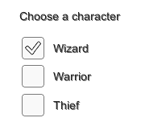
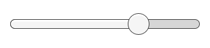
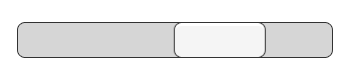
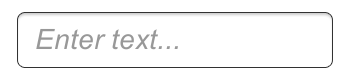

# Interaction Components（交互组件）

本节介绍 UI 系统中用于处理交互的组件，如鼠标或触摸事件，以及通过键盘或控制器进行的交互。

交互组件本身是不可见的，必须与一个或多个可视组件（Visual Components）结合使用才能正常工作。

## Common Functionality（通用功能）

大多数交互组件具有一些共同点。它们都是  **Selectables（可选项）** ，这意味着它们拥有共享的内建功能，可用于可视化状态间的过渡（Normal（正常）、Highlighted（高亮）、Pressed（按下）、Disabled（禁用）），以及通过键盘或控制器进行的导航。这些共享功能在 **Selectable 页面** 中有详细描述。

交互组件通常包含至少一个  **UnityEvent（Unity 事件）** ，当用户以特定方式与组件交互时该事件将被触发。如果连接到 UnityEvent 的代码中有异常抛出，UI 系统会捕获并记录这些异常。

## Button（按钮）

Button（按钮）组件拥有一个  **OnClick（点击时）UnityEvent** ，用于定义按钮被点击时执行的操作。

详见 Button 页面以了解如何使用 Button 组件。

## Toggle（开关）

Toggle（开关）组件包含一个 **Is On（是否开启）** 复选框，用于确定当前 Toggle 是开启还是关闭。用户点击 Toggle 时该值会被切换，并且视觉上的对勾标记会相应地显示或隐藏。它还有一个  **OnValueChanged（值变化时）UnityEvent** ，用于定义值变更时要执行的操作。

详见 Toggle 页面以了解如何使用 Toggle 组件。

## Toggle Group（开关组）

Toggle Group（开关组）可用于对一组相互排斥的 Toggle 进行分组。属于同一 Toggle Group 的 Toggle 会被限制为一次只能选择一个 —— 选择其中一个时其他将自动取消选中。

详见 Toggle Group 页面以了解如何使用 Toggle Group 组件。

## Slider（滑动条）

Slider（滑动条）有一个十进制数值  **Value（数值）** ，用户可以在最小值与最大值之间拖动滑块。它可以是水平或垂直方向的。它还有一个  **OnValueChanged（值变化时）UnityEvent** ，用于定义值改变时的响应操作。

详见 Slider 页面以了解如何使用 Slider 组件。

## Scrollbar（滚动条）

Scrollbar（滚动条）有一个介于 0 到 1 之间的十进制数值  **Value（数值）** 。当用户拖动滚动条时，该数值会随之改变。

Scrollbar 通常与 **Scroll Rect（滚动矩形）** 和 **Mask（遮罩）** 一起使用，以创建一个  **Scroll View（滚动视图）** 。Scrollbar 还有一个 **Size（尺寸）** 值，取值范围在 0 到 1 之间，用于决定滑块（Handle）在整个滚动条中的长度比例。这个值通常由另一个组件控制，用于表示滚动视图中可见内容的比例。 **Scroll Rect 组件可以自动完成这一功能** 。

Scrollbar 可以是水平或垂直方向的。它也包含一个  **OnValueChanged（值变化时）UnityEvent** ，用于定义数值变化时的操作。

详见 Scrollbar 页面以了解如何使用 Scrollbar 组件。

## Dropdown（下拉菜单）

Dropdown（下拉菜单）包含一个可供选择的选项列表。每个选项可以指定一个文本字符串，并可选附加一个图像。这些内容可以在 **Inspector（检查器）** 中设置，也可以通过代码动态设置。它包含一个  **OnValueChanged（值变化时）UnityEvent** ，用于定义当前选项改变时要执行的操作。

详见 Dropdown 页面以了解如何使用 Dropdown 组件。

## Input Field（输入字段）

Input Field（输入字段）用于让用户编辑 **Text（文本）元素** 中的文字内容。它包含一个  **UnityEvent（Unity 事件）** ，用于定义文本内容变更时要执行的操作，另一个事件则用于定义用户完成编辑时要执行的操作。

详见 Input Field 页面以了解如何使用 Input Field 组件。

## Scroll Rect /Scroll View（滚动矩形/滚动视图）

Scroll Rect（滚动矩形）用于在一个较小的区域中显示占据大量空间的内容。Scroll Rect 提供了滚动浏览内容的功能。

通常 Scroll Rect 与 **Mask（遮罩）** 一起使用，以创建一个  **Scroll View（滚动视图）** ，使得只有 Scroll Rect 内的滚动内容是可见的。它还可以与一个或两个 Scrollbar（滚动条）组合，允许用户通过拖动滚动条进行水平或垂直滚动。

详见 Scroll Rect 页面以了解如何使用 Scroll Rect 组件。
