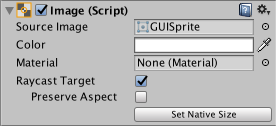
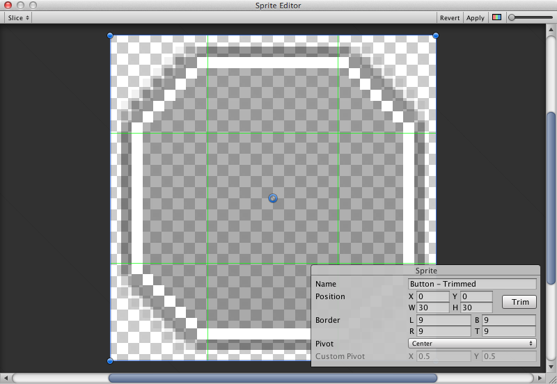

# Visual Components（可视组件）

随着 UI 系统的引入，Unity 添加了一些新的组件，用于实现 GUI（图形用户界面）相关的功能。本节将介绍可以创建的新组件的基础内容。

## Text（文本）

Text 组件，也被称为 Label（标签），包含一个 Text（文本）区域用于输入将要显示的文本。你可以设置字体（Font）、字体样式（Font Style）、字体大小（Font Size），以及是否启用富文本功能（Rich Text）。

此外，还有文本对齐方式（Alignment）、水平和垂直溢出设置（Horizontal Overflow 和 Vertical Overflow），用于控制当文本超出矩形宽度或高度时的显示方式。Best Fit（最佳适配）选项可以让文本自动缩放以适应可用空间。

## Image（图像）

Image（图像）包含一个 Rect Transform（矩形变换）组件和一个 Image（图像）组件。在 Target Graphic（目标图像）字段中可以设置一个精灵（Sprite），在 Color（颜色）字段中可以设置其颜色。也可以在 Image 组件上应用材质（Material）。Image Type（图像类型）字段定义精灵的显示方式，可选项包括：

* **Simple（简单）** - 等比例缩放整个精灵。
* **Sliced（切片）** - 利用 3x3 切片区域，使在调整大小时不拉伸四个角，只拉伸中心部分。
* **Tiled（平铺）** - 与 Sliced 类似，但中心部分不拉伸，而是重复平铺。若精灵没有边框，则整个精灵将被平铺。
* **Filled（填充）** - 类似 Simple 显示精灵，但从某一原点按照指定方向、方式和比例填充精灵。

当选择 Simple 或 Filled 类型时，Set Native Size（设置原生尺寸）选项将图片重置为原始精灵尺寸。

将图像导入为 UI 精灵的方法是在 Texture Type（纹理类型）设置中选择 Sprite(2D/UI)。与旧版 GUI 精灵相比，UI 精灵具有额外的导入设置，其中最显著的区别是新增了 Sprite Editor（精灵编辑器）。精灵编辑器提供了 9-slice（九宫格）切片选项，用于将图像分成 9 个区域，这样在缩放精灵时，四个角不会被拉伸或变形。

## Raw Image（原始图像）

与 Image 组件使用精灵（Sprite）不同，Raw Image 使用的是纹理（Texture），没有边框等设置。Raw Image 仅在必要时使用，其他大多数情况下建议使用 Image 组件。

## Mask（遮罩）

Mask（遮罩）不是一个可见的 UI 控件，而是一种用于修改子元素外观的方式。遮罩会将子元素限制在父对象的形状内（即“遮罩”子元素）。因此，如果子元素比父元素大，那么只有在父元素范围内的部分才会被显示。

## Effects（效果）

可视组件还可以应用各种简单的效果，如投影（Drop Shadow）或描边（Outline）。更多信息请参阅 UI Effects（UI 效果）参考页面。
