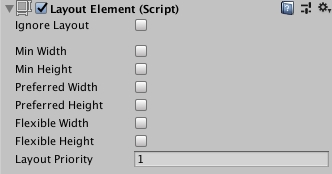
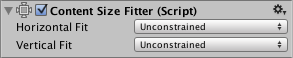
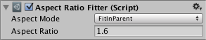

# Auto Layout（自动布局）

Rect Transform（矩形变换）布局系统足够灵活，能够处理多种不同类型的布局，并允许以完全自由的方式放置元素。然而，有时候可能需要更具结构性的一些方式。

Auto Layout System（自动布局系统）提供了一种在嵌套的布局组中放置元素的方法，例如： **Horizontal Groups（水平组）** 、**Vertical Groups（垂直组）** 或  **Grids（网格）** 。它还允许元素根据其包含的内容自动调整大小。例如，一个 Button（按钮）可以根据其文本内容加上一些填充动态调整尺寸，使其刚好适配。

Auto Layout System 是建立在基本的 Rect Transform 布局系统之上的。它可以选择性地应用于部分或全部元素。

## Understanding Layout Elements（理解布局元素）

Auto Layout System 基于 Layout Elements（布局元素）与 Layout Controllers（布局控制器）的概念。

一个 **Layout Element（布局元素）** 是一个带有 **Rect Transform** 的 Game Object（游戏对象），还可以附带其他组件。布局元素本身“知道”它应该拥有什么尺寸。它不会直接设置自己的尺寸，而是由其他作为布局控制器的组件使用其提供的信息，来计算出应该分配给它的尺寸。

一个布局元素具备以下属性：

* **Minimum width（最小宽度）**
* **Minimum height（最小高度）**
* **Preferred width（首选宽度）**
* **Preferred height（首选高度）**
* **Flexible width（弹性宽度）**
* **Flexible height（弹性高度）**

使用这些布局信息的布局控制器组件示例包括：**Content Size Fitter（内容尺寸适配器）** 和各种  **Layout Group Components（布局组组件）** 。布局组中布局元素尺寸的基本分配原则如下：

1. 先分配  **最小尺寸** ；
2. 如果有足够的空间，则分配  **首选尺寸** ；
3. 如果还有额外空间，则分配  **弹性尺寸** 。

任何带有 Rect Transform 的 Game Object 都可以作为布局元素。默认情况下，它们的最小、首选和弹性尺寸为 0。某些组件添加到 Game Object 上时，会改变这些布局属性。

**Image（图像）** 和 **Text（文本）** 组件就是会提供布局属性的两个示例。它们会根据图片或文本内容，改变其首选宽度和高度。

### Layout Element Component（布局元素组件）

如果你想要覆盖默认的最小尺寸、首选尺寸或弹性尺寸，可以通过为 Game Object 添加 **Layout Element Component（布局元素组件）** 来实现。



该组件允许你自定义一个或多个布局属性的值。启用你想要覆盖的属性的复选框，然后输入你希望使用的数值。

更多信息请参阅 Layout Element 的参考页面。

## Understanding Layout Controllers（理解布局控制器）

Layout Controllers（布局控制器）是控制一个或多个 **Layout Elements（布局元素）** 的组件，即带有 **Rect Transform（矩形变换）** 的 Game Object（游戏对象）。布局控制器可以控制它自身所在的布局元素，也可以控制其子对象中的布局元素。

一个作为布局控制器的组件也可以同时作为布局元素本身存在。

### Content Size Fitter（内容大小适配器）

**Content Size Fitter** 是一个控制自身布局元素尺寸的布局控制器。观察自动布局系统最简单的方式就是将 **Content Size Fitter** 组件添加到一个带有 **Text（文本）** 组件的 Game Object 上。



如果你将 **Horizontal Fit（水平适配）** 或 **Vertical Fit（垂直适配）** 设置为  **Preferred（首选）** ，那么 **Rect Transform** 将自动调整其宽度和/或高度，以适配文本内容。

更多信息请参阅 Content Size Fitter 的参考页面。

### Aspect Ratio Fitter（宽高比适配器）

**Aspect Ratio Fitter** 是一个控制自身布局元素尺寸的布局控制器。



它可以调整高度以适应宽度，或反之；也可以使该元素适应其父对象或包裹其父对象。**Aspect Ratio Fitter** 不考虑布局信息，如最小尺寸或首选尺寸。

更多信息请参阅 Aspect Ratio Fitter 的参考页面。

### Layout Groups（布局组）

**Layout Group（布局组）** 是控制其子布局元素的尺寸与位置的布局控制器。例如，**Horizontal Layout Group（水平布局组）** 会将子元素并排排列，而 **Grid Layout Group（网格布局组）** 则将子元素以网格方式排列。

一个布局组不会控制自身的尺寸。相反，它本身作为一个布局元素存在，可以被其他布局控制器控制，或者手动设置其尺寸。

无论布局组被分配到什么尺寸，它通常会尝试根据其子元素提供的最小、首选和弹性尺寸，为每个子元素分配适当的空间。布局组也可以任意嵌套使用。

更多信息请参阅  **Horizontal Layout Group** 、**Vertical Layout Group** 和 **Grid Layout Group** 的参考页面。

### Driven Rect Transform properties（被驱动的 Rect Transform 属性）

由于自动布局系统中的布局控制器可以自动控制某些 UI 元素的尺寸和位置，因此这些尺寸和位置不应同时通过 **Inspector（检查器）** 或 **Scene View（场景视图）** 手动编辑。这类手动更改的值会在下一次布局计算时被布局控制器重置。

**Rect Transform** 提供了一个 **Driven Properties（被驱动属性）** 的概念来处理这种情况。例如，当 **Content Size Fitter** 的 **Horizontal Fit（水平适配）** 被设置为 **Minimum（最小）** 或 **Preferred（首选）** 时，会驱动该 Game Object 上 Rect Transform 的宽度。此时宽度字段会变为只读，Rect Transform 顶部会显示一个提示框，告知其一个或多个属性正被 **Content Size Fitter** 驱动。

被驱动的 Rect Transform 属性不只是为了防止手动修改。一个布局可能仅仅因为 Game View（游戏视图）的分辨率或尺寸变化而发生改变。这种变化会影响布局元素的尺寸或位置，从而改变被驱动属性的值。但我们并不希望场景因此被标记为“有未保存的更改”。为防止这种情况，被驱动属性的值不会作为场景的一部分被保存，对它们的修改也不会标记场景为已更改。

## Technical Details（技术细节）

自动布局系统内置了一些组件，但也可以创建自定义的组件以特定方式控制布局。这可以通过让组件实现被自动布局系统识别的特定接口来完成。

### Layout Interfaces（布局接口）

如果一个组件实现了接口  **ILayoutElement** ，那么自动布局系统会将该组件视为一个  **Layout Element（布局元素）** 。

如果一个组件实现了接口  **ILayoutGroup** ，则期望它驱动其子对象的  **Rect Transform（矩形变换）** 。

如果一个组件实现了接口  **ILayoutSelfController** ，则期望它驱动其自身的  **RectTransform** 。

### Layout Calculations（布局计算）

自动布局系统按照以下顺序对布局进行评估和执行：

1. 通过调用 **ILayoutElement** 组件的 `CalculateLayoutInputHorizontal` 方法，计算布局元素的最小、首选和弹性  **宽度** 。

   这个过程是自底向上的，先计算子对象，再计算父对象，以便父对象在计算时可以考虑其子对象提供的信息。
2. 通过调用 **ILayoutController** 组件的 `SetLayoutHorizontal` 方法，计算并设置布局元素的实际  **宽度** 。

   这个过程是自顶向下的，先计算父对象，再计算子对象，因为子对象的宽度分配需要基于父对象提供的总宽度。

   在此步骤之后，布局元素的 **Rect Transform** 将拥有新的宽度。
3. 通过调用 **ILayoutElement** 组件的 `CalculateLayoutInputVertical` 方法，计算布局元素的最小、首选和弹性  **高度** 。

   这个过程也是自底向上的，先计算子对象，再计算父对象，使得父对象可以参考子对象提供的信息。
4. 通过调用 **ILayoutController** 组件的 `SetLayoutVertical` 方法，计算并设置布局元素的实际  **高度** 。

   这个过程是自顶向下的，先计算父对象，再计算子对象，因为子对象的高度分配需要基于父对象提供的总高度。

   在此步骤之后，布局元素的 **Rect Transform** 将拥有新的高度。

从上述过程可以看出，自动布局系统会先评估  **宽度** ，再评估  **高度** 。因此，计算出的高度可以依赖于宽度，但计算出的宽度不能依赖于高度。

### Triggering Layout Rebuild（触发布局重新构建）

当某个组件的属性发生变化，从而导致当前布局无效时，需要重新计算布局。可以使用以下调用触发重建：

```csharp
LayoutRebuilder.MarkLayoutForRebuild (transform as RectTransform);
```

布局重建不会立即发生，而是在当前帧结束、渲染开始之前执行。这样做的原因是，如果立刻重建，可能会在同一帧内多次执行布局重建，从而影响性能。

**建议在以下情况中触发布局重建：**

* 在可能改变布局的属性的 setter 中；
* 在以下回调方法中：
  * `OnEnable`
  * `OnDisable`
  * `OnRectTransformDimensionsChange`
  * `OnValidate`（仅编辑器中需要，运行时不需要）
  * `OnDidApplyAnimationProperties`
