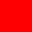

## Rich Text（富文本）

UI 元素和 Text Mesh（文本网格）的文本可以包含多种字体样式和字号。**Rich Text（富文本）** 同时被 **UI 系统** 和传统的 **GUI 系统** 所支持。`Text`、`GUIStyle`、`GUIText` 和 `TextMesh` 类都具有一个 **Rich Text** 设置，它会指示 Unity 在文本中查找  **标记标签（markup tags）** 。`Debug.Log` 函数也可以使用这些标记标签来增强代码的错误报告。标签本身不会显示，但它们表示对文本应用的样式更改。

### Markup format（标记格式）

该标记系统受 HTML 启发，但并不打算完全兼容标准 HTML。基本的思想是：一个文本片段可以被一对匹配的标签括起来：

```css
We are <b>not</b> amused.
```

如上例所示，标签是用 “尖括号”（< 和 >）括起来的文本。

你需要在想要样式化的文本段落前放置一个 **起始标签（opening tag）** 。标签内的文本表示标签的名称（此例中为 `b`）。

你还需要在段落的末尾放置一个 **结束标签（closing tag）** 。它和起始标签名称相同，但前面多了一个斜杠 `/`。每一个起始标签都必须有一个对应的结束标签。如果你没有关闭起始标签，它会作为普通文本被渲染。

这些标签不会直接展示给用户，而是被解释为用于样式化文本的指令。上例中使用的 `<b>` 标签会对“not”一词应用  **加粗样式（boldface）** ，因此文本在屏幕上显示为：We are **not** amused


被标签包裹的一段文本（包括标签本身）被称为一个  **元素（element）** 。

### Nested elements（嵌套元素）

可以通过将一个元素嵌套在另一个元素内部的方式，对同一段文本应用多种样式：

```css
We are <b><i>definitely not</i></b> amused
```

`<i>` 标签会应用  **斜体样式（italic）** ，所以这段文本的屏幕显示效果是：We are ***definitely not*** amused


注意闭合标签的顺序是与起始标签相反的。这种顺序在内层标签只覆盖外层元素部分文本时更为清晰：

```html
We are <b>absolutely <i>definitely</i> not</b> amused
```

显示效果为：We are **absolutely *definitely* not** amused


### Tag parameters（标签参数）

某些标签对文本产生简单的“启用/禁用”样式效果，但有些标签则可以有不同的变化。例如，`color` 标签需要知道应用哪种颜色。这类信息通过参数添加到标签中：

```html
We are <color=green>green</color> with envy
```

结果显示为：


请注意： **结束标签不包含参数值** 。参数值可以选择用引号包裹，但并非必须。

 **标签参数中不能包含空格** 。例如：

```html
We are <color = green>green</color> with envy
```

是无效的，因为等号 `=` 两侧有空格。

## Supported tags（支持的标签）

下表描述了 Unity 支持的所有样式标签（styling tags）。

<div style="width: 100%; overflow-x: auto;">

| Tag（标签）        | Description（说明）                                                                                                                                                                                                                                                                                                                                          | Example（示例）                                            | Notes（备注）                                                                                                                                                                                             |
| ------------------ | ------------------------------------------------------------------------------------------------------------------------------------------------------------------------------------------------------------------------------------------------------------------------------------------------------------------------------------------------------------ | ---------------------------------------------------------- | --------------------------------------------------------------------------------------------------------------------------------------------------------------------------------------------------------- |
| **b**        | 以加粗形式渲染文本。                                                                                                                                                                                                                                                                                                                                         | We are `<b>`not `</b>` amused.                         |                                                                                                                                                                                                           |
| **i**        | 以斜体形式渲染文本。                                                                                                                                                                                                                                                                                                                                         | We are `<i>`usually `</i>` not amused.                 |                                                                                                                                                                                                           |
| size               | 根据参数值设置文本大小（以像素为单位）。                                                                                                                                                                                                                                                                                                                     | We are <size=50>largely `</size>` unaffected.            | 尽管该标签适用于Debug.Log,<br />但如果设置的 size 太大，<br />你会发现控制台窗口栏中的行间距看起来会很奇怪。                                                                                              |
| **color**    | 根据参数值设置文本的颜色。<br />颜色可以用传统的 HTML 格式指定:`#rrggbbaa ` —— 其中的字母代表一对十六进制数字，<br />分别表示颜色的红（red）、绿（green）、蓝（blue）和透明度（alpha）值。<br />例如，完全不透明的青色可以写作  `color=#00ffffff`                                                                                                     | We are <color=#ff0000ff>colorfully `</color>` amused     | 另一种方式是直接使用颜色的名称。<br />这种方式更易理解，但可选的颜色范围有限，且默认始终是完全不透明。<br />例如：`<color=cyan>some text</color>`可用的颜色名称见下方的颜色名称表。                     |
| **material** | 仅对**text mesh（文本网格）** 有效，用参数指定的材质来渲染一段文字。<br />该值是一个索引，对应 text mesh 的材质数组，在 **Inspector（检视器）** 中可见。                                                                                                                                                                                         | We are <material=2>texturally `</material>` amused       |                                                                                                                                                                                                           |
| **quad**     | 仅对**text mesh（文本网格）** 有效，在文本中内嵌显示一张图像。<br />它接收一些参数：<br />指定图像使用的材质、图像高度（以像素为单位）、以及一个矩形区域的四个参数，用于指定显示图像的部分。<br />与其他标签不同，`quad`  **不会包裹文本内容** ，因此没有结束标签，而是在起始标签结尾使用斜杠 `/` 表示该标签是“自闭合”的（self-closing）。 | <quad material=1 size=20 x=0.1 y=0.1 width=0.5 height=0.5> | 该标签会选择渲染器材质数组中索引位置的材质，将图像高度设置为 20 像素。<br />图像所显示的矩形区域由 `x`、`y`、`width` 和 `height` 决定，所有数值都是该纹理未缩放时的宽度和高度的 **比例** 。 |

</div>

### Supported colors（支持的颜色）

下表列出了在 `<color>` 富文本标签中可以使用**名称**而不是十六进制代码表示的颜色。

| Color name（颜色名称）    | Hex value（十六进制值） | Swatch（色块示例）                                          |
| ------------------------- | ----------------------- | ----------------------------------------------------------- |
| aqua (same as cyan)       | #00ffffff               |  |
| black                     | #000000ff               |  |
| blue                      | #0000ffff               |  |
| brown                     | #a52a2aff               |  |
| cyan (same as aqua)       | #00ffffff               |  |
| darkblue                  | #0000a0ff               |  |
| fuchsia (same as magenta) | #ff00ffff               |  |
| green                     | #008000ff               |  |
| grey                      | #808080ff               |  |
| lightblue                 | #add8e6ff               |  |
| lime                      | #00ff00ff               |  |
| magenta (same as fuchsia) | #ff00ffff               |  |
| maroon                    | #800000ff               |  |
| navy                      | #000080ff               |  |
| olive                     | #808000ff               |  |
| orange                    | #ffa500ff               |  |
| purple                    | #800080ff               |  |
| red                       | #ff0000ff               |  |
| silver                    | #c0c0c0ff               |  |
| teal                      | #008080ff               |  |
| white                     | #ffffffff               |  |
| yellow                    | #ffff00ff               |  |

## Editor GUI（编辑器 GUI）

在 Unity 的编辑器 GUI 系统中， **富文本（Rich text）默认是禁用的** ，但你可以通过自定义一个 `GUIStyle`（GUI 样式）来显式启用它。你需要将 `richText` 属性设置为 `true`，并将该样式传递给相应的 GUI 函数：

```csharp
GUIStyle style = new GUIStyle ();
style.richText = true;
GUILayout.Label("<size=30>Some <color=yellow>RICH</color> text</size>", style);
```
