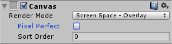
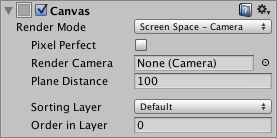
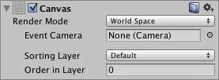
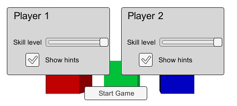
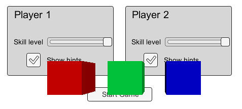
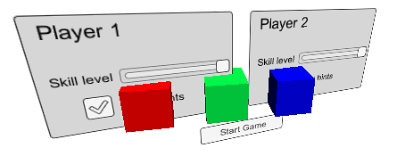
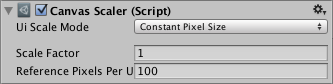

# Canvas Components（画布组件）

所有 UI 组件都必须放置在一个 Canvas（画布）中。

* **Canvas（画布）**
* **Canvas Scaler（画布缩放器）**
* **Canvas Group（画布组）**
* **Canvas Renderer（画布渲染器）**

## **Canvas（画布）**

Canvas 组件代表了一个抽象空间，UI 元素在这个空间中进行布局和渲染。所有 UI 元素都必须是附有 Canvas 组件的 GameObject 的子对象。当你通过菜单（ **GameObject > Create UI** ）创建 UI 元素时，如果场景中尚未存在 Canvas，Unity 会自动创建一个 Canvas 对象。

### Properties（属性）

| Properties（属性）                                                        | **Function（功能）:**                                                                                                                                                                                        |
| ------------------------------------------------------------------------- | ------------------------------------------------------------------------------------------------------------------------------------------------------------------------------------------------------------------ |
| **Render Mode（渲染模式）**                                         | UI 如何渲染到屏幕或作为场景中的 3D 对象（见下文）。 选项包括：**Screen Space - Overlay（屏幕空间-覆盖）** 、**Screen Space - Camera（屏幕空间-摄像机）** 和  **World Space（世界空间）** 。 |
| **Pixel Perfect（像素精确）** （仅限屏幕空间模式）                  | UI 是否应精确渲染而不使用抗锯齿，以提升像素精度？                                                                                                                                                                  |
| **Render Camera（渲染摄像机）** （仅限 Screen Space - Camera 模式） | 指定 UI 应该渲染到哪个摄像机（见下文）。                                                                                                                                                                           |
| **Plane Distance（平面距离）** （仅限 Screen Space - Camera 模式）  | UI 平面应距离摄像机多远。                                                                                                                                                                                          |
| **Event Camera（事件摄像机）** （仅限 World Space 模式）            | 用于处理 UI 事件的摄像机。                                                                                                                                                                                         |
| **Receives Events（接收事件）**                                     | 此 Canvas 是否接收和处理 UI 事件？                                                                                                                                                                                 |

### Details（详细说明）

一个场景中通常只需要一个 Canvas 就能满足所有 UI 元素的需求，但也可以有多个 Canvas。还可以使用嵌套 Canvas，即一个 Canvas 作为另一个 Canvas 的子对象，用于优化性能。嵌套 Canvas 会继承其父 Canvas 的 Render Mode（渲染模式）。

传统上，UI 是以图形的方式直接渲染在屏幕上的，即不考虑相机视角或 3D 空间。Unity 支持这种屏幕空间渲染，同时也支持根据 Render Mode 属性将 UI 作为场景中的对象进行渲染。可用的模式如下：**Screen Space - Overlay** , **Screen Space - Camera** and  **World Space** .

#### Screen Space - Overlay（屏幕空间 - 覆盖）

在这种模式下，Canvas 会缩放以适应屏幕，并直接渲染，不考虑场景或摄像机（即使场景中没有摄像机，UI 仍然会被渲染）。当屏幕尺寸或分辨率改变时，UI 会自动重新缩放以适应变化。UI 会覆盖所有其他图像，例如摄像机视图。

注意：Screen Space - Overlay 模式下的 Canvas 必须放在层级结构的顶层。如果不这样做，UI 可能会在视图中消失。这是 Unity 的内置限制。为了获得预期效果，请确保 Screen Space - Overlay 的 Canvas 保持在层级结构的最上层（顶级）。

#### Screen Space - Camera（屏幕空间 - 摄像机）

在这种模式下，Canvas 会像被绘制在一个位于指定摄像机前方的平面上一样进行渲染。UI 在屏幕上的大小不会因距离改变而改变，因为它总是会被缩放以适应摄像机的视椎体（frustum）。当屏幕尺寸、分辨率或摄像机视椎体变化时，UI 会自动重新缩放。场景中任何比 UI 平面更靠近摄像机的 3D 对象都会被渲染在 UI 前面，而在平面后面的对象会被遮挡。

#### World Space（世界空间）

此模式将 UI 渲染为场景中的一个平面对象。不同于 Screen Space - Camera 模式，这个平面不需要面向摄像机，你可以任意设置其朝向。Canvas 的大小通过其 Rect Transform（矩形变换）设置，但其在屏幕上的显示大小将取决于摄像机的角度和距离。场景中的其他对象可以在 Canvas 后方、穿过 Canvas 或在其前方。

### **Hints（提示）**

* 想了解如何设置 World Space 模式下的 Canvas，请参见 [Creating a World Space UI](https://mapleinori.net/docs/UGUI/UIHowTos/CreatingAWorldSpaceUI)**（创建世界空间 UI）** 页面。
* 有关如何使 Canvas 和 UI 适应不同分辨率或宽高比的信息，请参阅 [Designing UI for Multiple Resolutions](https://mapleinori.net/docs/UGUI/UIHowTos/DesigningUIForMultipleResolutions)**（为多种分辨率设计 UI）** 页面以及 [Canvas Scaler](https://mapleinori.net/docs/UGUI/Reference/CanvasComponents#canvas-scalercanvas-缩放器) **（画布缩放器）** 页面。

## Canvas Scaler（Canvas 缩放器）

Canvas Scaler 组件用于控制 Canvas 中 UI 元素的整体缩放和像素密度。这种缩放会影响 Canvas 下的所有内容，包括字体大小和图像边框。

### Properties（属性）

| Properties（属性）                                 | **Function（功能）**                               |
| -------------------------------------------------- | -------------------------------------------------------- |
| **UI Scale Mode（UI 缩放模式）**             | 决定 Canvas 中 UI 元素的缩放方式。                       |
| **Constant Pixel Size（固定像素大小）**      | 使 UI 元素无论屏幕大小如何都保持相同的像素尺寸。         |
| **Scale With Screen Size（随屏幕尺寸缩放）** | 屏幕越大，UI 元素越大。                                  |
| **Constant Physical Size（固定物理大小）**   | 使 UI 元素无论屏幕大小和分辨率如何都保持相同的物理尺寸。 |

**Settings for Constant Pixel Size（固定像素大小的设置）** ：

| Properties（属性）                        | Function（功能）                                                                      |
| ----------------------------------------- | ------------------------------------------------------------------------------------- |
| Scale Factor（缩放因子）                  | 按此因子缩放 Canvas 中所有的 UI 元素。                                                |
| Reference Pixels Per Unit（单位参考像素） | 如果一个精灵有此 "Pixels Per Unit" 设置，那么精灵中的一个像素将覆盖 UI 中的一个单位。 |

**Settings for Scale With Screen Size（随屏幕尺寸缩放的设置）** ：

| Properties（属性）                        | Function（功能）                                                                      |
| ----------------------------------------- | ------------------------------------------------------------------------------------- |
| Reference Resolution（参考分辨率）        | UI 布局设计时参考的分辨率。如果当前屏幕分辨率更大，则 UI 将被放大，若更小则会缩小。   |
| Screen Match Mode（屏幕匹配模式）         | 当当前分辨率的宽高比不符合参考分辨率时，用于缩放 canvas 区域的模式。                  |
| Match Width or Height（匹配宽度或高度）   | 使用宽度为参考、高度为参考，或介于两者之间来缩放 canvas 区域。                        |
| Expand（扩展）                            | 水平方向或垂直方向扩展 canvas 区域，使其尺寸永远不会小于参考尺寸。                    |
| Shrink（收缩）                            | 水平方向或垂直方向裁剪 canvas 区域，使其尺寸永远不会大于参考尺寸。                    |
| Match（匹配）                             | 确定缩放是使用宽度、高度为参考，或在两者之间进行混合。                                |
| Reference Pixels Per Unit（单位参考像素） | 如果一个精灵有此 "Pixels Per Unit" 设置，那么精灵中的一个像素将覆盖 UI 中的一个单位。 |

**Settings for Constant Physical Size（固定物理大小的设置）** ：

| Properties（属性）                        | Function（功能）                                                                             |
| ----------------------------------------- | -------------------------------------------------------------------------------------------- |
| Physical Unit（物理单位）                 | 用于指定位置和尺寸的物理单位。                                                               |
| Fallback Screen DPI（备用屏幕 DPI）       | 如果设备没有提供 DPI，则使用的默认 DPI 值。                                                  |
| Default Sprite DPI（默认精灵 DPI）        | 用于像素每英寸的默认值，适用于其 Pixels Per Unit 与 Reference Pixels Per Unit 相匹配的精灵。 |
| Reference Pixels Per Unit（单位参考像素） | 如果精灵设置了 Pixels Per Unit，其 DPI 将与 Default Sprite DPI 匹配。                        |

**Settings for World Space Canvas（World Space Canvas 的设置，当 Canvas 设置为 World Space 时显示）** ：

| Properties（属性）                          | Function（功能）                                                                                                                         |
| ------------------------------------------- | ---------------------------------------------------------------------------------------------------------------------------------------- |
| Dynamic Pixels Per Unit（动态单位像素密度） | 用于 UI 中动态生成的位图（如文本）的单位像素数量。                                                                                       |
| Reference Pixels Per Unit（单位参考像素）   | 如果精灵有此 "Pixels Per Unit" 设置，则精灵中的一个像素将在世界中占据一个单位。如果此值设为 1，则直接使用精灵中的 Pixels Per Unit 设置。 |

### Details（详细说明）

当 Canvas 设置为 “Screen Space - Overlay”或 “Screen Space - Camera”时，Canvas Scaler 的 UI Scale Mode 可以设置为 Constant Pixel Size、Scale With Screen Size或 Constant Physical Size。

#### Constant Pixel Size（固定像素大小）

使用 Constant Pixel Size 模式时，UI 元素的位置和尺寸以屏幕像素为单位指定。当 Canvas 没有附加 Canvas Scaler 时，也将采用这种默认行为。然而，借助 Canvas Scaler 中的 Scale Factor 设置，可以对 Canvas 中所有 UI 元素应用一个恒定的缩放。

#### Scale With Screen Size（随屏幕尺寸缩放）

使用 Scale With Screen Size 模式时，可以根据指定的参考分辨率的像素来指定位置和尺寸。如果当前屏幕分辨率大于参考分辨率，Canvas 将继续使用参考分辨率的分辨率，但会放大以适应屏幕。如果分辨率更小，则会缩小以适配。

如果当前屏幕分辨率与参考分辨率的宽高比不同，按每个轴独立缩放会导致非等比缩放，这通常是不希望的。Reference Resolution 组件将使 Canvas 分辨率偏离参考分辨率，以保持屏幕宽高比。可通过 Screen Match Mode 设置控制这种偏离行为。

#### Constant Physical Size（固定物理大小）

使用 Constant Physical Size 模式时，UI 元素的位置和尺寸以物理单位指定，如毫米、点（points）或皮卡（picas）。该模式依赖于设备正确报告其屏幕 DPI。你可以为无法报告 DPI 的设备指定一个备用 DPI。

#### World Space（世界空间）

当 Canvas 设置为 “World Space” 时，可以使用 Canvas Scaler 来控制 Canvas 中 UI 元素的像素密度。

### Hints（提示）

* 请参阅页面 [Designing UI for Multiple Resolutions](https://mapleinori.net/docs/UGUI/UIHowTos/DesigningUIForMultipleResolutions)（为多分辨率设计 UI），其中对如何结合使用 Rect Transform 锚点和 Canvas Scaler 来构建适应不同分辨率和宽高比的 UI 布局进行了逐步说明。

## Canvas Group（画布组）

Canvas Group 可以用来从一个位置控制一整组 UI 元素的某些属性，而无需逐个处理它们。Canvas Group 的属性会影响其所在的 GameObject（游戏对象）及其所有子对象。

### Properties（属性）

| Properties（属性）                          | Function（功能）                                                                                                                                                                                       |
| ------------------------------------------- | ------------------------------------------------------------------------------------------------------------------------------------------------------------------------------------------------------ |
| **Alpha** （透明度）                  | 控制该组中 UI 元素的不透明度。取值范围为 0 到 1，其中 0 表示完全透明，1 表示完全不透明。 注意，各个元素仍然保留自己的透明度值，因此 Canvas Group 的 Alpha 值会与每个 UI 元素自身的 alpha 值相乘。 |
| **Interactable** （可交互）           | 决定该组件是否接收输入。当设置为 false 时，交互将被禁用。                                                                                                                                              |
| **Block Raycasts** （阻挡射线）       | 此组件是否会作为射线检测的碰撞体？你需要在附加于 Canvas（画布）的 Graphic Raycaster（图形射线投射器）上调用 RayCast 函数。这不适用于 Physics.Raycast（物理射线检测）。                                 |
| **Ignore Parent Groups** （忽略父组） | 此组是否也会受到更高层级 GameObject（游戏对象）上的 Canvas Group 设置影响，或是否忽略它们从而覆盖它们的设置？                                                                                          |

### Details（详情）

Canvas Group 的典型用法包括：

* 通过在窗口的 GameObject 上添加一个 Canvas Group 并控制其 Alpha 属性，实现整个窗口的淡入淡出效果。
* 通过在父级 GameObject 上添加一个 Canvas Group 并将其 Interactable 属性设置为 false，使一整套控件变为不可交互（“灰化”）。
* 通过在某个 UI 元素或其父对象上添加一个 Canvas Group 组件并将其 Block Raycasts 属性设置为 false，使一个或多个 UI 元素不阻挡鼠标事件。

## Canvas Renderer（画布渲染器）

Canvas Renderer 组件用于在 Canvas（画布）中渲染图形化的 UI 对象。

### Properties（属性）

Canvas Renderer 在检查器中没有可见的属性。

### Details（详细说明）

从菜单中创建的标准 UI 对象（ **GameObject > Create UI** ）都会在需要时自动附加 Canvas Renderer 组件，但如果你使用自定义 UI 对象，可能需要手动添加该组件。

尽管在检查器中没有可见的属性，但可以通过脚本访问一些属性和函数 —— 详见脚本参考文档中的 [CanvasRenderer](https://docs.unity.cn/ScriptReference/CanvasRenderer.html.md) 页面以获取完整信息。
