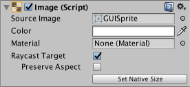

# Visual Components（可视组件）

可视组件用于简化创建过程，并提供特定于 GUI 的功能。

* [Text](https://docs.unity.cn/Packages/com.unity.ugui@1.0/manual/script-Text.html)
* [Image](https://docs.unity.cn/Packages/com.unity.ugui@1.0/manual/script-Image.html)
* [Raw Image](https://docs.unity.cn/Packages/com.unity.ugui@1.0/manual/script-RawImage.html)
* [Mask](https://docs.unity.cn/Packages/com.unity.ugui@1.0/manual/script-Mask.html)

## Text（文本）

Text 控件用于向用户显示一段不可交互的文本。它可用于为其他 GUI 控件提供标题或标签，或用于展示指令或其他文字内容。

### Properties（属性）

| Property（属性）                | Function（功能）                                                                                              |
| ------------------------------- | ------------------------------------------------------------------------------------------------------------- |
| Text（文本）                    | 控件显示的文本内容。                                                                                          |
| Character（字符）               |                                                                                                               |
| Font（字体）                    | 用于显示文本的 Font（字体）。                                                                                 |
| Font Style（字体样式）          | 应用于文本的样式。 选项包括 Normal（常规）、Bold（加粗）、Italic（斜体）和 Bold And Italic（加粗斜体）。 |
| Font Size（字体大小）           | 显示文本的大小。                                                                                              |
| Line Spacing（行间距）          | 文本行之间的垂直间距。                                                                                        |
| Rich Text（富文本）             | 文本中的标记元素是否应被解释为 Rich Text（富文本）样式？                                                      |
| Paragraph（段落）               |                                                                                                               |
| Alignment（对齐方式）           | 文本的水平和垂直对齐方式。                                                                                    |
| Align by Geometry（按几何对齐） | 是否使用字形的几何范围进行水平对齐，而不是使用字形度量信息。                                                  |
| Horizontal Overflow（水平溢出） | 当文本太宽无法适配矩形时使用的处理方式。选项包括 Wrap（换行）和 Overflow（溢出）。                            |
| Vertical Overflow（垂直溢出）   | 当换行后的文本太高无法适配矩形时使用的处理方式。 选项包括 Truncate（截断）和 Overflow（溢出）。          |
| Best Fit（最佳适配）            | Unity 是否应忽略大小属性，并尝试让文本适配控件的矩形区域？                                                    |
| Color（颜色）                   | 用于渲染文本的颜色。                                                                                          |
| Material（材质）                | 用于渲染文本的 Material（材质）。                                                                             |

默认的文本元素如下所示：

### Details（详情）

一些控件（如 Buttons（按钮）和 Toggles（开关））内建了文字描述。对于没有内建文本的控件（如 Sliders（滑块）），你可以使用一个 Text 控件创建标签来说明其用途。Text 也适用于展示说明列表、故事文本、对话内容以及法律免责声明。

Text 控件提供了常见的字体大小、样式和文本对齐等参数。当启用 Rich Text（富文本）选项后，文本中的标记元素将被视为样式信息，因此你可以将某个单词或短句设置为加粗或变色等效果（参见 Rich Text 页面了解标记语言的具体用法）。

### Hints（提示）

请参见 [Effects](https://mapleinori.net/docs/UGUI/Reference/VisualUIInteractionComponents#UI Effect Components)（效果）页面，了解如何为文本应用简单的阴影或描边效果。

## Image（图像）

Image 控件用于向用户显示一个不可交互的图像。你可以将其用于装饰或图标等用途，也可以通过脚本更改图像，以反映其他控件的变化。该控件与 Raw Image（原始图像） 控件类似，但提供了更多用于图像动画和准确填充控件矩形的选项。不过，Image 控件要求其 Texture（纹理）必须是 Sprite（精灵），而 Raw Image 可以接受任何 Texture。

### Properties（属性）

| Property（属性）                | Function（功能）                                                  |
| ------------------------------- | ----------------------------------------------------------------- |
| Source Image（源图像）          | 表示要显示图像的 Texture（纹理），必须以 Sprite（精灵）格式导入。 |
| Color（颜色）                   | 应用于图像的颜色。                                                |
| Material（材质）                | 用于渲染图像的 Material（材质）。                                 |
| Raycast Target（射线检测目标）  | 如果希望 Unity 将该图像视为射线检测的目标，请启用此选项。         |
| Preserve Aspect（保留纵横比）   | 确保图像保持其原有的尺寸比例。                                    |
| Set Native Size（设置原始尺寸） | 将图像框的尺寸设置为 Texture（纹理）的原始像素大小。              |

要在 Image 控件中使用图像，必须将该图像以 Sprite 格式导入。

## Raw Image（原始图像）

Raw Image 控件用于向用户显示一个不可交互的图像。你可以将其用于装饰或图标等用途，也可以通过脚本更改图像，以反映其他控件的变化。该控件与 Image（图像） 控件类似，但提供了更多用于图像动画和准确填充控件矩形的选项。不过，Image 控件要求其 Texture（纹理）必须是 Sprite（精灵），而 Raw Image 可以接受任何 Texture。

### Properties（属性）

| Property（属性）               | Function（功能）                                                                                                          |
| ------------------------------ | ------------------------------------------------------------------------------------------------------------------------- |
| Texture（纹理）                | 表示要显示图像的 Texture（纹理）。                                                                                        |
| Color（颜色）                  | 应用于图像的颜色。                                                                                                        |
| Material（材质）               | 用于渲染图像的 Material（材质）。                                                                                         |
| Raycast Target（射线检测目标） | 如果希望 Unity 将该图像视为射线检测的目标，请启用此选项。                                                                 |
| UV Rectangle（UV 矩形）        | 图像在控件矩形中的偏移和尺寸，使用归一化坐标（范围为 0.0 到 1.0）表示。 图像的边缘会被拉伸以填充 UV 矩形周围的空间。 |

### Details（详细信息）

由于 Raw Image 不要求使用 Sprite（精灵）纹理，你可以使用它来显示任何 Unity Player 可用的纹理。例如，你可以使用 `WWW` 类显示从 URL 下载的图像，或显示游戏中某个对象的纹理。

UV Rectangle（UV 矩形）属性允许你显示较大图像的一小部分。X 和 Y 坐标指定图像中与控件左下角对齐的部分。例如，X 坐标为 0.25 时，图像左侧四分之一将被裁剪。W 和 H（即宽度和高度）属性指示将被缩放以适配控件矩形的图像部分的宽度和高度。例如，宽度和高度为 0.5 将把图像的四分之一区域缩放到控件矩形大小。通过更改这些属性，你可以按需缩放和裁剪图像（参见 [Scrollbar](https://mapleinori.net/docs/UGUI/Reference/InteractionComponents#Scrollbar)（滚动条） 控件）。

## Mask（遮罩）

Mask（遮罩）不是一个可见的 UI 控件，而是一种用于修改控件子元素显示方式的手段。遮罩会将子元素限制（即“遮罩”）在父对象的形状范围内。因此，如果子元素比父对象大，那么只有子元素中位于父对象范围内的部分会被显示出来。

### Properties（属性）

| Property（属性）         | Function（功能）                                                |
| ------------------------ | --------------------------------------------------------------- |
| Show Graphic（显示图形） | 遮罩（父）对象的图像是否应以 alpha 混合的方式绘制在子对象之上？ |

### Description（说明）

Mask（遮罩）的常见用途是显示一张大图像的一小部分，例如使用一个 Panel（面板）对象（菜单：GameObject > Create UI > Panel）作为“框架”。你可以通过将 Image（图像）设为 Panel 的子对象来实现这个目的。然后将图像定位到应显示的区域正好位于 Panel 区域的后面。

*红色区域表示 Panel 区域，子图像位于其后方*

接着，向 Panel 添加一个 Mask 组件。Panel 外部的子图像区域将变得不可见，因为它们被 Panel 的形状遮罩掉了。

*被遮罩的区域用虚线表示，实际效果中这些区域是不可见的*

如果之后移动该图像，只有被 Panel 揭示的部分会可见。图像的移动可以由 [Scrollbars](https://mapleinori.net/docs/UGUI/Reference/InteractionComponents#Scrollbar)（滚动条）控制，以创建一个可滚动的地图查看器之类的功能。

**Implementation（实现方式）**

遮罩功能是通过 GPU 的 stencil buffer（模板缓冲区）来实现的：

* 第一个 Mask 元素会向 stencil buffer 写入值 1
* 所有位于遮罩下方的元素在渲染时会检查 stencil buffer，并且只会渲染那些 stencil 值为 1 的区域
* 嵌套的 Mask 会向模板缓冲区写入递增的位掩码，这意味着可渲染的子对象需要满足 stencil 值的逻辑与运算 (&) 才能被正确渲染。

## RectMask2D（矩形遮罩2D）

RectMask2D 是一个类似于 Mask（遮罩）控件的遮罩控件。它将子元素限制在父元素的矩形范围内。与标准的 Mask 控件相比，它有一些限制，但也具备若干性能上的优势。

### Description（说明）

RectMask2D 的常见用途是用于显示一个较大区域中的一小部分。通过使用 RectMask2D 对该区域进行“框选”。

**RectMask2D 控件的限制包括：**

* 它只能在 2D 空间中工作
* 它无法正确遮罩不共面的元素

**RectMask2D 的优点包括：**

* 它不使用 stencil buffer（模板缓冲区）
* 不产生额外的 draw calls（绘制调用）
* 不会改变材质（Material）
* 性能高效

## UI Effect Components（UI 效果组件）

效果组件允许为 Text（文本）和 Image（图像）图形添加简单的效果，例如阴影和描边。

* **Shadow**
* **Outline**
* **Position as UV1**

### **Shadow（阴影）**

Shadow 组件为 Text（文本）或 Image（图像）等图形组件添加一个简单的阴影效果。它必须与图形组件在同一个 GameObject 上。

**Properties（属性）**

| Property（属性）            | Function（功能）                 |
| --------------------------- | -------------------------------- |
| **Effect Color**      | 阴影的颜色。                     |
| **Effect Distance**   | 阴影的偏移量，以向量形式表示。   |
| **Use Graphic Alpha** | 将图形的颜色与效果颜色进行相乘。 |

### **Outline（描边）**

Outline 组件为 Text（文本）或 Image（图像）等图形组件添加一个简单的描边效果。它必须与图形组件在同一个 GameObject 上。

**Properties（属性）**

| Property（属性）            | Function（功能）                 |
| --------------------------- | -------------------------------- |
| **Effect Color**      | 描边的颜色。                     |
| **Effect Distance**   | 描边效果的水平和垂直距离。       |
| **Use Graphic Alpha** | 将图形的颜色与效果颜色进行相乘。 |

### **Position as UV1（UV1位置）**

该组件为文本和图像图形添加一个简单的“Position as UV1”效果。

**Properties（属性）**

| Property（属性） | Function（功能） |
| ---------------- | ---------------- |
| **Script** |                  |
