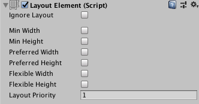

# Auto Layout（自动布局）

自动布局系统提供了一种方式，可将元素放置在嵌套的布局组中，例如 Horizontal Layout Group（水平布局组）、Vertical Layout Group（垂直布局组）或 Grid Layout Group（网格布局组）。它还允许元素根据所包含的内容自动调整大小。

* Content Size Fitter（内容大小适配器）
* Layout Element（布局元素）
* Horizontal Layout Group（水平布局组）
* Vertical Layout Group（垂直布局组）
* Grid Layout Group（网格布局组）

## Layout Element（布局元素）

如果你想要覆盖某个布局元素的最小、首选或灵活尺寸，你可以通过向该 GameObject 添加一个 Layout Element（布局元素）组件来实现。

布局控制器会按以下顺序为布局元素分配宽度或高度：

1. 首先，布局控制器分配最小尺寸属性（Min Width（最小宽度）、Min Height（最小高度））。
2. 如果有足够的可用空间，布局控制器会分配首选尺寸属性（Preferred Width（首选宽度）、Preferred Height（首选高度））。
3. 如果还有额外的可用空间，布局控制器会分配灵活尺寸属性（Flexible Width（灵活宽度）、Flexible Height（灵活高度））。

关于最小、首选和灵活尺寸的更多信息，请参阅 Auto Layout（自动布局）文档。

### 属性（Properties）

启用某个宽度或高度属性后，其旁边会显示一个数值字段。你可以使用该数值字段输入该属性的精确值。Min（最小）和 Preferred（首选）尺寸使用常规单位，而 Flexible（灵活）尺寸使用相对单位。

| 属性（Property）              | 功能（Function）                                             |
| ----------------------------- | ------------------------------------------------------------ |
| Ignore Layout（忽略布局）     | 启用后，布局系统会忽略该布局元素。                           |
| Min Width（最小宽度）         | 此布局元素应具有的最小宽度。                                 |
| Min Height（最小高度）        | 此布局元素应具有的最小高度。                                 |
| Preferred Width（首选宽度）   | 在分配额外宽度之前，此布局元素应具有的首选宽度。             |
| Preferred Height（首选高度）  | 在分配额外高度之前，此布局元素应具有的首选高度。             |
| Flexible Width（灵活宽度）    | 相对于其同级元素，此布局元素应填充的额外可用宽度的相对数量。 |
| Flexible Height（灵活高度）   | 相对于其同级元素，此布局元素应填充的额外可用高度的相对数量。 |
| Layout Priority（布局优先级） | 此组件的布局优先级。                                         |

如果一个 GameObject 拥有多个具有布局属性的组件（例如同时拥有 Image（图像）组件和 LayoutElement（布局元素）组件），布局系统会使用布局优先级（Layout Priority）最高的组件中的属性值。

如果这些组件具有相同的布局优先级（Layout Priority），布局系统会对每个属性使用最大值，而不管该值来自哪个组件。

### 说明（Description）

Layout Element（布局元素）组件允许你覆盖一个或多个布局属性的值。启用你想要覆盖的属性的复选框，然后指定你想使用的值。

最小和首选尺寸是以常规单位定义的，而灵活尺寸是以相对单位定义的。如果某个布局元素的灵活尺寸大于 0，意味着所有可用空间都会被填充。同级元素的相对灵活尺寸值决定了它们各自填充的可用空间比例。通常情况下，灵活宽度和高度的值仅设置为 0 或 1。

在某些情况下，同时指定首选尺寸和灵活尺寸是有意义的。灵活尺寸只有在所有首选尺寸都已完全分配后才会被分配。因此，如果某个布局元素指定了灵活尺寸但没有首选尺寸，它将保持其最小尺寸，直到其他布局元素增长到其完整的首选尺寸，然后才开始根据额外可用空间增长。通过同时指定一个灵活尺寸，可以避免这种情况，使该元素能够与其他具有首选尺寸的布局元素同时增长，并在所有灵活尺寸分配完成后继续扩展。

## Content Size Fitter（内容尺寸适配器）

### 属性（Properties）

| 属性（Property）           | 功能（Function）                   |
| -------------------------- | ---------------------------------- |
| Horizontal Fit（水平适配） | 控制宽度的方式。                   |
| Unconstrained（不受约束）  | 不根据布局元素来驱动宽度。         |
| Min Size（最小尺寸）       | 根据布局元素的最小宽度来驱动宽度。 |
| Preferred Size（首选尺寸） | 根据布局元素的首选宽度来驱动宽度。 |
| Vertical Fit（垂直适配）   | 控制高度的方式。                   |
| Unconstrained（不受约束）  | 不根据布局元素来驱动高度。         |
| Min Size（最小尺寸）       | 根据布局元素的最小高度来驱动高度。 |
| Preferred Size（首选尺寸） | 根据布局元素的首选高度来驱动高度。 |

### 说明（Description）

Content Size Fitter（内容尺寸适配器）的功能是作为一个布局控制器来控制自身布局元素（layout element）的尺寸。该尺寸是由 GameObject 上布局元素组件提供的最小尺寸或首选尺寸决定的。此类布局元素可以是 Image（图像）或 Text（文本）组件、布局组（layout groups），或者是 Layout Element（布局元素）组件。

值得注意的是，当 Rect Transform（矩形变换）被调整大小时——无论是通过 Content Size Fitter（内容尺寸适配器）还是其他方式——调整是围绕枢轴（pivot）进行的。这意味着可以通过设置枢轴来控制调整的方向。

例如，当枢轴位于中心时，Content Size Fitter 会使 Rect Transform 向四周等量扩展。而当枢轴位于左上角时，Content Size Fitter 会使 Rect Transform 向下和向右扩展。

## Aspect Ratio Fitter（长宽比适配器）

### 属性（Properties）

| 属性（Property）                      | 功能（Function）                                                                                                                     |
| ------------------------------------- | ------------------------------------------------------------------------------------------------------------------------------------ |
| Aspect Mode（长宽模式）               | 控制矩形如何调整尺寸以强制符合指定的长宽比。                                                                                         |
| None（无）                            | 不调整矩形来适配长宽比。                                                                                                             |
| Width Controls Height（宽度控制高度） | 高度会根据宽度自动调整。                                                                                                             |
| Height Controls Width（高度控制宽度） | 宽度会根据高度自动调整。                                                                                                             |
| Fit In Parent（适应父级）             | 宽度、高度、位置和锚点会自动调整，使该矩形在保持长宽比的前提下完全适应父对象的矩形区域。 父对象的某些区域可能不会被此矩形覆盖。 |
| Envelope Parent（包裹父级）           | 宽度、高度、位置和锚点会自动调整，使该矩形在保持长宽比的前提下覆盖整个父对象区域。 此矩形可能会超出父对象的范围。               |
| Aspect Ratio（长宽比）                | 需要强制保持的长宽比。该值是宽度除以高度的结果。                                                                                     |

### 说明（Description）

Aspect Ratio Fitter（长宽比适配器）的作用是作为一个布局控制器，用来控制其自身布局元素（layout element）的尺寸。它可以根据宽度自动调整高度，或根据高度调整宽度，或者使元素适应其父对象的内部区域，或者包裹父对象的整个区域。Aspect Ratio Fitter 不会考虑布局信息，例如最小尺寸和首选尺寸。

需要注意的是，当 Rect Transform（矩形变换）被调整大小时——无论是通过 Aspect Ratio Fitter 还是其他方式——其调整是围绕枢轴（pivot）进行的。这意味着可以通过设置枢轴来控制矩形的对齐方式。例如，将枢轴设置在顶部中央时，矩形将会左右均匀扩展，并只向下增长，而顶部边缘保持不变。

## Horizontal Layout Group（水平布局组）

Horizontal Layout Group 组件会将其子布局元素（child layout elements）并排放置在一起。它们的宽度根据以下模型由各自的最小、首选和可伸缩宽度（minimum, preferred, and flexible widths）决定：

* 所有子布局元素的 **最小宽度（minimum widths）** 相加，再加上它们之间的间距（spacing），得到整个 Horizontal Layout Group 的最小宽度（minimum width）。
* 所有子布局元素的 **首选宽度（preferred widths）** 相加，再加上它们之间的间距，得到整个 Horizontal Layout Group 的首选宽度（preferred width）。
* 如果 Horizontal Layout Group 的宽度小于或等于其最小宽度，则所有子布局元素的宽度也将是它们的最小宽度。
* Horizontal Layout Group 越接近其首选宽度，每个子布局元素也越接近其首选宽度。
* 如果 Horizontal Layout Group 的宽度大于其首选宽度，多余的可用空间将根据子布局元素各自的 **可伸缩宽度（flexible widths）** 按比例分配。

有关最小、首选和可伸缩宽度的更多信息，请参阅 Auto Layout（自动布局）文档。

### 属性（Properties）

| 属性（Property）                     | 功能（Function）                                                                                                                                                                                                                                               |
| ------------------------------------ | -------------------------------------------------------------------------------------------------------------------------------------------------------------------------------------------------------------------------------------------------------------- |
| Padding（内边距）                    | 布局组内部边缘的内边距。                                                                                                                                                                                                                                       |
| Spacing（间距）                      | 各布局元素之间的间距。                                                                                                                                                                                                                                         |
| Child Alignment（子元素对齐方式）    | 当子布局元素没有填满所有可用空间时使用的对齐方式。                                                                                                                                                                                                             |
| Control Child Size（控制子元素大小） | 是否由 Layout Group 控制子布局元素的宽度和高度。                                                                                                                                                                                                               |
| Use Child Scale（使用子元素缩放）    | 在调整大小和布局元素时，是否考虑子布局元素的缩放比例（scale）。 宽度和高度对应于每个子布局元素的 Rect Transform（矩形变换）组件中的 Scale > X 和 Scale > Y 值。 **注意** ：无法通过 Animator Controller（动画控制器）对 Scale 值进行动画处理。 |
| Child Force Expand（子元素强制扩展） | 是否强制子布局元素扩展以填满额外的可用空间。                                                                                                                                                                                                                   |

## Vertical Layout Group（垂直布局组）

Vertical Layout Group 组件会将其子布局元素（child layout elements）垂直叠放在一起。它们的高度根据各自的最小、首选和可伸缩高度（minimum, preferred, and flexible heights）由以下模型决定：

* 所有子布局元素的 **最小高度（minimum heights）** 相加，再加上它们之间的间距（spacing），得到整个 Vertical Layout Group 的最小高度（minimum height）。
* 所有子布局元素的 **首选高度（preferred heights）** 相加，再加上它们之间的间距，得到整个 Vertical Layout Group 的首选高度（preferred height）。
* 如果 Vertical Layout Group 的高度小于或等于其最小高度，则所有子布局元素的高度也将是它们的最小高度。
* Vertical Layout Group 越接近其首选高度，每个子布局元素也越接近其首选高度。
* 如果 Vertical Layout Group 的高度大于其首选高度，多余的可用空间将根据子布局元素各自的 **可伸缩高度（flexible heights）** 按比例分配。

有关最小、首选和可伸缩高度的更多信息，请参阅 Auto Layout（自动布局）文档。

### 属性（Properties）

| 属性（Property）                     | 功能（Function）                                                                                                                                                                                                                                               |
| ------------------------------------ | -------------------------------------------------------------------------------------------------------------------------------------------------------------------------------------------------------------------------------------------------------------- |
| Padding（内边距）                    | 布局组内部边缘的内边距。                                                                                                                                                                                                                                       |
| Spacing（间距）                      | 各布局元素之间的间距。                                                                                                                                                                                                                                         |
| Child Alignment（子元素对齐方式）    | 当子布局元素没有填满所有可用空间时使用的对齐方式。                                                                                                                                                                                                             |
| Control Child Size（控制子元素大小） | 是否由 Layout Group 控制子布局元素的宽度和高度。                                                                                                                                                                                                               |
| Use Child Scale（使用子元素缩放）    | 在调整大小和布局元素时，是否考虑子布局元素的缩放比例（scale）。 宽度和高度对应于每个子布局元素的 Rect Transform（矩形变换）组件中的 Scale > X 和 Scale > Y 值。 **注意** ：无法通过 Animator Controller（动画控制器）对 Scale 值进行动画处理。 |
| Child Force Expand（子元素强制扩展） | 是否强制子布局元素扩展以填满额外的可用空间。                                                                                                                                                                                                                   |

## Grid Layout Group（网格布局组）

Grid Layout Group 组件会将其子布局元素（child layout elements）排列成一个网格。

### 属性（Properties）

| 属性（Property）                  | 功能（Function）                                                                                       |
| --------------------------------- | ------------------------------------------------------------------------------------------------------ |
| Padding（内边距）                 | 布局组内部边缘的内边距。                                                                               |
| Cell Size（单元格大小）           | 用于布局组中每个元素的固定大小。                                                                       |
| Spacing（间距）                   | 布局元素之间的间距。                                                                                   |
| Start Corner（起始角）            | 放置第一个元素的起始角落。                                                                             |
| Start Axis（起始轴）              | 放置元素所沿的主轴。Horizontal（水平）会在开启新行前填满整行；Vertical（垂直）会在开启新列前填满整列。 |
| Child Alignment（子元素对齐方式） | 当子布局元素未填满所有可用空间时所使用的对齐方式。                                                     |
| Constraint（约束）                | 将网格约束为固定的行数或列数，以帮助自动布局系统（auto layout system）。                               |

### 描述（Description）

与其他布局组不同，Grid Layout Group 会忽略其所包含子布局元素的  **最小、首选和可伸缩尺寸（minimum, preferred, and flexible size）** ，而是为所有子元素分配一个固定大小，由 Grid Layout Group 自身的 **Cell Size（单元格大小）** 属性定义。

#### Grid Layout Group 与自动布局（auto layout）

在将 Grid Layout Group 作为自动布局系统的一部分使用时（例如与 Content Size Fitter（内容尺寸适配器）结合使用），需要注意一些特殊事项。

自动布局系统会**分别**计算水平和垂直方向的尺寸。这可能与 Grid Layout Group 相冲突，因为网格的行数依赖于列数，反之亦然。

对于某个给定数量的单元格，有多种行列组合方式可以使网格适配内容。为了帮助布局系统判断，可以使用 **Constraint（约束）** 属性指定你希望表格具有固定的列数或行数。

以下是一些与 Content Size Fitter 配合使用布局系统的建议方式：

**灵活宽度 + 固定高度（Flexible width and fixed height）**

设置一个具有灵活宽度、固定高度的网格，当添加更多元素时网格会横向扩展，可以设置如下属性：

* Grid Layout Group Constraint（网格约束）：**Fixed Row Count（固定行数）**
* Content Size Fitter Horizontal Fit（水平适配）：**Preferred Size（首选尺寸）**
* Content Size Fitter Vertical Fit（垂直适配）：**Preferred Size（首选尺寸）** 或 **Unconstrained（不约束）**
  > 若使用 Unconstrained（不约束）的 Vertical Fit，则你需要手动为网格设置一个足够容纳指定行数单元格的高度。
  >

**固定宽度 + 灵活高度（Fixed width and flexible height）**

设置一个具有固定宽度、灵活高度的网格，当添加更多元素时网格会纵向扩展，可以设置如下属性：

* Grid Layout Group Constraint（网格约束）：**Fixed Column Count（固定列数）**
* Content Size Fitter Horizontal Fit（水平适配）：**Preferred Size（首选尺寸）** 或 **Unconstrained（不约束）**
* Content Size Fitter Vertical Fit（垂直适配）：**Preferred Size（首选尺寸）**
  > 若使用 Unconstrained 的 Horizontal Fit，则你需要手动为网格设置一个足够容纳指定列数单元格的宽度。
  >

**宽高都灵活（Both flexible width and height）**

如果你希望网格的宽度和高度都灵活，那么可以这样设置，但你将无法控制具体的行数和列数。网格会尝试使行列数大致相等。设置方式如下：

* Grid Layout Group Constraint（网格约束）：**Flexible（灵活）**
* Content Size Fitter Horizontal Fit（水平适配）：**Preferred Size（首选尺寸）**
* Content Size Fitter Vertical Fit（垂直适配）：**Preferred Size（首选尺寸）**
