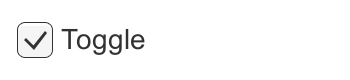
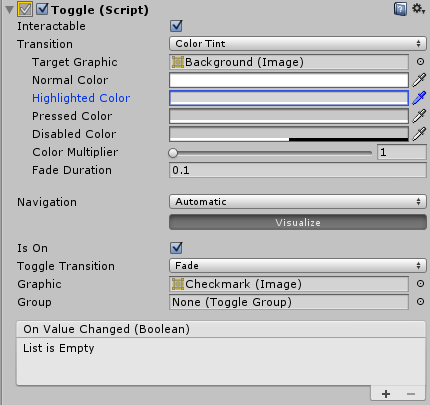
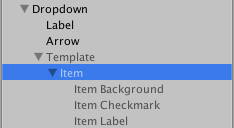
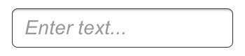

# **Interaction Components（交互组件）**

UI 系统中的交互组件负责处理交互，例如鼠标或触摸事件，以及使用键盘或控制器的交互操作。

* **Selectable Base Class（可选基类）**
* **Button（按钮）**
* **Toggle（切换开关）**
* **Toggle Group（切换组）**
* **Slider（滑动条）**
* **Scrollbar（滚动条）**
* **Scroll Rect（滚动矩形）**
* **InputField（输入字段）**

## **Selectable Base Class（可选基类）**

**Selectable 类** 是所有交互组件的基类，负责处理所有共有的功能项。

| 属性（Property）                 | 功能（Function）                                                                                                                                                                                                                                       |
| -------------------------------- | ------------------------------------------------------------------------------------------------------------------------------------------------------------------------------------------------------------------------------------------------------ |
| **Interactable（可交互）** | 决定该组件是否接受输入。当其设置为 `false`时，交互被禁用，状态会切换为 **Disabled（禁用）** 状态。                                                                                                                                            |
| **Transition（过渡效果）** | 在一个 Selectable 组件中，有多个**Transition Options（过渡选项）** ，用于定义当前状态下的视觉过渡。 不同的状态包括： **Normal（正常）** 、 **Highlighted（高亮）** 、**Pressed（按下）** 和 **Disabled（禁用）** 。 |
| **Navigation（导航）**     | 提供一系列**Navigation Options（导航选项）** ，用于控制如何实现键盘导航控件之间的移动。                                                                                                                                                          |

### **Transition Options（过渡选项）**

在一个 **Selectable（可选）组件** 中，有多个过渡选项，具体取决于该组件当前所处的状态。不同的状态包括： **Normal（正常）** 、 **Highlighted（高亮）** 、**Pressed（按下）** 和  **Disabled（禁用）** 。

| **过渡选项（Transition Options）** | **功能（Function）**                                                                                                                                                                                                                                                         |
| ---------------------------------------- | ---------------------------------------------------------------------------------------------------------------------------------------------------------------------------------------------------------------------------------------------------------------------------------- |
| **None（无）**                     | 此选项表示按钮完全没有任何状态效果。                                                                                                                                                                                                                                               |
| **Color Tint（颜色渐变）**         | 根据按钮当前的状态改变按钮的颜色。可以为每个独立状态选择颜色，也可以设置不同状态之间的**Fade Duration（渐变持续时间）** 。 数值越大，颜色之间的渐变越慢。                                                                                                               |
| **Sprite Swap（图片切换）**        | 根据按钮当前的状态显示不同的**Sprite（精灵图）** ，这些精灵图可以自定义设置。                                                                                                                                                                                                |
| **Animation（动画）**              | 根据按钮的状态播放不同动画。必须存在**Animator（动画控制器）组件**才能使用动画过渡。必须确保 **Root Motion（根运动）** 被禁用。 要创建动画控制器，可点击 **Generate Animation（生成动画）** ，或自行创建，并确保将动画控制器添加到按钮的 Animator 组件上。 |

每种 **Transition（过渡）** 选项（除了 None 之外）都会提供额外的选项用于控制状态之间的过渡。以下分别是每种过渡的详细属性设置：

#### Color Tint（颜色渐变）

| 属性（Property）                        | 功能（Function）                                                                                      |
| --------------------------------------- | ----------------------------------------------------------------------------------------------------- |
| **Target Graphic（目标图形）**    | 用于交互组件的图形元素。                                                                              |
| **Normal Color（正常颜色）**      | 控件处于正常状态时的颜色。                                                                            |
| **Highlighted Color（高亮颜色）** | 控件被高亮时的颜色。                                                                                  |
| **Pressed Color（按下颜色）**     | 控件被按下时的颜色。                                                                                  |
| **Disabled Color（禁用颜色）**    | 控件被禁用时的颜色。                                                                                  |
| **Color Multiplier（颜色乘数）**  | 对每个状态颜色进行乘法处理。使用此项可以使颜色亮度高于 1（如需要将图形元素变亮或增强 alpha 透明度）。 |
| **Fade Duration（渐变时间）**     | 从一个状态渐变到另一个状态所需的时间（单位为秒）。                                                    |

#### Sprite Swap（图片切换）

| 属性（Property）                           | 功能（Function）                 |
| ------------------------------------------ | -------------------------------- |
| **Target Graphic（目标图形）**       | 用作默认状态的精灵图（Sprite）。 |
| **Highlighted Sprite（高亮精灵图）** | 控件高亮时使用的精灵图。         |
| **Pressed Sprite（按下精灵图）**     | 控件按下时使用的精灵图。         |
| **Disabled Sprite（禁用精灵图）**    | 控件禁用时使用的精灵图。         |

#### Animation（动画）

| 属性（Property）                            | 功能（Function）               |
| ------------------------------------------- | ------------------------------ |
| **Normal Trigger（正常触发器）**      | 控件正常状态时触发的动画事件。 |
| **Highlighted Trigger（高亮触发器）** | 控件高亮状态时触发的动画事件。 |
| **Pressed Trigger（按下触发器）**     | 控件按下状态时触发的动画事件。 |
| **Disabled Trigger（禁用触发器）**    | 控件禁用状态时触发的动画事件。 |

### Navigation Options（导航选项）

| 属性（Property）              | 功能（Function）                                                         |
| ----------------------------- | ------------------------------------------------------------------------ |
| **Navigation（导航）**  | 指定在游戏模式（Play Mode）下，UI 元素之间的导航方式。                   |
| **None（无）**          | 不启用键盘导航。也会确保该控件不会因点击/触摸而获得焦点。                |
| **Horizontal（水平）**  | 启用水平方向的导航。                                                     |
| **Vertical（垂直）**    | 启用垂直方向的导航。                                                     |
| **Automatic（自动）**   | 启用自动导航。                                                           |
| **Explicit（显式）**    | 在此模式下，可以明确指定在按不同方向键时控件的导航目标。                 |
| **Visualize（可视化）** | 选中此选项将在 Scene（场景）窗口中直观显示你设置的导航关系。见下文说明。 |

**Scene（场景）窗口中显示的导航连接可视化图**

在上述可视化模式中，箭头表示一组控件作为整体时，焦点切换的设置方式。这意味着，对于每一个独立的 UI 控件，当该控件获得焦点时，按下方向键后将切换到哪个控件，可以通过箭头直观查看。

例如，在上图中，如果“Button（按钮）”当前获得焦点，当用户按下右箭头键时，左侧的第一个 **Vertical Slider（垂直滑动条）** 将获得焦点。需要注意的是，垂直滑动条无法通过上下键移除焦点，因为这些键本身用于调节滑动条的值。水平滑动条与左右箭头键也同理：它们用于调节数值，而不是切换焦点。

## Button（按钮）

Button 控件响应用户的点击操作，用于启动或确认一个动作。常见的例子包括网页表单中的 Submit（提交）和 Cancel（取消）按钮。

### 属性（Properties）

| 属性（Property）                 | 功能（Function）                                                            |
| -------------------------------- | --------------------------------------------------------------------------- |
| **Interactable（可交互）** | 启用 Interactable 后，按钮将接受输入。详见 Interactable 的 API 文档。       |
| **Transition（过渡效果）** | 定义该控件在用户操作时的视觉响应方式。详见 Transition Options（过渡选项）。 |
| **Navigation（导航）**     | 控制该控件在 UI 控件序列中的导航行为。详见 Navigation Options（导航选项）。 |

### **事件（Events）**

| 属性（Property）             | 功能（Function）                                  |
| ---------------------------- | ------------------------------------------------- |
| **On Click（点击时）** | 一个 UnityEvent，当用户点击按钮并释放时会被触发。 |

### **详细说明（Details）**

该按钮设计用于在用户点击并释放时启动某个动作。如果在释放鼠标点击之前鼠标移出按钮区域，则不会触发该动作。

按钮只有一个事件： **On Click** ，它在用户完成点击时响应。常见的使用场景包括：

* 确认决策（例如，开始游戏或保存游戏）
* 跳转到 GUI 的子菜单
* 取消当前进行中的操作（例如，下载一个新场景）

## **Toggle（切换控件）**

Toggle 控件是一个复选框，允许用户开启或关闭某个选项。

### **属性（Properties）**

| 属性（Property）                        | 功能（Function）                                                                                    |
| --------------------------------------- | --------------------------------------------------------------------------------------------------- |
| **Interactable（可交互）**        | 此组件是否接受输入？详见 Interactable。                                                             |
| **Transition（过渡效果）**        | 控件对用户操作的视觉响应方式。详见 Transition Options（过渡选项）。                                 |
| **Navigation（导航）**            | 控件的导航顺序设置。详见 Navigation Options（导航选项）。                                           |
| **Is On（是否开启）**             | 切换控件是否在开始时处于开启状态？                                                                  |
| **Toggle Transition（切换过渡）** | 值更改时的图形反应方式。 选项包括 None（无，即勾选标记直接出现或消失） 和 Fade（淡入或淡出）。 |
| **Graphic（图像）**               | 用于显示勾选标记的图像。                                                                            |
| **Group（所属组）**               | 此 Toggle 所属的 Toggle Group（切换组）（如果有）。                                                 |

### **事件（Events）**

| 属性（Property）                       | 功能（Function）                                                                        |
| -------------------------------------- | --------------------------------------------------------------------------------------- |
| **On Value Changed（值变更时）** | 一个 UnityEvent，在点击 Toggle 时触发。该事件可以作为 bool 类型的动态参数传递当前状态。 |

### **详细说明（Details）**

Toggle 控件允许用户开启或关闭某个选项。在只允许选择一个选项的场景中，也可以将多个 Toggles 合并为一个 Toggle Group（切换组）。

Toggle 拥有一个事件： **On Value Changed** ，它在用户更改当前值时触发。新值作为布尔值参数传递给事件函数。Toggle 的常见使用场景包括：

* 开启或关闭某个选项（例如，在游戏中播放音乐）
* 让用户确认他们已阅读法律免责声明
* 在 Toggle Group 中选择一个选项（例如，一周中的某一天）

注意：Toggle 是一个父级容器，为其子元素提供可点击区域。如果 Toggle 没有子元素（或子元素被禁用），则不可点击。

## **Toggle Group（切换组）**

Toggle Group 本身不是一个可见的 UI 控件，而是一种修改一组 Toggle 行为的方式。属于同一组的 Toggles 只能有一个处于开启状态 —— 当其中一个被点击开启时，其他会自动关闭。

### **属性（Properties）**

| 属性（Property）                           | 功能（Function）                                                                                                                                                                        |
| ------------------------------------------ | --------------------------------------------------------------------------------------------------------------------------------------------------------------------------------------- |
| **Allow Switch Off（允许全部关闭）** | 是否允许所有 Toggle 都关闭？ 如果启用该设置，则点击当前已开启的 Toggle 会将其关闭，使得所有 Toggles 都处于关闭状态； 若禁用该设置，则点击当前已开启的 Toggle 不会改变其状态。 |

### **说明（Description）**

设置 Toggle Group 的方法是将 Toggle Group 对象拖拽到每个 Toggle 的 Group 属性上。

Toggle Group 在用户必须从一组选项中做出互斥选择时非常有用。常见场景包括选择玩家角色类型、速度设置（慢、中、快等）、预设颜色或星期几。你可以在场景中拥有多个 Toggle Group 对象，因此可以根据需要创建多个独立的组。

与其他 UI 元素不同，具有 Toggle Group 组件的对象不必是 Canvas（画布）的子对象，但 Toggle 本身仍需是 Canvas 的子对象。

注意：如果场景加载或组实例化时组内有多个 Toggle 处于开启状态，Toggle Group 并不会立即强制应用其互斥约束。只有当新的 Toggle 被开启时，其他 Toggle 才会被关闭。因此， **你需要确保从一开始就只有一个 Toggle 被开启** 。

## **Slider（滑动条）**

Slider 控件允许用户通过拖动鼠标，从预设范围中选择一个数值。注意：类似的 ScrollBar（滚动条）控件是用于滚动，而不是选择数值。常见示例包括：游戏中的难度设置、图像编辑器中的亮度设置。

### **属性（Properties）**

| 属性（Property）                  | 功能（Function）                                                                                                                                       |
| --------------------------------- | ------------------------------------------------------------------------------------------------------------------------------------------------------ |
| **Interactable（可交互）**  | 此组件是否接受输入？详见 Interactable。                                                                                                                |
| **Transition（过渡效果）**  | 控件对用户操作的视觉响应方式。详见 Transition Options（过渡选项）。                                                                                    |
| **Navigation（导航）**      | 控件的导航顺序设置。详见 Navigation Options（导航选项）。                                                                                              |
| **Fill Rect（填充区域）**   | 用于填充滑动条进度区域的图像。                                                                                                                         |
| **Handle Rect（滑块区域）** | 用于表示滑动“把手”部分的图像。                                                                                                                       |
| **Direction（方向）**       | 拖动滑块时数值增加的方向。 选项包括 Left To Right（从左到右）、Right To Left（从右到左）、Bottom To Top（从下到上）和 Top To Bottom（从上到下）。 |
| **Min Value（最小值）**     | 滑块处于最小端（由 Direction 属性决定）时的数值。                                                                                                      |
| **Max Value（最大值）**     | 滑块处于最大端（由 Direction 属性决定）时的数值。                                                                                                      |
| **Whole Numbers（整数值）** | 是否将滑动条限制为整数？                                                                                                                               |
| **Value（当前值）**         | 滑动条当前的数值。 如果在 Inspector 中设置了初始值，则会作为初始值使用，但在运行时会随滑块移动而变化。                                            |

### **事件（Events）**

| 属性（Property）                       | 功能（Function）                                                                                                                                                                |
| -------------------------------------- | ------------------------------------------------------------------------------------------------------------------------------------------------------------------------------- |
| **On Value Changed（值变更时）** | 一个 UnityEvent，在滑动条当前值发生改变时被调用。 该事件会以 float 类型的动态参数传递当前值。 无论是否启用了 Whole Numbers（整数值）属性，该值始终以 float 类型传递。 |

### **详细说明（Details）**

滑动条的数值由滑块（Handle）在滑动条长度上的位置决定。数值从 Min Value（最小值）按比例增加到 Max Value（最大值），取决于滑块被拖动的距离。默认行为是数值从左向右增加，但也可以通过设置 Direction 属性反转该行为。你还可以选择 Bottom To Top（从下到上）或 Top To Bottom（从上到下）来使滑动条垂直增加。

滑动条拥有一个事件： **On Value Changed** ，在用户拖动滑块时触发。当前的数值作为 float 类型参数传递给函数。常见的使用场景包括：

* 选择游戏中的难度等级、灯光亮度等
* 设置距离、尺寸、时间或角度

## **Scrollbar（滚动条）**

Scrollbar 控件允许用户滚动查看一张过大而无法完全显示的图像或其他视图。注意：类似的 Slider（滑动条）控件用于选择数值，而不是滚动。常见示例包括文本编辑器侧边的垂直滚动条，以及用于查看大图或地图某一部分的水平和垂直滚动条组合。

### **属性（Properties）**

| 属性（Property）                    | 功能（Function）                                                                                                                                       |
| ----------------------------------- | ------------------------------------------------------------------------------------------------------------------------------------------------------ |
| **Interactable（可交互）**    | 此组件是否接受输入？详见 Interactable。                                                                                                                |
| **Transition（过渡效果）**    | 控件对用户操作的视觉响应方式。详见 Transition Options（过渡选项）。                                                                                    |
| **Navigation（导航）**        | 控件的导航顺序设置。详见 Navigation Options（导航选项）。                                                                                              |
| **Fill Rect（填充区域）**     | 用于控制背景区域的图像。                                                                                                                               |
| **Handle Rect（滑块区域）**   | 用于表示滑动“把手”部分的图像。                                                                                                                       |
| **Direction（方向）**         | 拖动滑块时数值增加的方向。 选项包括 Left To Right（从左到右）、Right To Left（从右到左）、Bottom To Top（从下到上）和 Top To Bottom（从上到下）。 |
| **Value（当前值）**           | 滚动条的初始位置数值，范围为 0.0 到 1.0。                                                                                                              |
| **Size（大小）**              | 滚动条中滑块的比例大小，范围为 0.0 到 1.0。                                                                                                            |
| **Number Of Steps（步进数）** | 滚动条允许的离散滚动位置的数量。                                                                                                                       |

### **事件（Events）**

| 属性（Property）                       | 功能（Function）                                                                                   |
| -------------------------------------- | -------------------------------------------------------------------------------------------------- |
| **On Value Changed（值变更时）** | 一个 UnityEvent，在滚动条当前值发生改变时被调用。 该事件会以 float 类型的动态参数传递当前值。 |

### **详细说明（Details）**

滚动条的值由滑块（Handle）在滚动条长度上的位置决定，该值以两个极端端点之间的小数值表示。例如，默认的从左到右的滚动条在最左端的值为 0.0，在最右端为 1.0，值为 0.5 表示位于中间位置。可以通过设置 Direction 属性为 Top To Bottom（从上到下）或 Bottom To Top（从下到上）来将滚动条设置为垂直方向。

Scrollbar 和类似的 Slider 控件之间有一个显著的区别： **Scrollbar 的滑块可以改变大小** ，以表示当前可滚动的范围；当可滚动范围较小时，滑块会占据大部分滚动条，只允许轻微地向任一方向移动。

滚动条有一个事件： **On Value Changed** ，在用户拖动滑块时触发。当前值作为 float 类型参数传递给事件函数。常见的使用场景包括：

* 垂直滚动一段文字内容。
* 水平滚动时间轴。
* 配合使用，水平和垂直滚动大图像以查看放大区域。滑块大小的变化表示缩放程度，从而反映可滚动的距离。

## **Dropdown（下拉框）**

Dropdown 可用于让用户从一组选项中选择一个选项。

该控件显示当前选中的选项。一旦点击，它会展开选项列表，以便用户选择新选项。选择新选项后，列表会再次关闭，控件显示新的已选择选项。如果用户点击控件本身或 Canvas（画布）内的任意其他位置，列表也会关闭。

### **属性（Properties）**

| 属性（Property）                    | 功能（Function）                                                    |
| ----------------------------------- | ------------------------------------------------------------------- |
| **Interactable（可交互）**    | 此组件是否接受输入？详见 Interactable。                             |
| **Transition（过渡效果）**    | 控件对用户操作的视觉响应方式。详见 Transition Options（过渡选项）。 |
| **Navigation（导航）**        | 控件的导航顺序设置。详见 Navigation Options（导航选项）。           |
| **Template（模板）**          | 下拉列表模板的 Rect Transform（矩形变换）组件。详见下文说明。       |
| **Caption Text（标题文本）**  | 用于显示当前所选选项文本的 Text 组件。（可选）                      |
| **Caption Image（标题图像）** | 用于显示当前所选选项图像的 Image 组件。（可选）                     |
| **Item Text（项文本）**       | 用于显示列表项文本的 Text 组件。（可选）                            |
| **Item Image（项图像）**      | 用于显示列表项图像的 Image 组件。（可选）                           |
| **Value（当前值）**           | 当前所选选项的索引。0 是第一个选项，1 是第二个，依此类推。          |
| **Options（选项）**           | 可选项的列表。每个选项可以指定一个文本字符串和一个图像。            |

### **事件（Events）**

| 属性（Property）                       | 功能（Function）                                            |
| -------------------------------------- | ----------------------------------------------------------- |
| **On Value Changed（值变更时）** | 一个 UnityEvent，当用户点击了下拉列表中的某个选项时被调用。 |

### **详细说明（Details）**

选项列表可以在 Inspector（检查器）中指定，也可以通过代码分配。每个选项可以指定一个文本字符串，也可以选择性地指定图像（如果 Dropdown 设置为支持图像）。

该按钮拥有一个事件： **On Value Changed** ，当用户点击列表中的某个选项后触发。它支持发送一个整数类型的数值，该数值为所选选项的索引。0 是第一个选项，1 是第二个，依此类推。

#### **模板系统（The template system）**

Dropdown 控件设计为包含一个子 GameObject（游戏对象），该对象作为点击下拉框时显示的下拉列表模板。模板 GameObject 默认处于非激活状态，但在编辑模板时可以将其激活，以更清晰地查看效果。必须在 Dropdown 组件的 Template 属性中指定对模板对象的引用。

模板中必须有一个带 Toggle（开关）组件的项。点击下拉框控件创建实际下拉列表时，此项会被复制多次，每个选项对应一个副本。该项的父对象会自动调整大小，以容纳所有列表项。

一个简单的下拉框设置，列表项是模板的直接子对象。

一个更高级的下拉框设置，包含一个 scrollview（滚动视图），当选项过多时可以滚动。

模板可以用多种方式设置。菜单项 GameObject > UI > Dropdown 创建的默认模板包括一个 scroll view（滚动视图），这样当选项太多无法一次显示时，会显示一个滚动条，用户可以滚动浏览选项。但这并不是模板设置的必要部分。

（关于 Scroll Views（滚动视图）的设置，请参见 ScrollRect 页面。）

#### **文本和图像支持的设置（Setup of text and image support）**

Dropdown 支持每个选项包含一个文本内容和一个图像内容。文本和图像都是可选的，只有当 Dropdown 设置为支持它们时才可使用。

当 Caption Text（标题文本）和 Item Text（项文本）属性都已设置时，下拉框支持每个选项的文本显示。使用菜单项 GameObject > UI > Dropdown 创建时，这些默认就已设置。

* **Caption Text（标题文本）** 是用于显示当前所选选项的 Text 组件。通常是 Dropdown GameObject 的子对象。
* **Item Text（项文本）** 是用于显示每个选项的 Text 组件。通常是 Item GameObject 的子对象。

当 Caption Image（标题图像）和 Item Image（项图像）属性都已设置时，下拉框支持每个选项的图像显示。它们默认未设置。

* **Caption Image（标题图像）** 是用于显示当前所选选项图像的 Image 组件。通常是 Dropdown GameObject 的子对象。
* **Item Image（项图像）** 是用于显示每个选项图像的 Image 组件。通常是 Item GameObject 的子对象。

实际使用的文本和图像通过 Dropdown 组件的 Options（选项）属性指定，或可通过代码设置。

#### **下拉列表的位置（Placement of the dropdown list）**

下拉列表相对于 Dropdown 控件的位置由 Template 的 Rect Transform（矩形变换）的锚点和中心点（pivot）决定。

默认情况下，列表会显示在控件下方。这是通过将模板锚定到底部实现的。模板的 pivot 也需要设置在顶部，这样当模板扩展以容纳多个选项时，只会向下扩展。

Dropdown 控件有简单的逻辑，防止下拉列表显示在 Canvas 边界之外，因为那样可能无法选择某些选项。如果下拉列表在默认位置不完全位于 Canvas 矩形内，则会反转其相对于控件的位置。例如，默认在控件下方显示的列表会改为在上方显示。

此逻辑较为简单，存在一定限制。模板大小不能超过 Canvas 尺寸的一半减去 Dropdown 控件的大小，否则当控件位于 Canvas 中间时，列表在上方或下方都可能没有足够空间显示。

## **Input Field（输入框）**

输入框是使 Text Control（文本控件）的文本可编辑的一种方式。与其他交互控件一样，它本身不是一个可见的 UI 元素，必须与一个或多个可视化的 UI 元素结合，才能显示出来。

### **属性（Properties）**

| 属性（Property）                                       | 功能（Function）                                                                                                                                |
| ------------------------------------------------------ | ----------------------------------------------------------------------------------------------------------------------------------------------- |
| **Interactable（可交互）**                       | 一个布尔值，决定输入框是否可以进行交互。                                                                                                        |
| **Transition（过渡效果）**                       | 过渡效果用于设置输入框在正常、突出显示、按下或禁用状态下的过渡方式。                                                                            |
| **Navigation（导航）**                           | 用于确定控件顺序的属性。详见 Navigation Options（导航选项）。                                                                                   |
| **TextComponent（文本组件）**                    | 引用用作输入框内容的 Text（文本）元素。                                                                                                         |
| **Text（文本）**                                 | 起始值。在开始编辑之前放入字段中的初始文本。                                                                                                    |
| **Character Limit（字符限制）**                  | 可以输入的最大字符数值。                                                                                                                        |
| **Content Type（内容类型）**                     | 定义输入框接受的字符类型。                                                                                                                      |
| **Standard（标准）**                             | 任何字符都可以输入。                                                                                                                            |
| **Autocorrected（自动更正）**                    | 自动更正决定输入是否跟踪未知词并建议一个更合适的替代选项，除非用户显式覆盖该操作，否则会自动替换输入的文本。                                    |
| **Integer Number（整数）**                       | 仅允许输入整数。                                                                                                                                |
| **Decimal Number（小数）**                       | 仅允许输入数字和一个小数点。                                                                                                                    |
| **Alphanumeric（字母数字）**                     | 允许输入字母和数字，但不允许输入符号。                                                                                                          |
| **Name（姓名）**                                 | 自动将每个单词的首字母大写。请注意，用户可以使用删除键绕过大小写规则。                                                                          |
| **Email Address（电子邮件地址）**                | 允许输入一个最多包含一个“@”符号的字母数字字符串。句点（.）不能相邻。                                                                          |
| **Password（密码）**                             | 使用星号隐藏输入的字符。允许输入符号。                                                                                                          |
| **Pin（密码）**                                  | 使用星号隐藏输入的字符。仅允许输入整数。                                                                                                        |
| **Custom（自定义）**                             | 允许自定义行类型、输入类型、键盘类型和字符验证。                                                                                                |
| **Line Type（行类型）**                          | 定义文本在文本框内的格式。                                                                                                                      |
| **Single Line（单行）**                          | 仅允许文本显示在一行上。                                                                                                                        |
| **Multi Line Submit（多行提交）**                | 允许文本使用多行。仅在需要时使用新行。                                                                                                          |
| **Multi Line Newline（多行换行）**               | 允许文本使用多行。用户可以按回车键插入新行。                                                                                                    |
| **Placeholder（占位符）**                        | 这是一个可选的“空”图形，显示输入框为空文本时的提示。请注意，即使输入框已被选中（即获得焦点），此“空”图形仍然显示。例如：“请输入文本...”。 |
| **Caret Blink Rate（光标闪烁率）**               | 定义光标在行内闪烁的速率。                                                                                                                      |
| **Selection Color（选中颜色）**                  | 选中文本部分的背景颜色。                                                                                                                        |
| **Hide Mobile Input（隐藏移动输入）（仅限iOS）** | 隐藏移动设备屏幕键盘附带的本地输入框。请注意，这仅适用于 iOS 设备。                                                                             |

### **事件（Events）**

| 属性（Property）                      | 功能（Function）                                                                                                                                  |
| ------------------------------------- | ------------------------------------------------------------------------------------------------------------------------------------------------- |
| **On Value Change（值变化时）** | 一个 UnityEvent，当输入框的文本内容发生变化时触发。该事件可以发送当前的文本内容，作为字符串类型的动态参数。                                       |
| **End Edit（结束编辑时）**      | 一个 UnityEvent，当用户完成编辑文本内容（通过提交或点击其他地方使焦点移出输入框）时触发。该事件可以发送当前的文本内容，作为字符串类型的动态参数。 |

### **详细说明（Details）**

可以从菜单（Component > UI > Input Field）将 Input Field 脚本添加到任何现有的 Text（文本）控件对象中。完成此操作后，还应将对象拖动到 Input Field 的 Text 属性中，以启用编辑。

Text 控件本身的 Text 属性会随着用户的输入而变化，编辑完成后可以通过脚本获取该值。请注意，Rich Text（富文本）不支持可编辑的 Text 控件；当输入时，字段会立即应用任何富文本标记，但这些标记本质上会“消失”，并且没有后续方法来更改或移除样式。

### **提示（Hints）**

要获取 Input Field 的文本，请使用 InputField 组件本身的 text 属性，而不是显示文本的 Text 组件的 text 属性。Text 组件的 text 属性可能会被截断，或者对于密码字段，显示为星号（*）。

## **Scroll Rect（滚动区域）**

当需要在一个小区域内显示占用大量空间的内容时，可以使用 Scroll Rect（滚动区域）。Scroll Rect 提供了滚动这些内容的功能。

通常，Scroll Rect 会与一个 Mask（蒙版）结合使用，以创建一个滚动视图，其中只有 Scroll Rect 内部的可滚动内容是可见的。它还可以与一个或两个 Scrollbars（滚动条）结合使用，这些滚动条可以拖动以水平或垂直滚动。

### **属性（Properties）**

| 属性（Property）                             | 功能（Function）                                                                                                                   |
| -------------------------------------------- | ---------------------------------------------------------------------------------------------------------------------------------- |
| **Content（内容）**                    | 这是对要滚动的 UI 元素的 Rect Transform（矩形变换）的引用，例如一个大图像。                                                        |
| **Horizontal（水平）**                 | 启用水平滚动。                                                                                                                     |
| **Vertical（垂直）**                   | 启用垂直滚动。                                                                                                                     |
| **Movement Type（移动类型）**          | 无限制、弹性或限制。使用弹性或限制模式强制内容保持在 Scroll Rect 的边界内。 弹性模式在内容达到 Scroll Rect 边界时会使其反弹。 |
| **Elasticity（弹性）**                 | 这是弹性模式下使用的弹跳量。                                                                                                       |
| **Inertia（惯性）**                    | 设置惯性时，指针释放后内容会继续移动。如果没有设置惯性，内容仅在拖动时移动。                                                       |
| **Deceleration Rate（减速率）**        | 设置惯性时，减速率决定了内容停止移动的速度。 0的值将立即停止移动。值为1时，移动永远不会减速。                                 |
| **Scroll Sensitivity（滚动灵敏度）**   | 滚动鼠标滚轮和触摸板滚动事件的灵敏度。                                                                                             |
| **Viewport（视口）**                   | 引用视口的 Rect Transform，它是内容 Rect Transform 的父元素。                                                                      |
| **Horizontal Scrollbar（水平滚动条）** | 可选的水平滚动条元素引用。                                                                                                         |
| **Visibility（可见性）**               | 当滚动条不需要时，是否应自动隐藏，并可选择是否扩展视口。                                                                           |
| **Spacing（间距）**                    | 滚动条与视口之间的间距。                                                                                                           |
| **Vertical Scrollbar（垂直滚动条）**   | 可选的垂直滚动条元素引用。                                                                                                         |
| **Visibility（可见性）**               | 当滚动条不需要时，是否应自动隐藏，并可选择是否扩展视口。                                                                           |
| **Spacing（间距）**                    | 滚动条与视口之间的间距。                                                                                                           |

### **事件（Events）**

| 属性（Property）                       | 功能（Function）                                                                                                       |
| -------------------------------------- | ---------------------------------------------------------------------------------------------------------------------- |
| **On Value Changed（值变化时）** | 一个 UnityEvent，当滚动区域的滚动位置发生变化时触发。 该事件可以发送当前的滚动位置，作为 Vector2 类型的动态参数。 |

### **详细说明（Details）**

滚动视图中的重要元素是视口、滚动内容，以及可选的一个或两个滚动条。

* 根 GameObject（游戏对象）有 Scroll Rect 组件。
* 视口有一个 Mask（蒙版）组件。视口可以是根 GameObject，也可以是一个作为根 GameObject 子对象的独立 GameObject。如果使用自动隐藏滚动条，它必须是子对象。视口的 Rect Transform 必须在 Scroll Rect 的 Viewport 属性中引用。
* 所有滚动内容必须是单个 content（内容）GameObject（游戏对象）的子对象，该 GameObject 是视口的子对象。内容的 Rect Transform 必须在 Scroll Rect 的 Content 属性中引用。
* 滚动条——如果使用——是根 GameObject 的子对象。有关滚动条设置的更多详细信息，请参见 Scrollbar 页面，关于与滚动视图配合使用的滚动条设置，请参见下面的“滚动条设置”部分。

这张图展示了一种设置，其中视口是滚动视图根的子对象。这是通过使用 GameObject > UI > Scroll View（游戏对象 > UI > 滚动视图）菜单选项时的默认设置。

要滚动内容，输入必须来自 Scroll Rect 的边界内部，而不是来自内容本身。

使用 Unrestricted（无限制）滚动模式时要小心，因为可能会导致内容失控，无法恢复。当使用 Elastic（弹性）或 Clamped（限制）模式时，最好将内容定位在 Scroll Rect 的边界内开始，否则在 RectTransform 尝试将内容带回边界时，可能会发生不希望的行为。

#### **滚动条设置（Scrollbar setup）**

可以选择将 Scroll Rect 与一个水平和/或垂直滚动条连接。通常，这些滚动条会作为视口的同级元素放置在层级结构中，当存在时，应分别将它们拖动到 Scroll Rect 的 Horizontal Scrollbar（水平滚动条）和 Vertical Scrollbar（垂直滚动条）属性中。请注意，这样的水平滚动条的 Direction（方向）属性应设置为从左到右，垂直滚动条应设置为从下到上。

滚动条可以选择具有自动隐藏行为，如果内容不需要滚动（因为它不比视口大），则隐藏滚动条。请注意，自动隐藏仅在播放模式下发生。在编辑模式下，滚动条始终可见。这可以防止不应该标记为脏的场景被错误标记，并帮助创作有足够空间显示内容的比例，即使滚动条可见时也能保证内容不被遮挡。

如果一个或两个滚动条的可见性行为设置为“Auto Hide And Expand View”（自动隐藏并扩展视口），那么当滚动条隐藏时，视口会自动扩展，以占据滚动条原本占用的额外空间。在此设置下，视口的位置和大小由 Scroll Rect 驱动，水平滚动条的宽度以及垂直滚动条的高度也会受到驱动。此设置下，视口和滚动条必须是 Scroll Rect 根 GameObject 的子对象。

### **提示（Hints）**

内容的 RectTransform（矩形变换）的 pivot（支点）和 anchors（锚点）可以用来确定内容在视图内对齐的方式，尤其是当内容增加或缩小时。如果内容应始终与顶部对齐，请将锚点设置为父元素的顶部，并将支点设置为顶部位置。

请参见页面  **Making UI elements fit the size of their content** （使 UI 元素适应其内容大小）以了解如何让内容的 Rect Transform 自动调整大小以适应内容。
