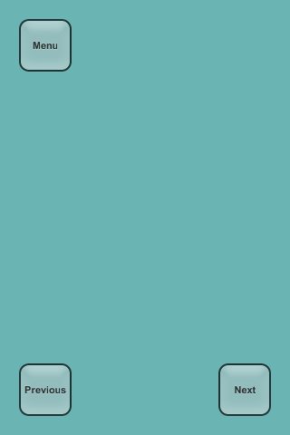
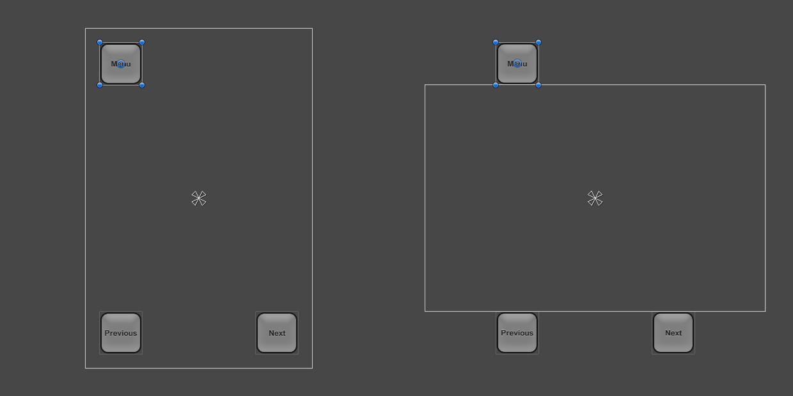
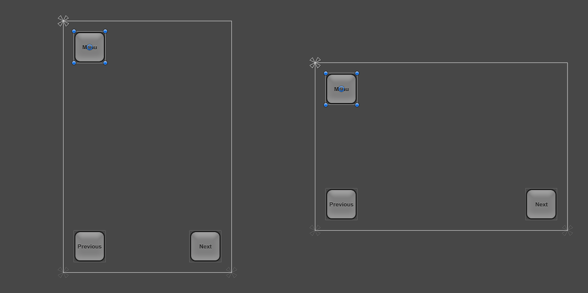
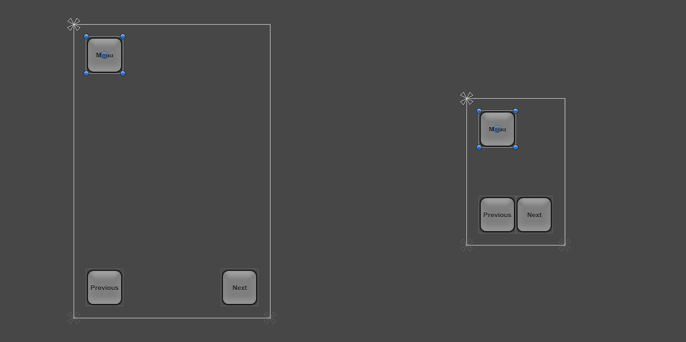
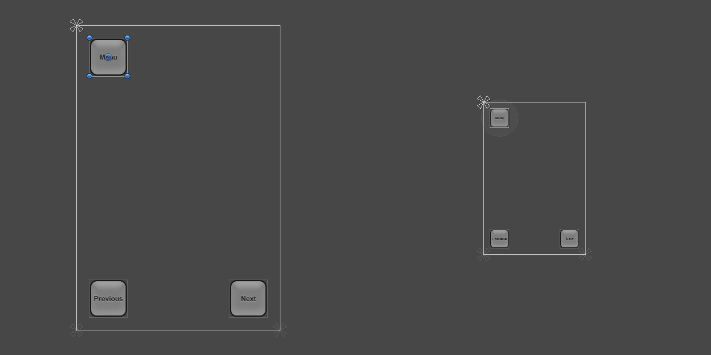

# UI How Tos（UI 操作指南）

在本节中，你可以学习解决常见 UI 任务的方法。

# Designing UI for Multiple Resolutions（为多种分辨率设计 UI）

现代游戏和应用通常需要支持各种不同的屏幕分辨率，尤其是 UI 布局需要能够适应这些分辨率。Unity 中的 UI 系统提供了多种工具来实现这一目标，并可以以多种方式进行组合使用。

在本操作指南中，我们将使用一个简单的案例研究，并在其背景下查看和比较不同的工具。在我们的案例中，屏幕的三个角上各有一个按钮，如下所示，我们的目标是使该布局适应各种分辨率。

在本操作指南中，我们将考虑四种屏幕分辨率：Phone HD（高清手机）纵向（640 x 960）和横向（960 x 640），以及 Phone SD（标清手机）纵向（320 x 480）和横向（480 x 320）。初始布局设置在 Phone HD 纵向分辨率下。

### Using anchors to adapt to different aspect ratios（使用 Anchors 锚点适配不同宽高比）

UI 元素默认锚定在父矩形的中心。这意味着它们与中心保持固定的偏移量。

如果在此设置下将分辨率更改为横屏宽高比，按钮可能甚至不再出现在屏幕矩形内。

一种保持按钮在屏幕内的方法是更改布局，使按钮的位置绑定在各自的屏幕角落。可以使用 Inspector（检视器）中的 Anchors Preset（锚点预设）下拉菜单，或在 Scene View（场景视图）中拖动三角形锚点手柄，将左上角按钮的锚点设置到左上角。最好在 Game View（游戏视图）中当前分辨率为最初设计的分辨率时进行此操作，以确保按钮位置正确。（更多关于 Anchors 的信息请参见 UI Basic Layout 页面。）类似地，可以将左下角和右下角按钮的锚点分别设置到左下角和右下角。

一旦按钮锚定在它们各自的角落，当更改分辨率时，它们将固定在角落上。

当屏幕大小更改为更大或更小的分辨率时，按钮也会保持锚定在各自的角落上。然而，由于它们保持像素中指定的原始大小，因此它们可能占据屏幕更大或更小的比例。这是否合适取决于你希望布局在不同分辨率屏幕上如何表现。

在本操作指南中，我们知道 Phone SD 的纵向和横向分辨率并不对应物理尺寸更小的屏幕，而是像素密度更低的屏幕。在这些低密度屏幕上，按钮不应显得比高密度屏幕上更大——它们应当保持相同的视觉尺寸。

这意味着按钮应该以与屏幕缩小比例相同的比例缩小。换句话说，按钮的缩放应随着屏幕大小变化而变化。这时就需要用到 Canvas Scaler（画布缩放器）组件。

### Scaling with Screen Size（随屏幕大小缩放）

Canvas Scaler（Canvas Scaler 组件）可以添加到根 Canvas 上——也就是带有 Canvas（画布）组件的 Game Object（游戏对象），所有 UI 元素都是其子对象。通过 GameObject 菜单创建新的 Canvas 时，该组件也会默认添加。

在 Canvas Scaler 组件中，你可以将 UI Scale Mode（UI 缩放模式）设置为  **Scale With Screen Size（随屏幕大小缩放）** 。在这种缩放模式下，你可以指定一个参考分辨率。如果当前屏幕分辨率比参考分辨率大或小，则 Canvas 的缩放因子会相应地调整，从而所有 UI 元素都会随着屏幕分辨率一起放大或缩小。

在我们的案例中，我们将 Canvas Scaler 设置为 Phone HD 纵向分辨率 640 x 960。现在，如果将屏幕分辨率设置为 Phone SD 的 320 x 480，整个布局会等比例缩小，因此在视觉上看起来与全分辨率时一致。所有内容都会缩小：按钮的大小、按钮与屏幕边缘的距离、按钮图形和文本元素。这意味着该布局在 Phone SD 纵向分辨率下的显示效果将与 Phone HD 相同，只是像素密度更低。

需要注意的一点是：添加 Canvas Scaler 组件后，还需检查在其他宽高比下布局的表现。将分辨率切换回 Phone HD 横向时，我们可以看到按钮现在显得比原来更大。

造成按钮在横向模式下变大的原因与 Canvas Scaler 的工作方式有关。默认情况下，它会将当前分辨率的宽度与 Canvas Scaler 的宽度进行比较，并将结果作为缩放因子来缩放所有内容。由于当前横向分辨率为 960 x 640，宽度是纵向分辨率 640 x 960 的 1.5 倍，因此布局被放大了 1.5 倍。

该组件有一个属性叫做 Match（匹配），其值可以为 0（宽度）、1（高度）或介于两者之间的数值。默认值为 0，即仅比较当前屏幕宽度与 Canvas Scaler 宽度。

如果将 Match 属性设置为 0.5，它将同时比较当前的宽度与参考宽度、当前的高度与参考高度，并选择一个介于两者之间的缩放因子。在本例中，横向分辨率的宽度是参考宽度的 1.5 倍，但高度也是其参考高度的 1.5 倍，因此两者相抵，最终缩放因子为 1，即按钮保持原始大小。

到这一步为止，该布局通过合理设置锚点以及在 Canvas 上添加 Canvas Scaler 组件，已经支持了四种屏幕分辨率。

关于如何根据不同屏幕尺寸缩放 UI 元素的更多信息，请参见 Canvas Scaler 参考页面。
