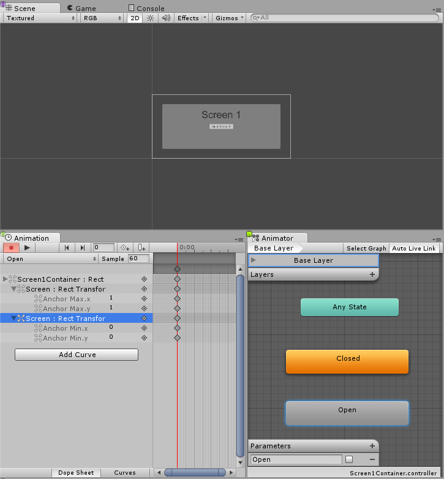
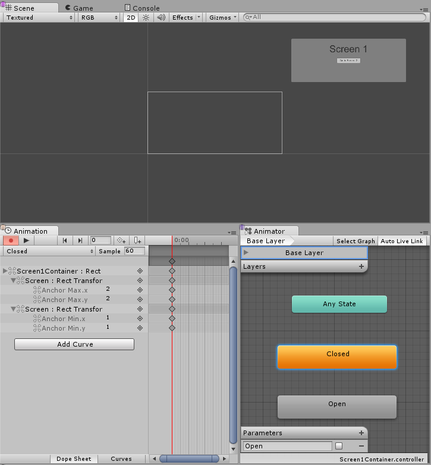
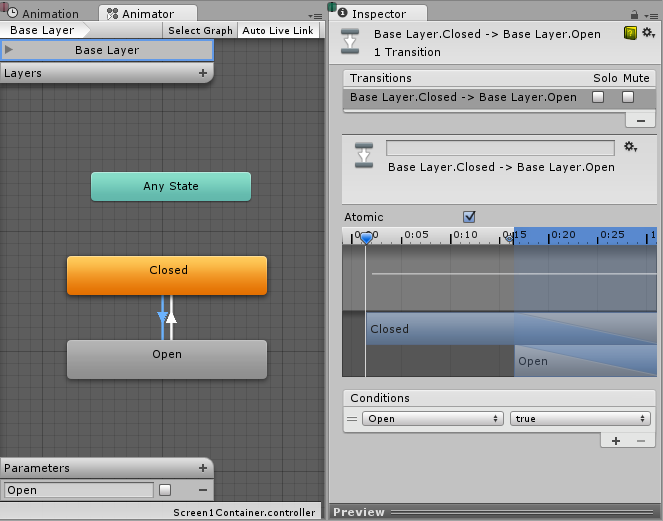
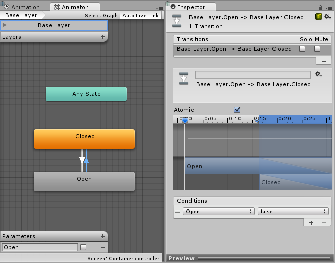
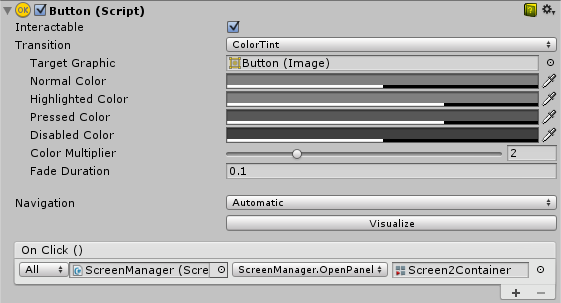

# **Creating Screen Transitions（创建界面切换效果）**

在多个 UI 界面之间切换是非常常见的需求。本页将介绍一种使用 **Animation（动画）** 和 **State Machines（状态机）** 来驱动并控制每个界面切换的简单方法。

## **Overview（概述）**

核心思路是：我们为每个界面配置一个  **Animator Controller（动画控制器）** ，其中包含两个状态（**Open（打开）** 和  **Closed（关闭）** ）以及一个布尔型  **Parameter（参数）** （Open）。切换界面时，你只需关闭当前已打开的界面，并打开目标界面。

为了简化操作，我们将创建一个小型的 **ScreenManager（界面管理器）** 类，用于记录并处理关闭已打开界面的任务。触发切换的按钮只需向 ScreenManager 发送指令，要求打开目标界面即可。

### **Thinking about Navigation（关于导航的思考）**

如果你打算支持使用手柄或键盘对 UI 元素进行导航，那么你需要注意以下几点：

* 避免界面外存在  **Selectable（可选中）元素** ，否则玩家可能会选中不可见的元素。解决方法是将不在当前界面中的 **Hierarchy（层级）** 设为非激活状态。
* 每当新界面展示时，需要设置其中的某个元素为  **selected（已选中）** ，否则玩家将无法通过导航进入该界面。

我们会在下面的 **ScreenManager** 类中处理以上逻辑。

## **Setting up the Animator Controller（设置 Animator Controller）**

现在来看看实现界面切换的最基础、最常见的 **Animator Controller（动画控制器）** 设置方法。控制器需要一个布尔型参数  **Open** ，以及两个状态：**Open（打开）** 和  **Closed（关闭）** 。每个状态都应对应一个只包含一个关键帧的动画，这样我们可以让 **State Machine（状态机）** 自行处理动画过渡效果。





现在我们需要在两个状态之间创建转换通道：

* 从  **Open 到 Closed** ：设置条件为当 **Open** 参数为 **false** 时触发。
* 从  **Closed 到 Open** ：设置条件为当 **Open** 参数为 **true** 时触发。





## Managing the screens（管理屏幕）

在完成上述所有设置后，剩下的唯一任务就是：将目标界面的 Animator（动画器）中的参数 Open（打开） 设置为  true ，并将当前已打开界面的 Open设置为  false 。为此，我们将创建一个简单的脚本：

```csharp
using UnityEngine;
using UnityEngine.UI;
using UnityEngine.EventSystems;
using System.Collections;
using System.Collections.Generic;

public class ScreenManager : MonoBehaviour {

    // Scene 启动时自动打开的界面
    public Animator initiallyOpen;

    // 当前已打开的界面
    private Animator m_Open;

    // 控制切换的参数的哈希值
    private int m_OpenParameterId;

    // 打开当前界面之前被选中的 GameObject（游戏对象）
    // 用于关闭界面时恢复之前的按钮选择状态
    private GameObject m_PreviouslySelected;

    // 需要检查的 Animator 状态与过渡名称
    const string k_OpenTransitionName = "Open";
    const string k_ClosedStateName = "Closed";

    public void OnEnable()
    {
        // 缓存参数“Open”的哈希值，供 Animator.SetBool 使用
        m_OpenParameterId = Animator.StringToHash(k_OpenTransitionName);

        // 如果设置了初始界面，则立即打开
        if (initiallyOpen == null)
            return;
        OpenPanel(initiallyOpen);
    }

    // 关闭当前已打开的界面，打开新传入的界面
    // 同时处理导航，将新界面中的元素设为选中状态
    public void OpenPanel(Animator anim)
    {
        if (m_Open == anim)
            return;

        // 激活新界面的层级结构以便播放动画
        anim.gameObject.SetActive(true);
        // 保存当前被选中的按钮（用于打开界面的按钮）
        var newPreviouslySelected = EventSystem.current.currentSelectedGameObject;
        // 将界面移动到最前面
        anim.transform.SetAsLastSibling();

        CloseCurrent();

        m_PreviouslySelected = newPreviouslySelected;

        // 设置新界面为当前打开的界面
        m_Open = anim;
        // 播放打开动画
        m_Open.SetBool(m_OpenParameterId, true);

        // 设置新界面中某个元素为当前选中项
        GameObject go = FindFirstEnabledSelectable(anim.gameObject);
        SetSelected(go);
    }

    // 在给定的层级结构中查找第一个可交互的 Selectable 元素
    static GameObject FindFirstEnabledSelectable(GameObject gameObject)
    {
        GameObject go = null;
        var selectables = gameObject.GetComponentsInChildren<Selectable>(true);
        foreach (var selectable in selectables) {
            if (selectable.IsActive() && selectable.IsInteractable()) {
                go = selectable.gameObject;
                break;
            }
        }
        return go;
    }

    // 关闭当前打开的界面
    // 同时处理导航，将选择恢复到之前的元素
    public void CloseCurrent()
    {
        if (m_Open == null)
            return;

        // 播放关闭动画
        m_Open.SetBool(m_OpenParameterId, false);

        // 恢复之前被选中的元素
        SetSelected(m_PreviouslySelected);
        // 启动协程，在动画结束后禁用界面层级
        StartCoroutine(DisablePanelDeleyed(m_Open));
        // 当前没有界面处于打开状态
        m_Open = null;
    }

    // 协程：检测关闭动画是否完成，然后禁用界面层级
    IEnumerator DisablePanelDeleyed(Animator anim)
    {
        bool closedStateReached = false;
        bool wantToClose = true;
        while (!closedStateReached && wantToClose)
        {
            if (!anim.IsInTransition(0))
                closedStateReached = anim.GetCurrentAnimatorStateInfo(0).IsName(k_ClosedStateName);

            wantToClose = !anim.GetBool(m_OpenParameterId);

            yield return new WaitForEndOfFrame();
        }

        if (wantToClose)
            anim.gameObject.SetActive(false);
    }

    // 设置传入的 GameObject 为选中项
    // 使用鼠标/触摸时，将其设为“之前选中的对象”，并暂不设置任何选中项
    private void SetSelected(GameObject go)
    {
        // 设置 GameObject 为当前选中
        EventSystem.current.SetSelectedGameObject(go);

        // 如果当前使用的是键盘输入，仅需设置选中项即可
        var standaloneInputModule = EventSystem.current.currentInputModule as StandaloneInputModule;
        if (standaloneInputModule != null)
            return;

        // 若使用的是指针设备（如鼠标），则不设置任何选中项
        // 但当用户切换为键盘输入时，导航会从这个 gameObject 开始
        EventSystem.current.SetSelectedGameObject(null);
    }
}
```

接下来我们将这个脚本关联到场景中。可以创建一个新的  **GameObject（游戏对象）** ，例如命名为 "ScreenManager"，然后将上述组件添加到该对象上。你可以为它指定一个初始界面，该界面将在场景开始时打开。

最后一步是让 UI 按钮起作用。选中你想用来触发界面切换的按钮，在 **Inspector（检视器）** 的 **On Click () 列表** 中添加一个新事件。将我们刚刚创建的 **ScreenManager** GameObject 拖入对象字段（ObjectField），然后在下拉菜单中选择  **ScreenManager->OpenPanel (Animator)** ，再将你想在点击按钮时打开的界面面板拖到最后的对象字段中。



## **Notes（备注）**

这个方法的唯一要求是每个界面拥有一个包含 **Open（打开）参数** 和 **Closed（关闭）状态** 的  **AnimatorController（动画控制器）** ，并不限制你的界面或 **State Machine（状态机）** 的具体结构。

该方法也适用于嵌套界面（nested screens），意味着每个嵌套层级只需一个 **ScreenManager** 即可。

我们设置的 **State Machine** 的默认状态是  **Closed** ，因此使用该控制器的所有界面在开始时都会处于关闭状态。**ScreenManager** 提供了一个 **initiallyOpen** 属性，可用于指定最先显示的界面。
